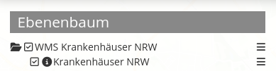
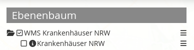
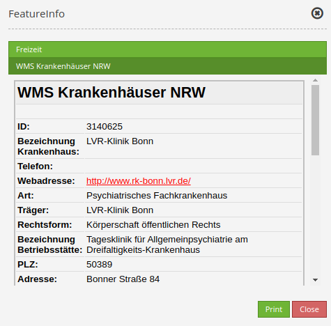

.. _feature_info:

FeatureInfo
************

This element provides feature info capabilities to Mapbender. It works with WMS.

.. image:: ../../../figures/feature_info.png
     :scale: 80

Configuration
=============

.. image:: ../../../figures/feature_info_configuration.png
     :scale: 80

* **Auto-open:** Enable or disable autoopening of the copyright window when starting the application (default: false).
* **Deactivate on close:** True/false to deactivate the functionality after closing the result dialog (default: true).
* **Print Result:** Offer a link to print the result of FeatureInfo (default: false)
* **Title:** Title of the element. It will be indicated next to the button.
* **Tooltip:** Text used as a tooltip. It will be indicated when hovering with the mouse cursor over the button. It also used as a header in the copyright window.
* **Target:** ID of Map element to query.
* **Type:** Type of the information, Element or Dialog (default: Dialog).
* **Display type:** Display of the information, Tabs or Accordion.
* **Max count:** Maximum number of results that should be displayed in the result dialog.
* **Width/Height:** Width/height of the dialog in px (default: 700/500).
* **Show original:** Show the CSS-style of the original feature info result (default: false).
* **Only valid:** The parameter "Only valid" highly depends on the format of the GetFeatureInfo response. Example UMN: As long as the template defines a correct HTML head and body element (e.g. by referencing a header and footer file), Mapbender will interpret the result as valid. If these head and body elements are missing, Mapbender will interpret the result as not valid.

Layer tree settings
---------------------------
The Layer "Krankenhäuser NRW" is visible and the FeatureInfo request for the same layer is activated.

The Layer "Krankenhäuser NRW" is visible and the FeatureInfo request for the same layer is deactivated.
 
.. image:: ../../../figures/de/feature_info_off.png
     :scale: 80

The Layer "Krankenhäuser NRW" is invisible and the FeatureInfo request for the same layer is activated.

The FeatureInfo can be requested even though the Layer is invisible.

Display as original and styled
------------------------------

With the option "Show original", the original design of the FeatureInfo response is used. If the option is deactivated, Mapbender tries to achieve a uniform representation.

Display as tabs and accordion
-----------------------------

With the switch "type", the responses of multiple services can be displayed either in different tabs or in an accordion.

Example Tabs:

.. image:: ../../../figures/feature_info_tabs.png
     :scale: 80

Example Accordion:

     
Printing the results
--------------------

The switch "Print result" allows you to print the output of the FeatureInfo. A "Print" button will appear on the FeatureInfo dialogue. The printing is done with the printing dialogue of the web browser.

To make sure that all images and background colors are available in your printout, you should check the printing settings of your web browser: In Firefox, you can check the option "Print background". In Chrome-based browsers the option is called "Background graphics". The used fonts can vary on a printout as PDF and depend on the specific viewer. Furthermore, most web browsers modify the pages a bit before printing to save ink/toner.
     

Button Configuration
--------------------

You need a button to show this element. See `Button <../misc/button.html>`_ for the general configuration options. The following screenshot shows an example for a FeatureInfo button which is activated the whole time until the user deactivates it. Another possibility is to close the FeatureInfo dialogue if the option "Deactivate on close" is activated.

* **Group:** featureinfo
* **Deactivate:** deactivate

.. image:: ../../../figures/feature_info_button.png
     :scale: 80

YAML-Definition:
----------------

.. code-block:: yaml

   title: FeaureInfo       # Titel des Elements
   tooltip: Feature Info   # text to use as tooltip
   type: dialog            # Default: dialog.
   target: map             # Id of Map element to query
   autoActivate: false     # true/false open when application is started, default: false
   deactivateOnClose: true # true/false to deactivate the functionality after closing the result dialog, default is true
   onlyValid: null         # require correct HTML format of response, default: false
   printResult: false      # offer a link to print the result of the featureInfo, default: false
   showOriginal: false     # show the css-style of the original feature info result, default: false
   displayType: tabs       # tabs/accordion Default: tabs
   width: 700              # width of the dialog in pixels, default is 700
   height: 500             # height of the dialog in pixels, default is 500

Class, Widget & Style
============================

* **Class:** Mapbender\\CoreBundle\\Element\\FeatureInfo
* **Widget:** mapbender.element.featureInfo.js
* **Style:** mapbender.elements.css
