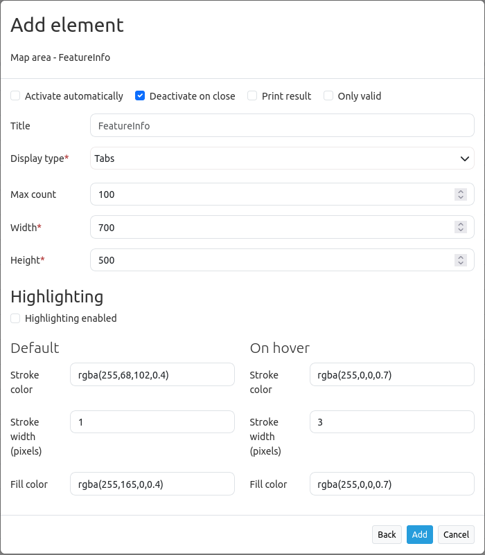

.. _feature_info:

Feature Info
************

This element provides feature info capabilities to Mapbender. It works for WMS services.

.. image:: ../../../figures/feature_info.png
     :scale: 80

Configuration
=============

* **Autoopen:** Enable or disable autoopening of the copyright window, when starting the application, default is disabled.
* **Deactivate on close:** true/false to deactivate the functionality after closing the result dialog, default is true.
* **Print Result:** offer a link to print the result of the featureInfo, default is false.
* **Title:** Title of the element. It will be indicated next to the button.
* **Tooltip:** Text used as a tooltip. It will be indacted when hovering with the mouse cursor over the button. It also used as a header in the copyright window.
* **Target:** Id of Map element to query.
* **Type:** Type of the information, Element or Dialog. Default and mandatory: Dialog.
* **Display:** Display of the information, Tabs or Accordion. 
* **Width/ Height:** width/ height of the dialog in px, default is 700/500.
* **Show original:** show the css-style of the original feature info result, default is false.
* **Only valid:** The parameter "Only valid" highly depends on the format of the GetFeatureInfo response. Example UMN: as long as the template defines a correct HTML head and body element (for example by referencing a header and footer file), Mapbender will interpret the result as valid. Are these head and body elements missing, Mapbender will interpret the result as not valid.

  * Please make sure, that the GetFeatureInfo Response is a valid HTML.
  * If you have defined ``text/plan`` as output-format, the switch ``only valid`` must not be activated because ``text/plain`` doesn't return valid HTML.

**Note:** It is possible to load WMS services dynmically into the application Via the information response of a FeatureInfo dialog. The WMS Loader is used for that feature. For further information take a look in the chapter `How to add a WMS by defining a link <../misc/wms_loader.html#how-to-add-a-wms-by-defining-a-link>`_.

Display as original and styled
------------------------------

With the option "Show Original" the original design of the FeatureInfo Response is used. If the option is deactivated, Mapbender tries to achieve an uniform representation.

Example original:

.. image:: ../../../figures/feature_info_original.png
     :scale: 80

Example styled:

.. image:: ../../../figures/feature_info_not_original.png
     :scale: 80             

Display as tabs and accordion
-----------------------------

With the switch "type" the responses of multiple services are displayed either in different tabs or in an accordion.

Example tabs:

.. image:: ../../../figures/feature_info_tabs.png
     :scale: 80

Example accordion:

.. image:: ../../../figures/feature_info_accordion.png
     :scale: 80

Printing the results
--------------------

The switch "print Result" allows you to print the output of the FeatureInfo. A Print button will appear on the FeatureInfo dialogue. The printing is done with the printing dialogue of the webbrowser.

To have all images and background-colors in your print-out you should check the printing-settings of your webbrowser: You can check in Firefox the option "Print background". In Chrome-based browsers the option is called "Background graphics". The used fonts can vary on a print-out as PDF and depends on the specific viewer. Furthermore most webbrowser modify the pages a bit before print-out to save ink/toner.

Button-Configuration
--------------------

You need a button to show this element. See :doc:`button` for the general configuration options. The following screen shot shows an example for a FeatureInfo Button which is activated the whole time until the user deactivates it. Another possibility is to close the FeatureInfo dialog, if that is configured with the option "deactivate on close".

* **Group:** featureinfo
* **Deactivate:** deactivate

.. image:: ../../../figures/feature_info_button.png
     :scale: 80

YAML-Definition:
----------------

.. code-block:: yaml

   title: FeaureInfo       # Titel des Elements
   tooltip: Feature Info   # text to use as tooltip
   type: dialog            # Default und mandatory: dialog.
   target: map             # Id of Map element to query
   autoActivate: false     # true/false open when application is started, default: false
   deactivateOnClose: true # true/false to deactivate the functionality after closing the result dialog, default is true
   onlyValid: null         # require correct HTML format of response, default: false
   printResult: false      # offer a link to print the result of the featureInfo, default: false
   showOriginal: false     # show the css-style of the original feature info result, default: false
   displayType: tabs       # tabs/accordion Default: tabs
   width: 700              # width of the dialog in pixels, default is 700
   height: 500             # height of the dialog in pixels, default is 500

Class, Widget & Style
============================

* **Class:** Mapbender\\CoreBundle\\Element\\FeatureInfo
* **Widget:** mapbender.element.featureInfo.js
* **Style:** mapbender.elements.css

HTTP Callbacks
==============

None.
