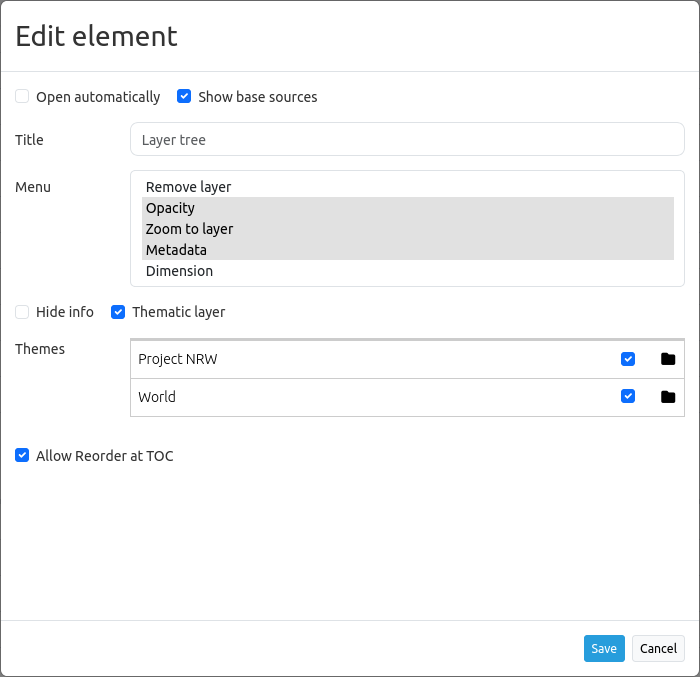

.. _layertree:

Layertree - Table of Content (TOC)
**********************************

Functions
=============

**What are the functionalities of the Layertree?**

* Display layers
* Display layergroups
* Display thematic layergroups (since version 3.0.5)
* Enabling and disabling layers
* Enabling and disabling queries for the layers
* Changing the order of layers
* Zoom to map extend of layers
* Query the metadata of layers

.. figure:: ../../../figures/layertree/layertree_example_dialog.png
           :scale: 80
           :alt: simple Layertree integrated as dialogue with a Layerset and Layer

           Simple Layertree integrated as dialogue with one Layerset and Layer.

.. figure:: ../../../figures/layertree/layertree_example_sidepane.png
           :scale: 80
           :alt: complex Layertree integrated in the sidebar with multiple Layersets divided into thematic groups

           Thematic Layertree integrated in the sidebar with multiple Layersets. 

To configure the Layer tree there are a few linking points to other elements that must be considered:

* `Layersets <../backend/layerset.html>`_
* `Map element <../basic/map.html>`_
* `Sources <../backend/source.html>`_

Configuration
=============

General Configuration
-----------------------

**What do we have to do?**

To use the different Layersets in our Layertree, various adjustments are necessary. These relate to:

#. Configuration of various Layersets,
#. Configuration of the map ( Map element) to display the Layersets 
#. Configuration of the Layertree itself

Through the use of the **Layersets**, the desired layers are included in the application. The instances are the references to the individual WMS services. With the plus-button **[1]** new Layersets can be created. Then, new layers can be integrated in the application by adding the existing instances **[2]**. The Layerset "overview " **[3]** is -as usual- used for displaying the overview map. 
For a detailed documentation on how the services can be integrated correctly, please head for to the documentation of the `layersets <../backend/layerset.html>`_ and `sources <../backend/source.html>`_. 

.. figure:: ../../../figures/layertree/layertree_configuration_layerset_en.png
           :scale: 80
           :alt: Configuration of various Layersets for integration into the Layertree.

           Configuration of various Layersets for integration into the Layertree.

In order to let the new integrated Layersets appear in the application, they must be specified in the `Mapelement <../basic/map.html>`_. 
Here, you define which Layersets you want to use in the map by checking **[1]** the Layersets in the list. The Layerset "overview " for example is not displayed on the main map. 
In this step, you define the order in which the Layersets appear in your Layertree and the map. You can move the created Layersets from the list [2] by drag & drop. Please notice that the first defined themes can cover underlying themes.

.. figure:: ../../../figures/layertree/layertree_configuration_map_en.png
           :scale: 80
           :alt:  Configuration in the map ( Map-Element ) to display the Layersets.

           Configuration in the map ( Map-Element ) to display the Layersets.

Workflow Layertree with basic functions 
----------------------------------------

In the following section, we walk through an exemplary configuration of a Layertree with basic functions in three steps: 

#. Configuration of a Layerset
#. Configuration of the map ( Mapelement) to display the Layerset
#. Configuration of the Layertree itself

In the example we defined one **Layerset** with one instance:

* Layerset World: 
    * Instance `OSM Demosource <https://osm-demo.wheregroup.com/service?&REQUEST=GetCapabilities&SERVICE=WMS&VERSION=1.3.0>`_

The instance of the OSM demosource is automatically included in the installation. Now this needs to be integrated into an existing Layerset. Change into the tab "Layersets". In the following example, the Layerset " YAML main" was renamed to " World ". 
In case of difficulties with the integration, the documentation of the `Layersets <../backend/layerset.html>`_ provides useful information.

.. figure:: ../../../figures/layertree/layertree_configuration_layerset_simple_en.png
           :scale: 80
           :alt: Configuration of a Layerset for integration into the simple Layertree.

           Configuration of a Layerset for integration into the simple Layertree.           

In the next step we configure the `Map element <../basic/map.html>`_ to display the Layersets in the **map**. To do this you need to change into the tab "Layouts" and edit the map element in the content. 
It is important, that you put a tick in the field of the Layerset "World" **[1]**, so it appears in the application afterwards. If you have questions for further configuration of the `Map element <../basic/map.html>`_  the documentation can help.

.. figure:: ../../../figures/layertree/layertree_configuration_map_simple_en.png
           :scale: 80 
           :alt:  Configuration in the map ( Map-Element ) to display the Layerset.

           Configuration in the map ( Map-Element ) to display the Layerset.

The last step is the configuration of the **Layertree**. 
The instances specified in the map element can be defined in more detail with the Layertree. If a predefined application has been copied, the Layertree should work now. If the element is newly created, it can already be used with the default settings without necessary further adjustments. 
For a better understanding of the functions and their usage we now edit the Layertree-element in the content.

.. figure:: ../../../figures/layertree/layertree_configuration_1_en.png
           :scale: 80 
           :alt: Configuration of the simple Layertree in the content.

           Configuration of the simple Layertree in the content.           

When configuring the Layersets the function Basesource is activated as default. This is important for the `BaseSourceSwitcher <../basic/basesourceswitcher.html>`_, which allows you to switch between predefined themes. By enabling  **Display BaseSources** [1], instances that have been loaded as a base source in the application, are displayed in the Layertree. 

The function **Display Header** [2] allows the inclusion of a headline in the Layertree.

.. figure:: ../../../figures/layertree/layertree_header_en.png
           :scale: 80 
           :alt: Headline in the Layertree.

           Headline in the Layertree.           

If you activate **Open automatically**, the Layertree is open on default when you start the application and must not be activated by clicking on a button or the unfolding of a sidebar. The **Title** [4] of the element is displayed in the "Layouts"-list and allows you to distinguish between different elements. The **Target** [5] is the ID of the map element. 

.. figure:: ../../../figures/layertree/layertree_title_en.png
           :scale: 80
           :alt: Title of the Layertree in the layout.

           Title of the Layertree in the layout.

By specifying a **Type** [6] the display of the Layertrees can be defined. There are two display options:

* *Dialog*
* *Element*

.. figure:: ../../../figures/layertree/layertree_type.png
           :scale: 80

:Dialog: 
  You should choose the type *Dialog* when the Layertree is integrated via a button and the configuration element is in the content.
:Element:
  You should choose the type *Element* when the Layertree is integrated via the sidepane. 

.. figure:: ../../../figures/layertree/layertree_type_map_en.png
           :scale: 80
           :alt: Type specification for the display of the Layertree.

           Type specification for the display of the Layertree.

.. figure:: ../../../figures/layertree/layertree_configuration_1_en.png
           :scale: 80 
           :alt: Setup of a simple layertree in the content-area.

           Setup of a simple layertree in the content-area.

Via the **Menu** [9] a number of buttons can be activated, which are then available in the layertree. 

* *Remove layer* (remove layer from the application)
* *Opacity* (change the opacity of a layer)
* *Zoom to layer* (zoom to the BBOX of the layer)
* *Metadata* (show the metadata of the layer)

.. figure:: ../../../figures/layertree/layertree_menu.png
           :scale: 80
           :alt: Configuration for the context-menu.

           Configuration for the context-menu.

The individual functions can be activated by clicking on the button. All active functions are highlighted in green. In addition next to each layer in the Layertree a symbol of the context menu appears. By clicking on the menu a window pops up and the individual features can be used. The menu can be closed by clicking on the x-button. 

.. figure:: ../../../figures/layertree/layertree_menu_map.png
           :scale: 80
           :alt: Context menu of the layer in the Layertree.

           Context menu of the layer in the Layertree.          

The slider in the Layertree context menu **[1]** regulates the function *Opacity*. By moving the green box you can adjust the opacity of each layer. The percent of the opacity is displayed as an integer in the box.

You can display the metadata of the layer by clicking on the Fact Sheet in the Layertree context menu **[2]**. If the service includes metadata, these will be displayed in a new dialog.

A click on the "x" in the Layertree context menu **[3]** allows you to remove a layer from the application for the duration of the session.

.. figure:: ../../../figures/layertree/layertree_menu_map.png
           :scale: 80
           :alt: Layertree context menu.

           Layertree context menu.

The function **Hide visibility by folders** [11] allows to save the configuration of the opacity. When active, the opacity of the layers is not displayed and can not be changed.

.. figure:: ../../../figures/layertree/layertree_configuration_1_en.png
           :scale: 80 
           :alt: Configuration of a simple Layertree in the content. 

           Configuration of a simple Layertree in the content.

By clicking on the "folder"-icon of the Layertree **[1]** to the left of the instance the embedded layers can be displayed. All layers that have been previously activated in the Layerset now appear in the list. The function **Hide not toggleable** [10] allows you to hide layers that don't contain multiple layers.  

.. figure:: ../../../figures/layertree/layertree_buttons.png
           :scale: 80
           :alt: Layertree Buttons.

           Layertree Buttons.

The checkbox next to the respective layer name **[2]** allows to turn a layer on and off. If the checkbox is set, the Layer will appear in the map. However, it will continue to respect the defined rules of the Layerset, such as scale-dependent display.

The "i"-icon next to a layer name **[3]** indicates if the FeatureInfo-function is enabled. The FeatureInfo-function is inactive if the "i"-icon is grayed out. If you activate the function with a click, the icon is dark gray and the requested information of the layer appears in a dialog box. 

The function **Hide info** [12] allows you to disable the FeatureInfo-function. Independent of the settings in the Layerset or source the FeatureInfo-function is no longer possible.

.. figure:: ../../../figures/layertree/layertree_configuration_1_en.png
           :scale: 80 
           :alt: Configuration of a simple Layertree in the content.

           Configuration of a simple Layertree in the content.

Workflow thematic Layertree
-------------------------------

In the following we walk through an exemplary configuration of a Layertree with advanced features such as the thematic layersets in three steps:

#. Configuration of multiple Layersets
#. Configuration of the map ( Map element) to display the Layerset
#. Configuration of the thematic Layertree itself

In the example, we defined two Layerset with two instances each:

* Layerset Project NRW:
  * Instance `DTK50 NRW <https://www.wms.nrw.de/geobasis/wms_nw_dtk50?&REQUEST=GetCapabilities&SERVICE=WMS&VERSION=1.3.0>`_ 
  * Instance `Wald NRW <http://www.wms.nrw.de/umwelt/waldNRW?&REQUEST=GetCapabilities&SERVICE=WMS&VERSION=1.3.0>`_
* Layerset World: 
  * Instance `OSM Demodienst <http://osm-demo.wheregroup.com/service?&REQUEST=GetCapabilities&SERVICE=WMS&VERSION=1.3.0>`_ 
  * Instance `GEBCO <https://www.gebco.net/data_and_products/gebco_web_services/web_map_service/mapserv?&REQUEST=GetCapabilities&SERVICE=WMS&VERSION=1.3.0>`_ 

For the configuraion of the Layersets the four services mentioned above were added as instances (Detailed information see above or in the documentation of the `Layersets <../backend/layerset.html>`_ and `Sources <../backend/source.html>`_).

For this example, the above mentioned steps were performed to add the Layerset "World" **[2]** with the instance "osm". Now we add the instance "GEBCO" in this Layerset. 
To use the thematic grouping we create a new Layerset named "Project NRW" **[3]** and load the two instances "DTK50 NRW" and "Forest NRW" into our new Layerset "Project NRW".  

.. figure:: ../../../figures/layertree/layertree_configuration_layerset_komplex_en.png
           :scale: 80
           :alt: Configuration of Layersets for thematic Layertree.

           Configuration of Layersets for thematic Layertree.

The Layerset should now contain three Layersets. The **Overview** [1] for the overview map, the **World**-Layerset [2] with the world-/ Germany-wide data and the **Project NRW** Layerset [3] with the two regional data sets from NRW. 

Now we configurate the `map element <../basic/map.html>`_  to display the Layersets in the map. To do this we switch to the tab "layout" and edit the feature in the content area.
It is now important that you set an active checkbox in the Layerset "World" AND Layerset "Project NRW" **[1]**, so that they appear later in the application.
If you have questions for further configuration of the map, you can view the documentation of the `map element <../basic/map.html>`_.

           Configuration of Layersets for thematic Layertree.

The last step is the creation of the Layertree itself.
The instances in the `map element <../basic/map.html>`_  can be defined in more detail via the Layertree. For a general understanding of the functions and introduction tutorial to create a Layertree please note the already declared settings in the workflow for the simple Layertree.

.. figure:: ../../../figures/layertree/layertree_configuration_1_en.png
           :scale: 80 
           :alt: Configuration of the simple Layertree.

           Configuration of the simple Layertree.

For the thematic Layertree we bind the element to the sidebar. For the integration into the Sidepane sector the element needs the type *Element* **[6]**.

.. figure:: ../../../figures/layertree/layertree_type.png
           :scale: 80
           :alt: Configuration of the type "Element".

           Configuration of the type "Element".

If the option **Thematic layer** is disabled the Layertree ignores the configured Layersets and shows the individual instances without thematic structuring in the main level. However, we want to show the layers of our thematic Layersets, so we activate the function **Thematic layer** [1].
Since we inserted both Layersets into the `map element <../basic/map.html>`_ of the application, they are now displayed under the **Themes**-area.

           Configuration of the thematic Layertree in the content

Thus, to let the **themes** in the application appear as you want, there are several configuration options:

.. figure:: ../../../figures/layertree/layertree_configuration_thematic_map_en.png
           :scale: 80

:[1] View theme:
  If this option is set, the Layerset appears as an additional level . If this option is not set, the defined instances are displayed in the main level.
:[2] Theme open or closed:
  If this option is set (symbol of the open folder), the theme in the Layertree is automatically opened or closed.
:[3] Theme source visibility:
  If this option is set, the "Show/ Hide source"-button is added in the Layertree.
:[4] Theme layer visibility:
  If this option is set, the "Activate all Layers"-button is added in the Layertree.

If we keep the default settings in the Theme Set "World" and activate the other options in the Theme Set "Project NRW", the configuration of the element will look like this:

.. figure:: ../../../figures/layertree/layertree_example_sidepane_config_en.png
           :scale: 80
           :alt: Configuration of the thematic Layertree in the content.

           Configuration of the thematic Layertree in the content.

Now we have the Layersets integrated as thematic groups. By configuring the thematic layer, the Layertree appears now like this:

.. figure:: ../../../figures/layertree/layertree_example_sidepane.png
           :scale: 80
           :alt: Configuration of the thematic Layertree in the sidepane.

           Configuration of the thematic Layertree in the sidepane.

The Layerset "World" is displayed as a theme, but it is not open and the two buttons are not available. In the Layerset "Project NRW" the theme is shown unfolded upon opening the application. The button for displaying/ hiding the source is available and all layers can be activated via a button.

YAML-Definition:
=================

.. code-block:: yaml
                
  title: layertree             # title of layertree
  target: ~                    # Id of the Map element to query
  type: ~                      # type of layertree, element or dialog
  useAccordion: false          # accordion element, default is false
  autoOpen: false              # true/false open when application is started, default is false
  showBaseSource: true         # show base layer, default is true
  showHeader: true             # shows a headline which counts the number of services
  menu: [opacity,zoomtolayer,metadata,removelayer]  # show contextmenu for the layer (like opacity, zoom to layer, metadata, remove layer), default is menu: []
..
   .. image:: ../../../figures/layertree/layertree_configuration_pre305.png
        :scale: 80

You can optionally use a button to show this element. See :ref:`button` for inherited configuration options. You also can define the layertree with a type element. Then you can display the layertree in a frame like the sidebar.

Class, Widget & Style
======================

* **Class:** Mapbender\\CoreBundle\\Element\\Layertree
* **Widget:** mapbender.element.layertree.js
* **Style:** mapbender.elements.css

HTTP Callbacks
==============

None.
