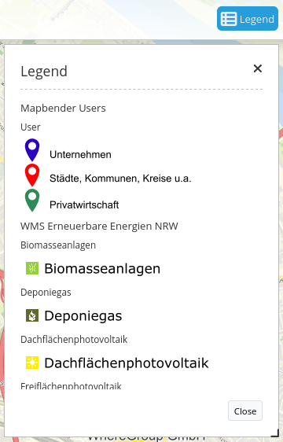
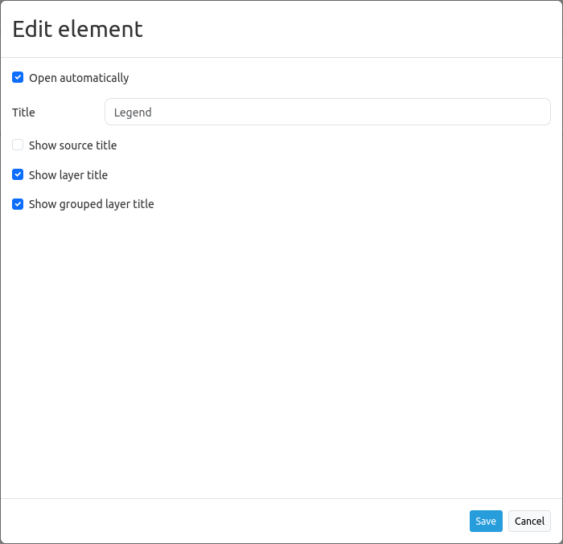
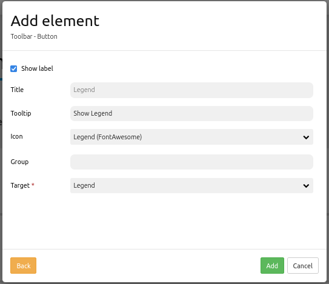

.. _legend:

Legend
******

The legend object shows a legend of the layers that are displayed in the map. Every single layer is listed which includes point, line and/or polygon objects.

Configuration
=============

.. image:: ../../../figures/legend_configuration.png
     :scale: 80

* **Autoopen:** If set true, the legend opens when the application is started. Default is true.
* **Hide empty layers:** hide layers from legend if they contain no objects, default is true.
* **Title:** Title of the element. The title will be listed in "Layouts". Is also shown next to the button, if "Show layer title" is true.
* **Tooltip:** Text that will be indicated if the mouse hovers over the legend for a longer time.
* **Elementtype:** Sets output as a dialog or blockelement, default is dialog.
* **Display type:** Accordion-like display or list. Default is list.
* **Target:** Id of Map element to query.

* **Generate legend url:** generates a GetLegendGraphic-URL if operation GetLegendGraphic is supported, default is false.
* **Show source title:** shows WMS/source title, default is true.
* **Show layer title:** shows layer title, default is true.
* **Show grouped layer title:** shows group title for grouped layers, default is true.

The Legend element is integrated via a button or in the sidepane. If you look for configurational details for the button, head over to this page: `Button <../misc/button.html>`_.

Configuration: Examples:
=======================

Legend in the Sidepane:
-----------------------
If yout want to integrate a legend to the sidepane, click the ``+`` -button in the "Layouts"-tab (section "Sidepane").

Then, choose the element "Legend" in the appearing window. The configurational dialog "Add element – Legend" will open.

Our configured element has the title "Legend". It is defined as *Elementtype* "blockelement", because it is integrated into the sidepane. *Display type* is set to "list" and *target* is set to "Main Map". The legends opens automatically (set checkbox *Autoopen*) and hides all layers which do not include objects (set checkbox *Hide empty layers*). Moreover, the layer title and the title of all grouped layers appears (set checkboxes *Show layer title* and *Show grouped layer title*).

Given this configuration, the result looks like this:

.. image:: ../../../figures/de/legend_example_sidepane.png
     :scale: 80

It is recommended that a legend element is always set as "blockelement" if integrated into the sidepane. If it is set as *Element type* "dialog", a pop up window opens and the legend will not be shown in the sidepane. If configured wrong, you can only see the heading ("Legend") in the sidepane. If the dialog is closed, it is impossible to bring it back via the frontend surface. If the legend should be integrated in the toolbar, the best way is to configure it with a "Button" element.

Legend in the toolbar:
----------------------
The legend element can be integrated with a button in the toolbar. First step: Integrate the legend element. Open the application backend and add the element into the content section of the Layout-tab.

.. image:: ../../../figures/de/add_content.png
     :scale: 80

In this example, the following settings are chosen:

.. image:: ../../../figures/legend_example_toolbar_dialog.png
     :scale: 80

As always, it is important to set the *Element type* to the appropriate setting - in this case, "dialog". In our example, the checkbox *Autoopen* is dismissed. Therefore, the legend opens with a click on the button.
This button has to be implemented into the toolbar section. For detailed instructions on buttons, see the Mapbender-Documentation page `Button <../misc/button.html>`_.

The configuration of a button can look like this:

Following the above instructions, the result in the application looks like this:

.. image:: ../../../figures/de/legend_example_toolbar.png
     :scale: 80

The toolbar shows the button for the legend element. If the button is clicked, the dialog with the generated legend opens.

The activation and deactivation of checkboxes in the configurational settings lead to:

.. image:: ../../../figures/de/legend_example_toolbar_oOTDTETGE.png
     :scale: 80

.. image:: ../../../figures/de/legend_example_toolbar_TDTETGE.png
     :scale: 80

.. image:: ../../../figures/de/legend_example_toolbar_TETGE.png
     :scale: 80

YAML-Definition:
----------------

.. code-block:: yaml

   tooltip: 'Legend'                    # text to use as tooltip
   elementType: dialog                  # dialog/blockelement, default is dialog
   autoOpen: true                       # true/false open when application is started, default is true
   displayType: list                    # accordion/list type of display, default is list
   target: ~                            # Id of Map element to query
   hideEmptyLayer: true                 # true/false hide when no legend is available, default is true
   generateGetLegendGraphicUrl: false   # true/false generate GetLegendGraphic-Url if the operation GetLegendGraphic is supported, default is false
   showWmsTitle: true                   # true/false show WMS title, default is true
   showLayerTitle: true                 # true/false show layer title, default is true
   showGroupedLayerTitle: true          # true/false show group title for grouped layers, default is true

You can optionally use a button to show this element. See :ref:`button` for inherited configuration options. You also can define the layertree with type element. Then you can display the layertree in a frame like the sidebar.

Class, Widget & Style
============================

* **Class:** Mapbender\\CoreBundle\\Element\\Legend
* **Widget:** mapbender.element.legend.js
* **Style:** mapbender.element.legend.css

HTTP Callbacks
==============

None.
