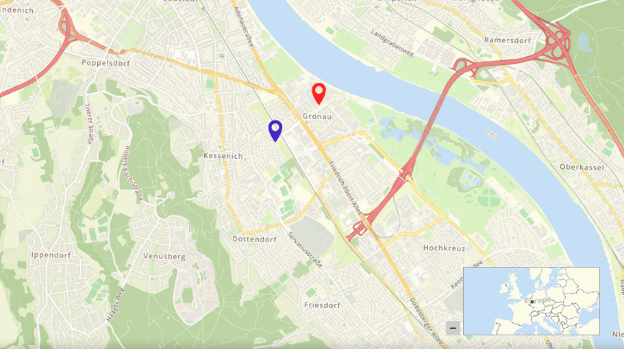

.. _overview:

Overview
********

The Overview element provides a control of an overview map, similar to the OpenLayers Overview control. This element though is easier to use when custom styling is needed.

You can define the size of your overview window and a position. Refer to a layerset that you defined before for the services to display in the overview map. The overview map can be fixed or can zoom when you zoom in/out in the main map. You also can define whether the overview map is minimized or maximized on start of the application.

.. image:: ../../../figures/overview.png
     :scale: 80

Configuration
=============

The Overview element must be placed in the Configuration underneath the Map element.

.. image:: ../../../figures/overview_configuration_dependency_map.png
   :scale: 80

The configuration dialog:

.. image:: ../../../figures/overview_configuration.png
     :scale: 80

* **Maximize:** true/false to open/close on start, default is true.
* **Fix:** true/false to fix the overview extent, default is true.
* **Title:** Title of the element. The title will be listed in "Layouts" and allows to distinguish between different buttons. It will be indicated if "Show label" is activated.
* **Tooltip:** text to use as tooltip.
* **Layerset:** refer to a layerset f.e. overview, define the layerset first and refer to it.
* **Target:** Id of Map element to query.
* **Anchor:** overview alignment, default is 'right-top'.
* **Width/ Height:** overview width and height.

Configuration example
=====================

There are different settings for the overview element:

.. image:: ../../../figures/overview_example_dialog.png
     :scale: 80

In the configuration example we implement the element (*Title*) "Overview". With *Layerset* we can select all previously implemented layersets. In this example we have two to choose from:

.. image:: ../../../figures/map_example_layersets.png
     :scale: 80

For the overview we choose the layerset overview. As *Target* we choose the element referenced. *Anchor* defines where the overview will be implemented (left-top, left-bottom, right-top or right-bottom). In this instance we choese right-bottom. *Width* and *Height* define the size of the window displaying the overview. Default settings are 200 and 100. Additionally it is possible to check the boxes *Maximize* and *Fix*. For the configuration example both checkmarks are set. Because of this the aplication will be maximized when opened. Additionally the map view is fixed. The excerpt shown of the map in the overview window wont change when the map is dragged and shows the maximum extend defined in `Map Element <map.html>`.

If the overview isnt fixed (unchecked *Fix*), the overview will change, if the map is zoomed or dragged. The default view is the defined start extend.
For the following parameter (no check of *Fix*, *Anchor*, left-bottom, *Width* 400 and *Height* 200):

.. image:: ../../../figures/overview_example_dialog_left-bottom.png
     :scale: 80

The overview will look like this:

.. image:: ../../../figures/de/overview_example_left-bottom.png
     :scale: 80