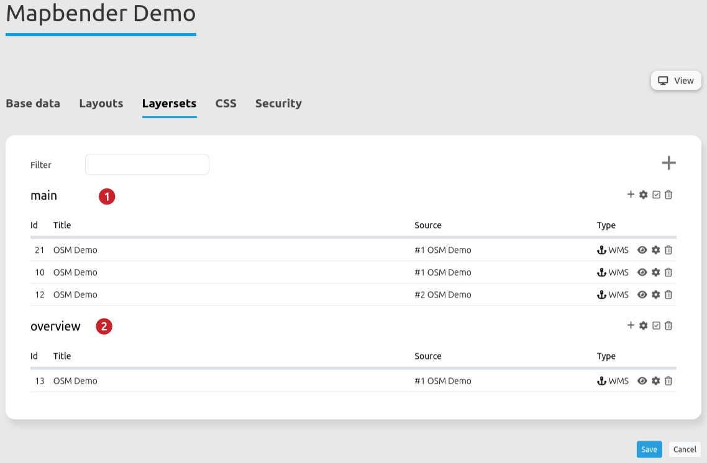
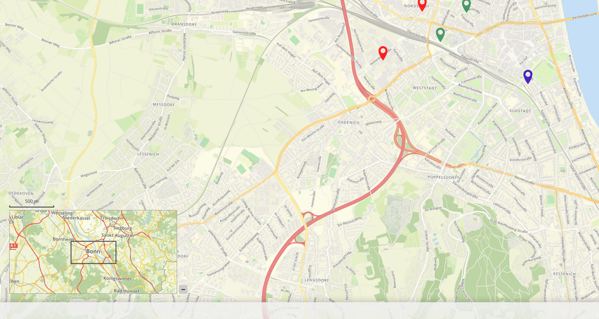

.. _overview:

Overview
********

Mapbender provides an overview map in addition to its main map. This element can be individually adjusted in terms of size, position and zoom behaviour. The overview map refers to a specific layerset and the instance(s) it contains.

.. image:: ../../../figures/overview.png
     :scale: 80

Configuration
=============

The configuration dialog offers the following settings:

.. image:: ../../../figures/overview_configuration.png
     :scale: 80

* **Maximize:** Opens the element on start (Default: true).
* **Fix:** Fixes the overview extent (Default: false).
* **Title:** Title of the element, will be listed in "Layouts".
* **Layerset:** Refers to a previously defined layerset, e.g. overview.
* **Width/Height:** Width and height of the element.
* **Position:** Position of the overview map frame in the application; options are: top left, bottom left, top right and bottom right.

Configuration example
=====================

.. image:: ../../../figures/overview_configuration_example.png
     :scale: 80

The element provides various configuration options. In the example, the settings *Maximize* and *Fix* are activated. As a result, the element is displayed (i.e. maximized) when the application is opened and the view of the map is fixed. If the latter function is deactivated, the overview adapts as soon as the map is moved or the scale is changed. The start extent is displayed when the application is opened. In the example, the element has the title "Overview". It is necessary that the overview map is linked to a layerset. The following layersets are available:

In the example, the layerset "Overview" was chosen. Width and height of the element correspond to the default setting. The position is defined as "lower right". The element looks like this in the application:

.. image:: ../../../figures/de/overview_example_right-bottom_fixed.png
     :scale: 80

For the following parameters (unchecking *Fix*, *Position*: left-bottom, *Width* 400 and *Height* 200), overview will look like this:

YAML-Definition:
----------------

.. code-block:: yaml

   tooltip: 'Overview'          # text to use as tooltip
   target: ~                    # Id of Map element to query
   layerset: ~                  # refer to a layerset, e.g. overview, define the layerset first and refer to it
   width: 200                   # overview width
   height: 100                  # overview height
   anchor: 'right-top'          # overview alignment, default is 'right-top'
                                # use inline e.g. in sidebar
                                # Options: 'inline', 'left-top', 'right-top', 'left-bottom', 'right-bottom'
   position: ['0px', '0px']     # overview position in relation to anchor, default: x=0px, y=0px
   maximized: true              # true/false to open/close on start, default is true
   fixed: true                  # true/false to fix the overview extent, default is true

