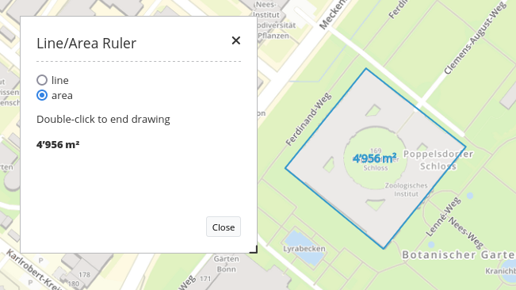

.. _ruler:

Line/Area Ruler
***************

The ruler is used to draw a line or area and display length/area in a dialog. You need a button to show this element. See :ref:`button` for inherited configuration options.
To use both functions (measuring areas and lines) in an application, you need two buttons that are in the same pre-defined group. Selecting a type determines whether the element measures lines or areas. Each ruler element can only measure either lines or areas.

Configuration
=============

.. image:: ../../../figures/ruler_configuration.png
     :scale: 80

* **Title:** Title of the element. It will be displayed in the measuring window in the application itself.
* **Target:** ID of Map element to query.
* **Type:** Choose type of element: line or area.

YAML-Definition:
----------------

This template can be used to insert the element into a YAML application.

.. code-block:: yaml

   title: mb.core.ruler.tag.line             # Choose 'line', 'area' or another title
   class: Mapbender\CoreBundle\Element\Ruler # Class of element
   target: map                               # ID of Map element to query, e.g. 'map'
   type: line                                # Choose type 'line' or 'area'

