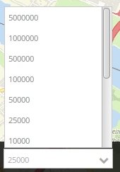

.. _scale_selector:

Scale Selector
***************

Displays a selctbox with scales. The map scale changes when an value from the selectbox is choosen. 
Notice: The Selectbox offers the scales that are defined for the map-Element.

Configuration
=============

.. image:: ../../../figures/scale_selector_configuration.png
     :scale: 80

* **show label:** true, to label the Scale Selector. The default-value is false.
* **Title:** Title of the element. The title will be listed in "Layouts" and allows to distinguish between different buttons. It will be indicated if "Show label" is activated.
* **Tooltip:** text to use as tooltip
* **Target:** Id of Map element to query.

YAML-Definition:
----------------

.. code-block:: yaml

   tooltip: "Scale"  # text to use as tooltip
   target: ~         # Id of Map element to query
   label: false      # false/true to label the scale selector, default is false

CSS-Styling
===========

You can overwrite the style of the element, for example the width with the following statement:

.. code-block:: css

                .mb-element-scaleselector.dropdown { 
                    width: 200px; 
                 }

   
Class, Widget & Style
============================

* **Class:** Mapbender\\CoreBundle\\Element\\ScaleSelector
* **Widget:** mapbender.element.scaleselector.js
* **Style:** mapbender.elements.css

HTTP Callbacks
==============

None.
