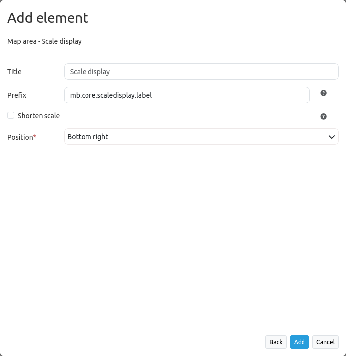

.. _scaledisplay:

ScaleDisplay
***********************

The ScaleDisplay displays the current map scale (1:1K or 1: 1000).

.. image:: ../../../figures/de/scaledisplay.png
     :scale: 100

.. image:: ../../../figures/de/scaledisplay_unit.png
     :scale: 100

Configuration
=============

* **Title:** Title of the element. The title will be listed in "Layouts" and allows to distinguish between different buttons.
* **Tooltip:** Text to use as tooltip.
* **Target:** ID of the Map element to query.
* **Scale prefix:** Prefix, shown with scale.
* **Unit prefix:** Prefix, shown with unit.
* **Anchor:** ScaleDisplay alignment, default is 'right-bottom' (use inline f.e. in sidebar).

YAML-Definition:
----------------

.. code-block:: yaml

   tooltip: 'ScaleDisplay'          # text to use as tooltip
   target: ~                        # ID of Map element to query
   anchor: 'inline'/'left-top'/     # ScaleDisplay alignment, default is 'right-bottom'
     'left-bottom'/'right-top'/     # use inline f.e. in sidebar
     'right-bottom'
   scalePrefix: Scale               # prefix, shown with scale
   unitPrefix: false                # prefix, shown with unit

Class, Widget & Style
============================

* **Class:** Mapbender\\CoreBundle\\Element\\ScaleDisplay
* **Widget:** mapbender.element.scaledisplay.js
* **Style:** mapbender.element.scaledisplay.css

HTTP Callbacks
==============

None.
