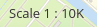

.. _scaledisplay:

ScaleDisplay
***********************

The ScaleDisplay displays the current map scale (1:1K or 1: 1000).

.. image:: ../../../figures/scaledisplay.png
     :scale: 100

Configuration
=============

.. image:: ../../../figures/scaledisplay_configuration.png
     :scale: 80

* **Title:** Title of the element. The title will be listed in "Layouts" and allows to distinguish between different buttons.
* **Tooltip:** Text to use as tooltip.
* **Target:** ID of the Map element to query.
* **Scale prefix:** Prefix, shown with scale.
* **Unit prefix:** Prefix, shown with unit, e.g. 1K as 1000.
* **Anchor:** ScaleDisplay alignment, default is 'right-bottom' (use inline e.g. in sidebar).