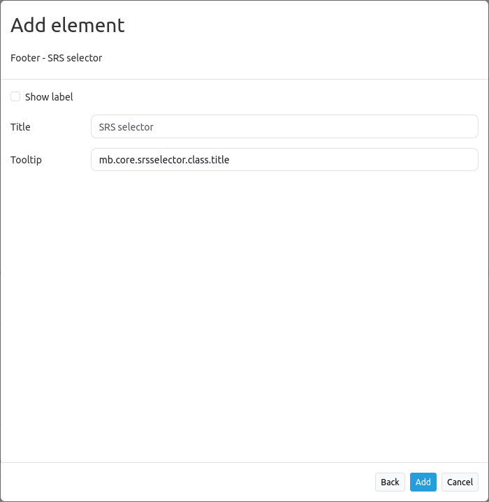

.. _srs_selector:

Spatial Reference System Selector (SRS Selector)
********************************************************

The spatial reference system selector changes the map's spatial reference system.
Notice: The Selectbox offers the SRS that are defined for the `map element <map.html>`_.

.. image:: ../../../figures/de/srs_selector.png
     :scale: 100

Configuration
=============

* **Title:** Title of the element. The title will be listed in "Layouts" and allows to distinguish between different buttons. It will be indicated if "Show label" is activated.
* **Tooltip:** text to use as tooltip.
* **Target:** Id of Map element to query.

YAML-Definition:
----------------

.. code-block:: yaml

   tooltip: 'SRS Selector'  # text to use as tooltip
   label: false             # true/false to label the srs selector, default is false
   target: ~                # Id of Map element to query

Class, Widget & Style
=====================

* **Class:** Mapbender\\CoreBundle\\Element\\SrsSelector
* **Widget:** mapbender.element.srsselector.js
* **Style:** mapbender.elements.css

HTTP Callbacks
==============

None.
