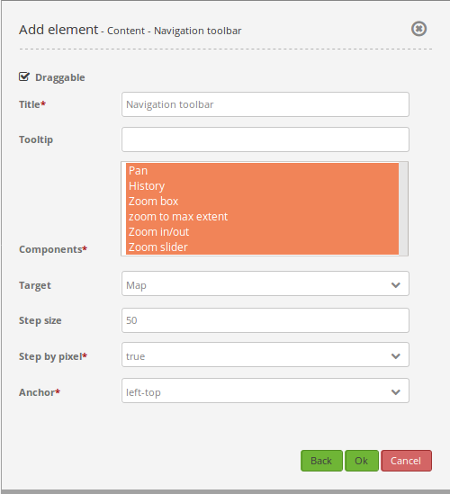
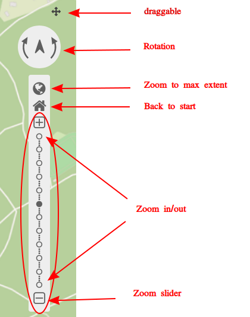
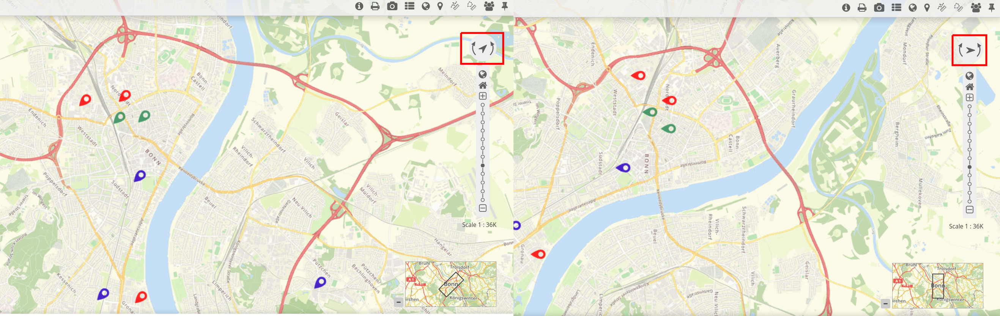
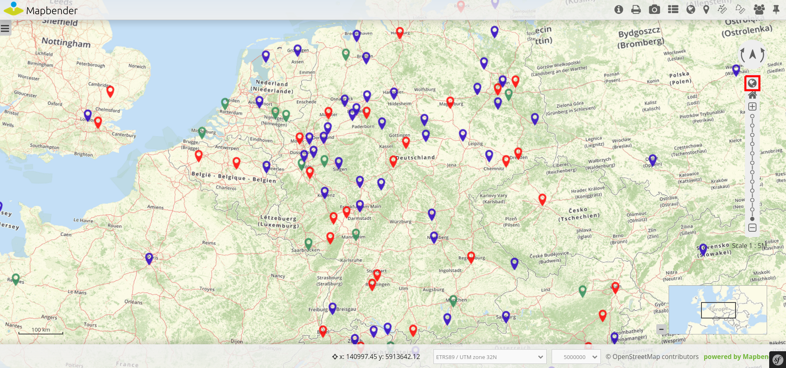
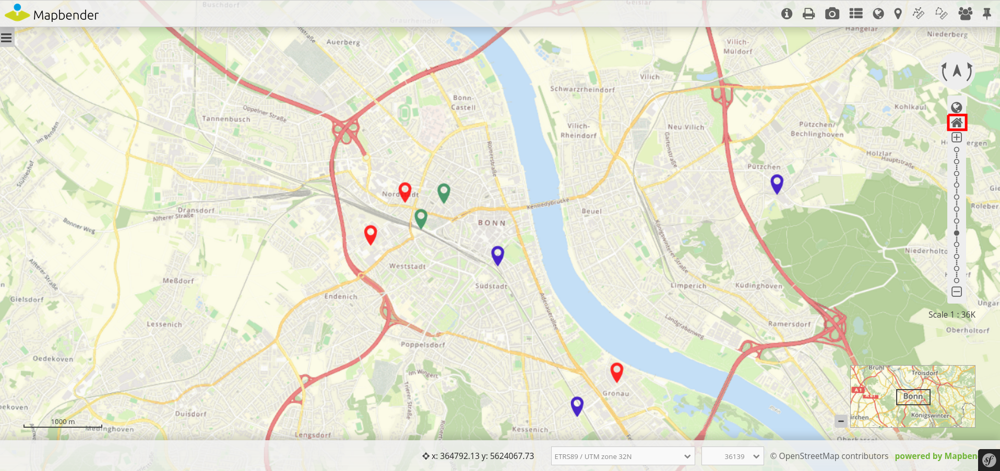
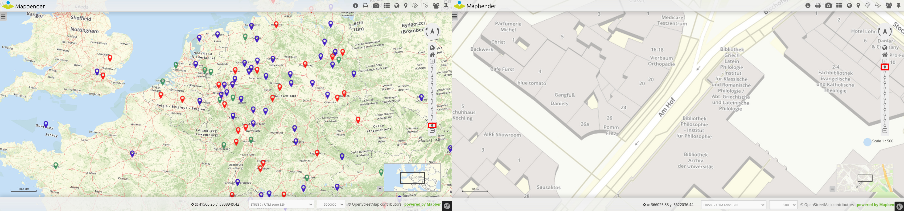

.. _zoom_bar:

Navigation Toolbar (Zoombar)
******************************

This element simplifies navigation within the map via rotation and zoom. Different scales can be selected from a bar or slider. Users also have the option to zoom to max extent or return to the start configuration. The zoombar itself is draggable.

.. image:: ../../../figures/zoom_bar.png
     :scale: 80

Configuration
=============

* **Draggable:** Element is draggable or not (default: true)
* **Title:** Title of the element. The title will be listed in "Layouts" and allows to distinguish between different buttons. It will be indicated if "Show label" is activated.
* **Target:** ID of Map element to query.
* **Tooltip:** Text to use as tooltip.
* **Components:** Components of the navigation toolbal (all selected by default). Options: Rotation, zoom to max extent, Back to start, Zoom in/out, Zoom slider
* **Back to start:** Resets layer settings (default: false).
* **Position:** Navigation toolbar alignment, default is 'left-top' (use inline e.g. in sidebar). Options: inline (for using the element in the sidepane), left-top, left-bottom, right-top, right-bottom

Components of the Navigation Toolbar element:
---------------------------------------------

You can integrate various different *components* in the configuration dialog box. These components include:

* Rotation
* Zoom to max extent
* Zoom to start
* Zoom in/out
* Zoom slider

In the application these components look like this:

If you set a tick at **Draggable**, then a small cross will appear next to the navigation toolbar that allows the user to move the element around.

**Rotation** enables changes of the map orientation. The following figure displays the map after one (left) and two (right) rotations. A click on the north arrow allows for a restoration of the original rotation.

Users can zoom to their smallest scale by **Zoom to max extent**. This *Max Extent* can be set individually in the `map element <map.html>`_ of the content.

It is possible to restore the initial center, scale, SRS and rotation with **Zoom to start**.

**Zoom in/out** allows to zoom in (``+`` -button) and out (``–`` -button) of the map. The element automatically sets to the next higher or lower scale. Zoom steps can be defined in the map element as well. There users also have the option to deactivate fixed zoom steps.
The component **Zoom slider** already includes *Zoom in/out*. Additionally, the user can select different scales from a bar.

YAML-Definition:
----------------

This template can be used to insert the element into a YAML application.

.. code-block:: yaml

   tooltip: 'Navigation Toolbar'    # text to use as tooltip
   components: ["rotation",         # components of the navigation toolbar (default: all selected)
   "zoom_max", "zoom_home",
   "zoom_in_out", "zoom_slider"]
   target: ~                        # ID of Map element to query
   stepsize: 50                     # step value for pan
   stepbypixel: false               # step type "by pixel"/"percent", false = percent (default: false)
   anchor: left-top                 # navigation toolbar alignment (default: 'left-top')
                                    # use inline e.g. in sidebar
                                    # Options: 'inline', 'left-top', 'left-bottom', 'right-top', 'right-bottom'
   draggable: true                  # element is draggable or not (default: true)
   zoomHomeRestoresLayers: false    # resets layer settings (default: false)

