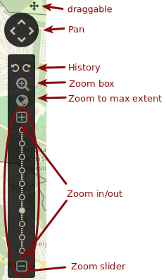
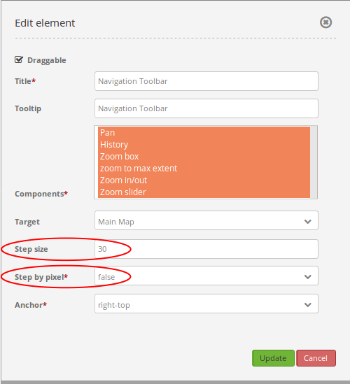

.. _zoom_bar:

Navigation Toolbar (Zoombar)
******************************

The Navigation Toolbar element provides a control to pan and zoom, similar to the OpenLayers PanZoomBar control. You can zoom to different zoom levels with the different components of this element. It is possible to zoom by creating a zoom box, but also by clicking on the different scales in the zoom bar. With the feature Zoom to max extent you have the possibility to zoom fast to the maximal spatial extent.

.. image:: ../../../figures/de/zoom_bar.png
     :scale: 80

Configuration
=============

.. image:: ../../../figures/zoom_bar_configuration.png
     :scale: 80

* **Draggable:** element is draggable or not, default true.
* **Title:** Title of the element. The title will be listed in "Layouts" and allows to distinguish between different buttons. It will be indicated if "Show label" is activated.
* **Tooltip:** text to use as tooltip.
* **Components:** components of the navigation toolbar, default all selected; Options: Pan, History, Zoom box, Zoom to max extent, Zoom in/out, Zoom slider
* **Target:** Id of Map element to query.
* **Step size:** step value for pan.
* **Step by pixel:** step type "by pixel"/"percent", false = percent, default is false.
* **Anchor:** navigation toolbar alignment, default is 'left-top' (use inline f.e. in sidebar); options: inline (for using the element in the sidepane), left-top, left-bottom, right-top, right-bottom

Components of the Navigaton Toolbar element:
---------------------------------------------
You can integrate various different *components* in the configuration dialog box. These components include:

* Pan
* History
* Zoom box
* Zoom to max extent
* Zoom in/out
* Zoom slider

In the application these components look like this:

In the application you can also see if the option *Draggable* is checked. You can move the navigation toolbar by clicking, holding and moving the small cross.

With the component **Pan** it is possible to move the map. By clicking on one of the four arrows you can move the map to the corresponding direction. It is possible to configure the step size in the configuration dialog box with the fields *Step size* and *Step by pixel*. If you set *Step by pixel* to true, the unit of the value in the field "Step size* is pixel. If it is set to false, the unit is percent. The value in *Step size* defines how far the map will be moved by clicking on the arrows.

If you configure the navigation toolbar like the example in the image, the map will be moved by 30% by clicking on one of the arrows. If you click on the north arrow the map will look like this:

.. image:: ../../../figures/de/navigationtoolbar_example_step_30percent.png
     :scale: 60

The component **History** contains two arrows. By clicking on the left arrow (back) the map view and zoom level change to the preview view. With the right arrow (forward) you can switch to the newer map view or zoom level. To clarify this feature, you can see an example here:

.. image:: ../../../figures/de/navigationtoolbar_example_history.png
     :scale: 60

Map view 1: the view of the city center of Bonn with a scale of 1:25.000

Map view 2: Zoom in to a scale of 1:10.000

Map view 3: Move the map view to Beuel with a scale of 1:10.000

The current view is now map view 3. By clicking on the left arrow (back), the view jumps back to map view 2. When you click on the left arrow (back) once more, you can see map view 1 with a scale of 1:25.000. By clicking on the right arrow (forward), map view 2 appears, etc.

The component **Zoom box** allows you to create a zoom box. The area, which is covered by the box, equals the area which will be zoomed to. With this feature you have the possibility to zoom fast and precise to the desired area.

.. image:: ../../../figures/de/navigationtoolbar_example_zoombox.png
     :scale: 60

With the component **Zoom to max extent** you can zoom fast to the *Max. Extent*, which is defined in the `map element <map.html>`_. You can only zoom to the *Max. Extent*, when you have defined the corresponding zoom level before. If it is not possible to zoom to the maximal map extent, the map will be shown with the maximum scale.
By clicking on *Zoom to max extent* and a maximum scale of 1:5.000.000 the map view looks like this:

.. image:: ../../../figures/de/navigationtoolbar_example_maxextent_5mio.png
     :scale: 60

With a maximum scale of 1:1.000.000 the map view looks like this:

.. image:: ../../../figures/de/navigationtoolbar_example_maxextent_1mio.png
     :scale: 60

With the component **Zoom in/out** you can zoom in by clicking on the ``+`` - symbol or zoom out by clicking n the ``–`` - symbol. With this feature you can change the zoom level to the next larger or next smaller scale. The scales can be defined in the `map element <map.html>`_. Depending on the defined scales, you can create larger or smaller steps in the zoom levels.

.. image:: ../../../figures/de/navigationtoolbar_example_zoominout.png
     :scale: 80

The component **Zoom slider** contains the component *Zoom in/out*. Additionally you have the possibilty to choose the zoom level by clicking on the different dots in the zoom bar. If you hover the mouse over the different dots, you can see the corresponding scale (see image). These scales are also defined in the `map element <map.html>`_. The filled dot shows the current scale. By clicking on a different dot you can change directly to another scale.

.. image:: ../../../figures/de/navigationtoolbar_example_zoomslider.png
     :scale: 80

YAML-Definition:
----------------

.. code-block:: yaml

   tooltip: 'Navigation Toolbar'    # text to use as tooltip
   components: ["pan","history",    # components of the navigation toolbar, default all selected
   "zoom_box","zoom_max",
   "zoom_slider"]
   target: ~                        # Id of Map element to query
   stepsize: 50                     # step value for pan
   stepbypixel: false               # step type "by pixel"/"percent", false = percent, default is false
   anchor: left-top                 # navigation toolbar alignment, default is 'left-top'
                                    # use inline f.e. in sidebar
                                    # Options: 'inline', 'left-top', 'right-top', 'left-bottom', 'right-bottom'
   draggable: true                  # element is draggable or not, default true

Class, Widget & Style
============================

* **Class:** Mapbender\\CoreBundle\\Element\\ZoomBar
* **Widget:** mapbender.element.zoombar.js
* **Style:** mapbender.element.zoombar.css

HTTP Callbacks
==============

None.
