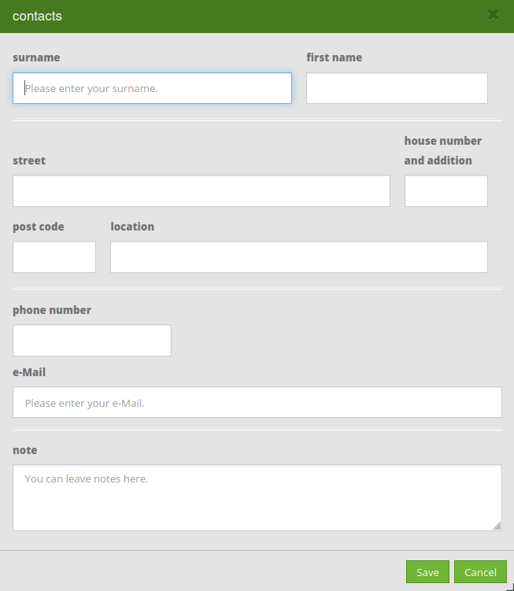
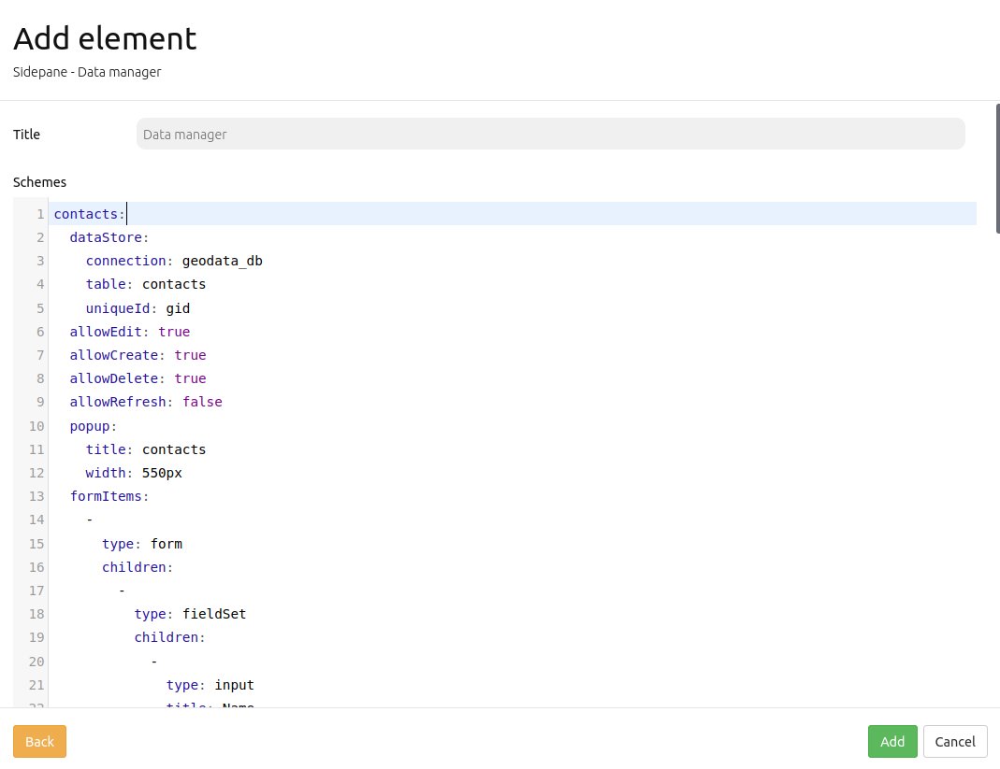

.. _datamanager:

Data Manager
************

The functionality of the Data Manager is similar to that of the 'Digitizer<digitizer.html>`_. However, the Data Manager only saves technical data, i.e. it does not store any geometry information.

Configuration example
---------------------

The Data Manager can for instance be used to store contact information.

.. image:: ../../../figures/data_manager.png
     :scale: 80

In the presented example, an input template is opened after click on the ``+`` -button. 
    

     
Setup
-----------

In order to use the Data Manager, a database connection has to be set up. Further information can be found in the chapter about the `configuration of a database <../../customization/yaml.html>`_.

The element can afterwards be integrated in the sidepane.
     

YAML-Definition
---------------

In the following, the YAML-Code of the formerly presented configuration example is displayed:

.. code-block:: yaml

contacts:
  dataStore:
    connection: geodata_db
    table: contacts
    uniqueId: gid
  allowEdit: true
  allowCreate: true
  allowDelete: true
  allowRefresh: false
  popup:
    title: contacts
    width: 550px
  formItems:
    -
      type: form
      children:
        -
          type: fieldSet
          children:
            -
              type: input
              title: surname
              placeholder: 'Please enter your surname.'
              name: surname
              css:
                width: 60%
            -
              type: input
              title: 'first name'
              name: first name
              css:
                width: 40%
        -
          type: breakLine
        -
          type: fieldSet
          children:
            -
              type: input
              title: street
              name: street
              css:
                width: 80%
            -
              type: input
              title: 'house number and addition'
              name: housnr
              css:
                width: 20%
        -
          type: fieldSet
          children:
            -
              type: input
              title: 'post code'
              name: post code
              css:
                width: 20%
            -
              type: input
              title: location
              name: location
              css:
                width: 80%
        -
          type: breakLine
        -
          type: fieldSet
          children:
            -
              type: input
              title: 'phone number'
              name: phone
        -
          type: input
          title: e-Mail
          placeholder: 'Please enter your e-Mail.'
          name: email
        -
          type: breakLine
        -
          type: textArea
          title: note
          placeholder: 'You can leave notes here.'
          name: note
  table:
    autoWidth: false
    columns:
      -
        data: surname
        title: surname
      -
        data: first name
        title: 'first name'
    info: true
    lenghtChange: false
    ordering: true
    pageLength: 10
    paging: true
    processing: true
    searching: true

