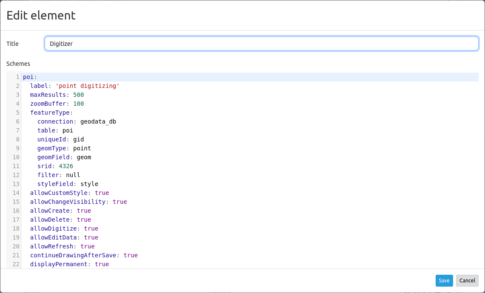

.. _digitizer:

Digitizer
*********

The Digitizer element allows building editing-interfaces. Currently you can build up your interface for point, line and polygon editing with a YAML-definition. 

Right now PostgreSQL is supported as a database. Oracle and SpatialLite can be used experimentally. The development of the Digitizer allows other data sources so that it can be extended to support - for example - OGC WFS services.

The Digitizer-Element offers complex editing functionality:

* move objects
* add vertices (lines, polygons)
* generation of enclaves, exclaves, circles and ellipses

In connection with the digitization, very complex forms can be generated for the acquisition of data.
    

.. image:: ../../../figures/digitizer.png
     :scale: 80

The following option for the construction of the forms are available:

* define more then one feature types for digitization. You can switch from one feature type to the other with a select box
* use a table as source. You can also define a filter to get a subset of the table
* Textfields
* Selectboxes, Multiselectboxes
* Radiobuttons, Checkboxes
* Textareas
* Datepicker
* File upload and Image Display
* Definition of tabs
* Definition breaklines
* Definition of Text 
* Mandatory fields, regular expressions to valid the content are possible
* Help texts
* Duplicate features
* Refresh after save

.. image:: ../../../figures/digitizer_with_tabs.png
     :scale: 80

Setup
=====

You can only use the element in the sidepane.

* **Title:** Title of the element. This is displayed in the layouts list and allows you to define several elements.
* **Target:** (ID) of the map.
* **Schemes:** YAML-Definition of the element Digitizer

The Ditigitzer needs access to a database where the editable tables are. You have to define a new database configuration to be able to connect with the geo database. 
Read more about this at `database <../../customization/database.html>`_.

The definition of the Digitizer is done in YAML syntax in the textarea configuration at schemes. Here you define the database connection, the editable table, the form to display the table, the attribute form and other behavior.
If errors occur in the database, fields or form, various error messages appear. Via the normal call and app.php comes a general error message.
If you want to reproduce the exact error, you should call the page via app_dev.php. In this case, detailed error messages about the error behavior appear.

* **debug:** Display error messages, e.g. syntax error in SQL [experimentel]

.. code-block:: yaml

    poi:
        [...]
        debug: true
        [...]        

YAML-Definition for the element Digitizer in the textarea schemes
-----------------------------------------------------------------

In the following YAML block, the example definition for three Digitizer forms is included. Copy the following block into your Digitizer element to test the capture of points, lines, and polygons.
You must first create the database connection and the three demo tables. The SQL commands for creating the tables can be found below.
The functionality of the built-in features and additional functions are explained in more detail in this example.

.. code-block:: yaml

    poi:
        label: point digitizing
        inlineSearch: true
        featureType:
            connection: search_db
            table: poi
            uniqueId: gid
            geomType: point
            geomField: geom
            srid: 4326
        openFormAfterEdit: true
        zoomScaleDenominator: 500
        allowEditData: true
        allowDelete: true
        allowDigitize: true
        useContextMenu: true
        toolset:
            - type: drawPoint
            - type: moveFeature
        popup:
            title: point test suite
            width: 500px
        searchType: currentExtent
        tableFields:
            gid: {label: Nr. , width: 20%}
            name: {label: Name , width: 80%}
        styles:
            default:
                strokeWidth: 2
                strokeColor: '#0e6a9e'
                fillColor: '#1289CD'
                fillOpacity: 1
                fillWidth: 2
                pointRadius: 10
            select:
                strokeWidth: 3
                strokeColor: '#0e6a9e'
                fillOpacity: 0.7
                pointRadius: 10
        formItems:
           - type: tabs
             children:
               - type: form
                 title: Basic information
                 css: {padding: 10px}
                 children:
                     - type: label
                       title: Welcome to the digitize demo. Try the new Mapbender feature!
                     - type: input
                       title: Name
                       mandatory: true
                       name: name
                       mandatoryText: Please give a name to the poi.
                       infoText: "Help: Please give a name to the new object."
                     - type: input
                       title: Title
                       mandatory: false
                       name: title
                       mandatoryText: Please give a title to the poi.
                     - type: textArea
                       name: abstract
                       title: Abstract
                       placeholder: 'please edit this field'
                     - type: select
                       title: Type
                       name: type
                       options: {A: A, B: B, C: C, D: D, E: E}
                     - type: breakLine
               - type: form
                 title: Personal information
                 css: {padding: 10px}
                 children:
                     - type: label
                       title: Please give us some information about yourself.
                     - type: fieldSet
                       children:
                           - type: input
                             title: Firstname
                             name: firstname
                             css: {width: 30%}
                           - type: input
                             title: Lastname
                             name: lastname
                             css: {width: 30%}
                           - type: input
                             title: E-Mail
                             name: email
                             css: {width: 40%}
                     - type: select
                       multiple: false
                       title: Interests
                       name: interests
                       options: {maps: maps, reading: reading, swimming: swimming, dancing: dancing, beer: beer, flowers: flowers}
                     - type: date
                       title: favorite Date
                       name: date_favorite                         
                       mandatory: true    
                       css: {width: 25%}
                     - type: breakLine
                     - type: breakLine
                     - type: checkbox
                       name: public
                       value: true
                       title: public (this new object is public)
    line:
        label: line digitizing
        inlineSearch: true
        featureType:
            connection: search_db
            table: lines
            uniqueId: gid
            geomType: line
            geomField: geom
            srid: 4326
        openFormAfterEdit: true
        allowDelete: true
        useContextMenu: true
        toolset:
            - type: drawLine
            - type: modifyFeature
            - type: moveFeature
        popup:
            title: line test suite
            width: 500px
        searchType: currentExtent
        tableFields:
            gid: {label: Nr. , width: 20%}
            name: {label: Name , width: 80%}
        styles:
            default:
                strokeWidth: 2
                strokeColor: '#0e6a9e'
                fillColor: '#1289CD'
                fillOpacity: 1
                fillWidth: 2
                pointRadius: 10
            select:
                strokeWidth: 3
                strokeColor: '#0e6a9e'
                fillOpacity: 0.7
                pointRadius: 10
        formItems:
           - type: form
             title: Basic information
             css: {padding: 10px}
             children:
                 - type: label
                   title: Welcome to the digitize demo. Try the new Mapbender feature!
                 - type: input
                   title: Name
                   name: name
                   mandatory: true
                   mandatoryText: Please give a name to the new object.
                   infoText: "Help: Please give a name to the new object."
                 - type: select
                   title: Type
                   name: type
                   options: {A: A, B: B, C: C, D: D, E: E}
    polygon:
        label: polygon digitizing
        inlineSearch: true
        featureType:
            connection: search_db
            table: polygons
            uniqueId: gid
            geomType: polygon
            geomField: geom
            srid: 4326
        openFormAfterEdit: true
        allowDelete: false
        useContextMenu: true
        toolset:
            - type: drawPolygon
            - type: drawRectangle
            - type: drawDonut
            - type: drawEllipse
            - type: drawCircle
            - type: modifyFeature
            - type: moveFeature
        popup:
            title: polygon test suite
            width: 500px
        searchType: currentExtent
        tableFields:
            gid: {label: Nr. , width: 20%}
            name: {label: Name , width: 80%}
        styles:
            default:
                strokeWidth: 2
                strokeColor: '#0e6a9e'
                fillColor: '#1289CD'
                fillOpacity: 1
                fillWidth: 2
                pointRadius: 10
            select:
                strokeWidth: 3
                strokeColor: '#0e6a9e'
                fillOpacity: 0.7
                pointRadius: 10
        formItems:
           - type: form
             title: Basic information
             css: {padding: 10px}
             children:
                 - type: label
                   title: Welcome to the digitize demo. Try the new Mapbender feature!
                 - type: input
                   title: Name
                   mandatory: true
                   name: name
                   mandatoryText: Please give a name to the new object.
                   infoText: "Help: Please give a name to the new object."
                 - type: select
                   title: Type
                   name: type
                   options: {A: A, B: B, C: C, D: D, E: E}

SQL for the demo tables
-----------------------

The following SQL commands must be executed in your database. You create three demo tables so that the individual functions can be tested using the YAML definition shown above.

.. code-block:: postgres

    create table public.poi (
        gid serial PRIMARY KEY,
        name varchar,
        type varchar,
        abstract varchar,
        public boolean,
        date_favorite date,
        title varchar,
        firstname varchar,
        lastname varchar,
        email varchar,
        interests varchar,
        user_name varchar,
        group_name varchar,
        modification_date date,
        my_type varchar,
        file_reference varchar,
        x float,
        y float,
        geom geometry(point,4326)
    );

.. code-block:: postgres

    create table public.lines (
        gid serial PRIMARY KEY,
        name varchar,
        type varchar,
        abstract varchar,
        public boolean,
        date_favorite date,
        title varchar,
        firstname varchar,
        lastname varchar,
        email varchar,
        interests varchar,
        length float,
        category varchar,
        user_name varchar,
        group_name varchar,
        modification_date date,
        my_type varchar,
        file_reference varchar,
        x float,
        y float,
        geom geometry(linestring,4326)
    );

.. code-block:: postgres

    create table public.polygons (
        gid serial PRIMARY KEY,
        name varchar,
        type varchar,
        abstract varchar,
        public boolean,
        date_favorite date,
        title varchar,
        firstname varchar,
        lastname varchar,
        email varchar,
        interests varchar,
        area float,
        category varchar,
        user_name varchar,
        group_name varchar,
        modification_date date,
        my_type varchar,
        file_reference varchar,
        x float,
        y float,
        geom geometry(polygon,4326)
    );

Usage
=====

General
-------

The Digitizer allows the editing of FeatureTypes. These are based on points, lines and polygon-geometries and their attribute-data. The attribute-data is displayed in the formular of the Digitizer. The geometry-editing is done via the map.

Create geometries
-----------------

Every FeatureType can unlock several `Toolsets <#definition-of-the-available-toolsets-toolset-type>`_ that can be used in the button-bar of the Digitizer.

For example in the FeatureType "poi" the toolset "drawPoint" unlocks the button to create a new point, the toolset "modifyFeature" unlocks the move-button.

.. image:: ../../../figures/digitizer_buttons_poi.png
     :scale: 80

Save, Delete, Cancel
--------------------

Three buttons are available in the attribute-dialog: Save, Delete and Cancel.

*Saving* changes only happens, if the "Save" button in the attribute-dialog is pressed. A move of the geometry alone doesn't save the feature directly (to avoid unnecessary stores into the database). It is mandatory to open the attribute-dialog and to click Save.

.. image:: ../../../figures/digitizer_save_delete_cancel.png
     :scale: 80

* **Save:** Saves the geometry and the attribute-data into the database.
* **Delet:** Deletes the data.
* **Cancel:** Doesn't save and delete the data, but keeps the geometry for further editing in the internal storage. The geometry is still present in the map and can be adjusted (for example with polygons). Attribute data is not stored.

Several options exit in the `basic definitions <#feature-basic-definition>`_, to customize the behaviour.

* allowEditData: Show the Save button.
* allowDelete: Show the Delete button.
* allowCancelButton: Show the Cancel button.
* allowDeleteByCancelNewGeometry: Behaviour of the Cancel button.

The *Delete* of a feature can be done with the dialog and from the table.

Vertices
--------

Editing polygons allows you to edit, move and delete vertices. The "edit vertices" button expects you to select a polygon. It will then be shown with its vertices.

.. image:: ../../../figures/digitizer_edit_vertices.png
           :scale: 80

The existing vertices are displayed opaque, possible new vertices are always in the middle of an edge, are light transparent and can be added by clicking on them.

Existing vertices can be deleted with the Delete-Key of the keyboard. To do this, move your mouse-pointer over a vertex and press the Del-key. *Note:* If the deletion of a vertex doesn't work in the first place, a click with the right mouse-button on the map may help. Especially with activated context-menu some events can currently get stuck.

Configuration
=============

The following chapters explain the individual components of the Digitizer that build up the base-structure and which can be used in the formular.

Feature basic definition
------------------------

A basic definition, here for the poi-example, may look like the following snippet:

.. code-block:: yaml

    poi:
        label: point digitizing
        minScale: 5000
        featureType:
            connection: search_db
            table: poi
            uniqueId: gid
            geomType: point
            geomField: geom
            srid: 4326
            filter: interests = 'maps'
        openFormAfterEdit: true
        zoomScaleDenominator: 500
        allowEditData: true
        allowDelete: true
        allowDigitize: true
        [...]
        popup:
            [...]

The possible options are:

* **label:** Label of the Digitizer popup
* **minScale:** Minimum scale, where the features should be displayed in the map (e.g. minscale: 5000 = show from a scale 'over' 1:5000, when zooming out).
* **featureType:** Connection to the database

  * connection: Name of the database-connection from the parameters/config.yml
  * table: Table-name in which the FeatureTypes are stored
  * uniqueId: Column-name with the unique identifier
  * geomType: Geometry-type
  * geomField: Column-name in which the geometry is stored
  * srid: Coordinate-system in EPSG-code
  * filter: Data filters for values ​​in a defined column, e.g. filter: interests = 'maps' 

* **openFormAfterEdit:** After creating a geometry the form popup is opened automatically to insert the attribute data. [true/false] Standard is true.
* **zoomScaleDenominator:** Zoom-scales to use for zooming to a feature.
* **allowEditData:** Allow or disable functions to edit or remove data. [true/false]. The Save button is always visible.
* **allowDigitize:** Allow to save data [true/false].
* **allowDelete:** Allow to delete data [true/false]. The Delete button is always visible.
* **allowDigitize:** Allow to create new features [true/false]. if false, no Digitizer buttons will occur (new Point, move, etc.).
* **useContextMenu:** Show the context-menu of a feature. [true/false]
* **allowCancelButton:** Show the Cancel button [true/false]. See `Save, Delete, Cancel <#save-delete-cancel>`_.
* **allowDeleteByCancelNewGeometry:** If true: When you create a new feature, the Cancel button will behave like the Delete button: The feature is removed from the map and the table. This is not the case if you edit an existing feature. [true/false]
* **displayOnInactive:** The current FeatureType will still be displayed on the map, although the Digitizer is deactivated in the Sidepane (Accordion, Tabs) [true/false]. If switched to true, this option is a bit tricky, due to the still activated Digitizer events but will be helpful for experienced users.
* **allowLocate:** Navigation to a feature via the tabs-keyboard-button, simple for operation without mouse. [True / false]. An extra "zoomTo" Button is displayed for each feature.

   .. image:: ../../../figures/digitizer/allowlocate.png
              :scale: 80

  
* **allowChangeVisibility:** Allow to change the visibility of one feature in the map (visible / invisible). [true/false]. An Eye Symbol is displayed, which allows to hide or display each feature indiviudally.

   .. image:: ../../../figures/digitizer/allowchangevisibility.png
              :scale: 80

  
* **showVisibilityNavigation:** Allow to change the visibility of all features in the map (visible / invisible). [true/false]
  
   .. image:: ../../../figures/digitizer/showvisibilitynavigation.png
              :scale: 80

.. * **displayPermanent:** FeatureTypes are displayed permanently (with explicit, active or select) [true/false]

Experimental:

* **allowCustomerStyle:** Allow user-specific styles for features in the map [true/false]. This feature is experimental: For each feature you can set unique styles.

 .. image:: ../../../figures/digitizer/showvisibilitynavigation.png
              :scale: 80

 A style-manager is used to let you set the unique styles.

 .. image:: ../../../figures/digitizer/stylemanager.png
              :scale: 80

Definition of the popup
-----------------------

.. code-block:: yaml

        popup:                                                          # Define the form as a popup. Further experimental adaptations here: http://api.jqueryui.com/dialog/
            title: POI                                                  # Definition of the popup title
            height: 400                                                 # height of the popup
            width: 500                                                  # width of the popup

            #modal: true                                                # Everything except the form window is grayed out and the position and size of the window is fixed for the duration of the data collection.
            #position: {at: "left+20px",  my: "left top-460px"}         # Position of the popup in the browser area

Definition of the feature table
-------------------------------

The Digitizer provides an object table. It can be used to navigate to features (zoom on the objects) and open the editing form. The object table can be sorted. 
The width of the individual columns can optionally be specified in percent or pixels.

* **tableFields:** define the columns for the feature table. 
   * definition of a colum: [table column]: {label: [label text], width: [css-definition, like width]}  
* **searchType:** search extent in the map, display of all features in the result table or only features displayed in the current extent [all / currentExtent], default is currentExtent
* **showExtendSearchSwitch:** Activate or deactivate the display of the searchType selectbox for searching in the curret extent [true/false]
* **view:** Settings for the object result table
   * Detailed information on possible configurations under https://datatables.net/reference/option/
   * **type**: Templatename [table]
   * **settings**: Settings for the functions of the result table *(Newly added, not fully documented!)*

.. code-block:: yaml

        searchType: currentExtent
        tableFields:
            gid: {label: Nr. , width: 20%}
            name: {label: Name , width: 80%}
        view:
            type: table
            settings:
                info: true
                processing: false
                ordering: true
                paging: true
                selectable: false
                autoWidth: false
                order: [[1, "asc"]]  # 1 | 2 presort columns

Tabs (type tabs)
----------------

Form elements can be placed unto different Tabs. The formItem type "tabs" is used for this.

.. code-block:: yaml

        formItems:
           - type: tabs                                                 # Type tabs creates tabs in the popup
             children:                                                  # The tabs are defined as sub-objects (children) of the form.
               - type: form
                 title: Basic information                               # title of the tabs
                 css: {padding: 10px}
                 children:                                              # Multiple subobjects in groups can be used to arrange data in the form next to each other
                     - type: label
                       title: Welcome to the digitize demo. Try the new Mapbender feature!
                       ...

For each input field the CSS-behavior and styling information can be assigned, regardless of the type. This can be used, for example, to highlight important fields or to fill an attribute field when editing another field.

parameters: 

* load, focus, blur
* input, change, paste
* click, dblclick, contextmenu
* keydown, keypress, keyup
* dragstart, ondrag, dragover, drop
* mousedown, mouseenter, mouseleave, mousemove, mouseout, mouseover, mouseup
* touchstart, touchmove, touchend, touchcancel

.. code-block:: yaml

        formItems:
           - type: tabs
             children:
               - type: form
                 [...]
                     - type: input
                       name: firstname
                       title: Firstname
                       css: {width: 30%}
                       input: |
                            var inputField = el;
                            var form = inputField.closest(".modal-body");
                            var datenkennungField = form.find("[name='datenkennung']");
                            datenkennungField.val(inputField.val());
                       focus: |
                            var inputField = el;
                            var form = inputField.closest(".modal-body");
                            form.css("background-color","#ffc0c0");
                       blur: |
                            var inputField = el;
                            var form = inputField.closest(".modal-body");
                            form.css("background-color","transparent");
                     - type: date
                       name: date
                       title: Date
                       css: {width: 30%}
                       # Highlight the year if you edit the date-field and autom. insert the year from the date
                       change: |
                            var inputField = el;
                            var form = inputField.closest(".modal-body");
                            var yearField = form.find("[name='year']");
                            var year = inputField.val().match(/\d+$/)[0];
                            yearField.val(year);
                            yearField.css("background-color","#ffc0c0");

Textfields (type input)
-----------------------

.. code-block:: yaml

                                                 - type: input                                      # element type definition
                                                   title: Title for the field                       # labeling (optional)
                                                   name: column_name                                # reference to table column (optional)
                                                   mandatory: true                                  # specify mandatory field (optional)
                                                   mandatoryText: You have to provide information.
                                                   cssClass: 'input-css'                            # additional css definition (optional)
                                                   value: 'default Text'                            # define a default value  (optional)
                                                   placeholder: 'please edit this field'            # placeholder appears in the field as information (optional)

Selectbox (selectbox or multiselect [type select])
--------------------------------------------------

By defining a selectbox, predefined values can be used in the form.
You can choose between a selectbox with a selectable entry (type select) or a multiselectbox with several selectable entries (type multiselect).

**(1) select - one selectable entry**

.. code-block:: yaml

                                                 - type: select                     # element type definition
                                                   title: select a type             # labeling (optional)
                                                   name: my_type                    # reference to table column (optional)                    
                                                   multiple: false                  # define a multiselect, default is false
                                                   options:                         # definition of the options (key, value)
                                                       1: pub
                                                       2: bar
                                                       3: pool
                                                       4: garden
                                                       5: playground

**(2) multiselect - several selectable entries**

The Multiselect-Box is activated by the attribute "multiple: true". You can choose multiple entries in the selectbox. The usage and their requirements of the database may vary. In general with the example above, you can switch the "interests" in the POIs to multiselects. The database fields is still a character varying.

.. code-block:: yaml

                -
                  type: select
                  multiple: true
                  title: Interests
                  name: interests
                  options:
                    maps: maps
                    reading: reading
                    swimming: swimming
                    dancing: dancing
                    beer: beer
                    flowers: flowers

**Notes:** From Digitizer version 1.2 the multiple selection provides an easier mechanism to choose an entry, which also allows a search in the drop-down-list. The navigation through the list is possible via keyboard. Possible entries are highlighted during typing. An already chosen entry can be removed by clicking the small "x" symbol.
Currently Mapbender comes with Digitizer 1.0.x. More versions: https://github.com/mapbender/mapbender-digitizer

.. image:: ../../../figures/digitizer/digi_multiselecttool.png
     :scale: 80
                    

The SQL (if maps and reading were chosen):

.. code-block:: postgres

                gisdb=> select interests from poi where gid=3;
                interests
                --------------
                maps,reading
                (1 row)

The keywords are saved in the database (for example: "dancing: Tanzen" and "flowers: Blumen" stores "dancing,flowers").

.. code-block:: yaml

                                                 - type: select                       # element type definition
                                                   title: select some types           # labeling (optional)
                                                   name: my_type                      # reference to table column (optional)
                                                   multiple: true                     # define a multiselect, default is false
                                                   options:
                                                     a: a                             # definition of the options (key, value)
                                                     b: b
                                                     c: c

**Get the options for the selectbox via SQL**

With a SQL request, the values of the selectbox can be directly pulled from the database. In this case, the key value mapping is not possible and only the indices of the entries can be stored.

.. code-block:: yaml

                                                 - type: select                                                    # element type definition
                                                   title: select some types                                        # labeling (optional)
                                                   name: my_type                                                   # reference to table column
                                                   connection: connectionName                                      # Define a connection selectbox via SQL
                                                   sql: 'SELECT DISTINCT key, value FROM tableName order by value' # get the options of the

Text/Label (type label)
-----------------------

.. code-block:: yaml

                                                 - type: label                                    # element type definition, label writes a non-editable text to the form window.
                                                   text: 'Please give information about the poi.' # define a text 

Text (type text)
----------------

Texts can be defined as a label in the form. In this case, fields of the data source can be accessed by using JavaScript.

.. code-block:: yaml

                                                - type: text                          # Type text for generating dynamic texts from the database
                                                  title:       Name                   # Label (optional)
                                                  name:        name                   # Name of the field (optional)
                                                  css:         {width: 80%}           # CSS definition (optional)
                                                  text: data.gid + ': ' + data.name
                                                  # Text definition in JavaScript
                                                  # data - data is the object, that gives access to all fields.
                                                  # z.B.: data.id + ':' + data.name

Textareas (type textarea)
-------------------------

Similar to the text field via type input (see above), text areas can be created that can contain several lines using type textArea.

.. code-block:: yaml

                                                 - type: textArea                    # Typ textArea creates a text area
                                                   rows: 4                           # Number of rows for the text area that appears when the form is opened. Field can be expanded by mouse in the form.
                                                   name: beschreibung                # table column
                                                   title: Bestandsaufnahme Bemerkung # Label (optional)

Breaklines (type breakline)
---------------------------

.. code-block:: yaml

                                                 - type: breakline                     # element type definition, will draw a line 

Checkboxes (type checkbox)
--------------------------

.. code-block:: yaml

                                                 - type:  checkbox        # Type checkbox creates a checkbox. When activated, the specified value (here 'TRUE') is written to the database.
                                                   title: Is this true?   # Label (optional)
                                                   name:  public          # table column 
                                                   value: true            # parameter when activating the checkbox is stored in DB (here 'TRUE').
                                                   checked: false         # behaviour of the checkbox (true or false). default is false. Defines whether checkbox is pre-selected (checked) on load

Mandatory fields
----------------

The notes for a mandatory field appear above the used fields. In the case of a missing entry in a defined mandatory field, this will be marked in red and (if defined) a speech bubble will appear. The object can not be saved if mandatory data is missing.

.. note:: Note: When using multiple tabs in the form, the creator may set an entry incorrectly on a non-visible tab in a mandatory field, so the saving process does not work. No error message appears outside the form. The applicant has to check the information in the form (label: red border / speech bubble with reference) before it can be stored correctly.

.. code-block:: yaml

                                                 - type:  [Angabe zum Feldtyp]           # Each field can be made mandatory

                                                   mandatory: true                       # true - field has to be set. Else you can't save the object. Regular expressions are possible too - see below.
                                                   mandatorytitle: Mandatory info!       # Text that appears in the field when the field is not filled or filled with an invalid value.
                                                   mandatoryText: Please choose a type!  # Text that is displayed in a speech bubble above the field when the field is not filled when it is saved or invalid.
                                                   mandatory: /^\w+$/gi                  # You can define a regular expression to check the input for a field. You can check f.e. for email or numbers. Read more http://wiki.selfhtml.org/wiki/JavaScript/Objekte/RegExp

                                                   # Check if input is a number
                                                   mandatory: /^[0-9]+$/
                                                   mandatoryText: Only numbers are valid for this field!

Date-picker (type date)
-----------------------

.. image:: ../../../figures/digitizer_datepicker.png
     :scale: 80

.. code-block:: yaml

                     - type: date                                       # click in the textfield opens a datepicker
                       title: favorite Date                             # Label (optional)
                       name: date_favorite                              # data table

Helptexts to the form-elements (attribute infotext)
---------------------------------------------------

The infotext can appear over every field, regardless of whether this is a mandatory field or not. If a infotext is specified, an info button appears above the field. Clicking on this button opens the information text.

.. code-block:: yaml

                                                 - type:  [type name]                                              # every field, regardless of whether this is a mandatory field or not

                                                   infoText:  Please note - only numbers are valid for this field. # Notice which will be displayed by i-symbol

Element groups (type: fieldSet)
-------------------------------

Elements can be grouped together in one row to provide logical connections or save space. To define a group you have to set type fieldSet and afterwards define the children which shall be grouped.

For each children you can define a width to control the pace for each element.

.. code-block:: yaml

                     - type: fieldSet             # Grouping of fields, regardless of field type
                       children:                  # Define the group elements by children
                           - type: input
                             title: Firstname
                             name: firstname
                             css: {width: 30%}    # Specifies the width of the group element. Together, the elements should be 100%.
                           - type: input
                             title: Lastname
                             name: lastname
                             css: {width: 30%}
                           - type: input
                             title: E-Mail
                             name: email
                             css: {width: 40%}

Coordinate Fields (type coordinates)
------------------------------------

For visual verification, manual entry or manual editing of point coordinates, the *coordinates* element can be used.

.. image:: ../../../figures/digitizer_coordinates.png
     :scale: 80

.. code-block:: yaml
                     
                     - type: coordinates
                       title_epsg: 'EPSG angeben'
                       title_longitude: 'Longitude'
                       title_latitude: 'Latitude'
                       coordinatesFieldsOrder: ['epsg','x','y']
                       title: ''
                       css: {width: 100% }
                       epsgCodes: [['EPSG:3857', 'EPSG:3857 (Pseudo Mercator)'], ['EPSG:4326', 'EPSG:4326 (WGS84)']]

The possible special properties are:

* **title_epsg**: the caption for the field to select the EPSG code of the coordinates
* **title_longitude**: the title of the longitude field
* **title_latitude**: the title of the latitude field
* **coordinatesFieldsOrder**: a list of strings, describing the order in which the three input elements occur
* **epsgCodes**: a list of tuples, each describing an EPSG code to select and its corresponding label in the form

File upload (type file)
-----------------------

The file upload can be used to link files to a database column in the form. To do this, the uploaded files are stored in Mapbender and the path is noted in the column.

The storage path and the name of the stored files can not yet be changed. The file upload always saves to the same directory and is  built up from the parameters:

* tablename
* columnname
* filename

The filesystem path is:

* <mapbender>/web/uploads/featureTypes/[tablename]/[columnname]/[filename].png

The linked URL stored in the database column is:

* http://localhost/mapbender/uploads/featureTypes/[tablename]/[columnname]/[filename].png

.. code-block:: yaml

                    - type: file                     # Typ file for the upload of files
                      title: Dateiupload             # Label (optional)
                      text: Laden Sie ein Bild hoch. # Informationtext (optional)
                      name: file_reference           # table column for the storage path

                      # Experimental parameters:
                      #accept: image/*               # Pre-selection of elements in the image format (window for file upload opens with restriction filter) 
                                                     # Other file-formats can be still uploaded

**Notes:** At this time, a "thumbnail" directory is created, which includes a smaller version of an image file. In future development this will be changed.

A possibility to show the uploaded images is the image-element.

Images (type image)
-------------------

.. image:: ../../../figures/digitizer_image.png
     :scale: 80

The image-element can be used to view a picture in the form. You can display images by specifying a URL in a database field or URL using the src parameter.

Images, which are marked by the element file in a table column, can thus also directly be integrated and displayed.

The image can be specified by specifying the two parameters src and name.

* **src**: Url-path or file path (can be relative path)
* **name**: Url-path or file path from the table column (can't be relative path)
* definition of name and src together: The content of the database column from name is taken. If the column is empty, the src is used.

.. code-block:: yaml
                      
                    - type: image                                         # Feature type field name image.
                      name: file_reference                                # Reference to the database column. If defined, the path or URL in the field can be used and replaces "src" option
                      src: "../bundles/mapbendercore/image/logo_mb3.png"  # Specify a path or URL to an image. If the path is relative use relative: true.
                      relative: true                                      # Optional. Default value is false. If true, the "src" path is determined from the "/web" directory.
                      enlargeImage: true                                  # Image is enlarged to original size/ maximum resolution by clicking on the preview image. It is not scaled to screen size.

                      # Experimental information about styling
                      imageCss:
                        width: 100%                                       # Image CSS Style: Scales the preview image in the form, different from the original size in percent.

**Caution**: If only name and not name and src are specified, the wrong image appears from the previous data entry, if the column is empty.

Dynamic paths (eg "bundles/mapbendercore/image/[nr].png" or 'bundles/mapbendercore/image/' + data.image_reference) can not be specified.

One way to work around this is to create a trigger that will merge the path and contents of a table field into the database column.

Definition of the available toolsets (Toolset Type)
---------------------------------------------------

Toolset types:

* **drawPoint** - Draw point
* **drawLine** - Draw a line
* **drawPolygon** - Draw polygon
* **drawRectangle** - Draw rectangle
* **drawCircle** - Draw circle
* **drawEllipse** - Draw ellipse
* **drawDonut** - Draw a Donut (enclave)
* **modifyFeature** - Move vertices of a geometry
* **moveFeature** - Move geometry
* **selectFeature** - Geometry de-/select (experimental). There is no interaction with the table yet and the available workflows are limited to the Delete operation.
* **removeSelected** - delete selected geometry (experimental). Deletes all objects selected in the map.
* **removeAll** - Caution: remove all geometries from the table

YAML-Definition of toolset types

.. code-block:: yaml

    polygon:
        [...]
        toolset:
            - type: drawPolygon
            - type: drawRectangle
            - type: drawDonut
            - type: removeSelected

Search in the tables (inline Search)
------------------------------------

You can use the inline search to search for an element in the table. 
The activated element displays a search bar above the table. It shows all the search results for records of the table.

.. code-block:: yaml

  poi:
      ...
      inlineSearch: true      # true: allows the search in the table, default is true
      ...

Context Menu
------------

Using the context menu, an object on the map can be considered in more detail.
After the activation you can open a context menu via the right mouse click on an object or cluster.

.. image:: ../../../figures/digitizer_contextmenu.png
     :scale: 80

Items of the Context Menu: 

* **Zoom to:** Zoom to the map extent of the object
* **Edit features:** Edit the features of the object. Opens the Digitizer dialog.
* **Remove:** Remove the selected object.

If the corresponding `basic definition <#feature-basic-definition>`_ (allowEditData, allowDelete) not defined, then they are also not available in the Context Menu. In the above example the delete function is not available for the polygons.

.. code-block:: yaml

  poi:
      ...
      useContextMenu: true
      ...

Clustering (experimental)
-------------------------

By clustering the objects can be combined on the map. 
Depending on the defined distance and zoom level different numbers of objects can be clustered.

Due to the complexity of the Clustering, future versions may have changes in functionality and syntax, so we define that still as experimental. Dependencies are to the display of features in the current extent/all areas and the different geometry types.

.. image:: ../../../figures/digitizer_clustering.png
     :scale: 80

Definition of the cluster element: 

* **scale:** Zoom level.
* **distance:** distance between features in m to activate the clustering.
* **disable:** zoom level to disable the clustering. 

.. code-block:: yaml

  poi:
      ...
      clustering:
          -
              scale: 10000        # Zoom level
              distance: 60        # distance between features to cluster
          -
              scale: 2500
              distance: 40
          -
              scale: 1000
              distance: 20
          -
              scale: 500
              distance: 1
              disable: true       # disable clustering at defined zoomlevel
      ...

Map-Refresh after save
----------------------

After saving an object, the refresh can be activated using the *refreshLayersAfterFeatureSave* option. This parameter is used to reload the defined layer instances in the map-element. This makes changes regarded to WMS services directly visible in the map. This event is thrown only if the "Save" button of the attribute dialog is pressed.

If the YAML application is used in the /application folder, it can be specified by a unique name or by the instance-ID. If the applications are edited using the graphical user interface in the backend with the digitizer-element, it can be specified by the instance-ID.

.. image:: ../../../figures/digitizer/layerinstance_id.png
     :scale: 80

.. code-block:: yaml

  poi:
      [...]
       allowEditData: true
       refreshLayersAfterFeatureSave:  # If no entry is made in this area no map refresh is carried out after saving 
         - 17
         - 18
         - osm        # specify by unique name only with applications in app/config/application
      [...]

**Notes:** Map-Refresh after save is available from Digitizer version 1.2. Currently Mapbender comes with Digitizer 1.0.x. More versions: https://github.com/mapbender/mapbender-digitizer

Duplicate features
------------------

Already captured objects can be duplicated. This is done via a duplicate-button within the popup of the current selected already existing feature, via the context menu and the hit table.
In order for the new object to be recognized better in the map, a color highlighting can be defined here.

The Duplicate button can be activated depending on a specific attribute value. This means that only when the corresponding attribute has a specific value (date> 0) the duplicate function works.

* **data**: Define default values for attributes.
* **rules**: Rule based duplicating (only if the filter/rule is active the object can be duplicated).
* **style**: Styling of the duplicated feature (more at Design and Styles)
* **on**: Events while duplicating process

.. code-block:: yaml

  poi:
      [...]
       copy: # If no specification is made in this area you can't duplicate objects
         enable: true
         data:
           date: 2017
         rules:
           - feature.attributes.id > 10
         style:
           label: "Dupliziertes Objekt"
           fillColor: "#ff0000"
           fillOpacity: 1
           strokeWidth: 4
           strokeColor: "#660033"
         on:
           success: widget._openFeatureEditDialog(feature)
           error: console.error(feature)

Events
------

Different events exist that can be associated to a feature to manipulate attributes before or after an action.

* **onBeforeSave**: Event before the storage of a new/ modified information
* **onAfterSave**: Event after the storage of a new/ modified information

* **onBeforeUpdate**: Event before the update of a modified information
* **onAfterUpdate**: Event after the update of a modified information
  
* **onBeforeSearch**: Event before the search in the SearchField of the Digitizer
* **onAfterSearch**: Event after the search in the SearchField of the Digitizer
 
* **onBeforeRemove**: Event before deleting data
* **onAfterRemove**: Event after deleting data

In difference to the save-events, the update-events work only on an update of the data, not on creation.

**Note:** The events are still in development and should be used with caution. The correct matching of the events and their dependencies are not yet finished and may be changed in future versions.

The following sections show some examples. If you want to set several parameters in an event, these can be listed in sequence, separated by a semicolon, e.g.

.. code-block:: yaml

                events:
                  onBeforeSave: $feature->setAttribute('interests', 'maps'); $feature->setAttribute('name', 'test');

**Storage of predefined attibute data in an additional attribute-columns:**

The following example shows how data can be written to an additional attribute column. This is done with the column "interests" and the fixed value "maps". When saving, the fixed value is stored in the table and you can use it via a filter for the selected display.

.. code-block:: yaml

                events:
                  onBeforeSave: $feature->setAttribute('interests', 'maps');

**Storage of group roles in an additional attribute-columns:**

The following example shows how mapbender user data can be written to an additional attribute column. Here, this is done with the column "group" and the storage with the group roles of the user (userRoles). 

.. code-block:: yaml

                events:
                  onBeforeSave: $feature->setAttribute('group', implode(',', $userRoles));

**Storage of attibute data in an additional attribute-columns:**

This example shows how data can be stored in an additional attribute-column after saving. In this case it is done with two geometry-columns "geom" and "geom2". When saving, the data of "geom" should be saved in the field "geom2".

Depending on the use case, the onBeforeInsert or the onBeforeUpdate event can be used.

At the time of the saving-process the new geometry doesn't yet persist in the database. Therefore it cannot be accessed as a feature but only via the corresponding "item", an internal Digitizer structure. This "item" is based on the formular and the defined attribute fields.

.. code-block:: yaml

                events:
                  onBeforeInsert: $item['geom2'] = $item['geom'];
                  onBeforeUpdate: $item['geom2'] = $item['geom'];

In this event the value of "geom2" is overwritten with the value of "geom".

**Storage of different geometry-types:**

The above scenario can be extended to a slightly constructed example in which simultaneously different geometry types shall be saved. With the help of PostGIS, lines are interpolated to points. The Digitizer can use an event to fire the according SQL statement.

.. code-block:: postgres
                
                events:
                  onBeforeInsert: |
                    $sql = "SELECT 
                    ST_Line_Interpolate_Point('".$item['geomline']."'::geometry, 1) as geom";
                    $stmnt = $this->getConnection()->prepare($sql);
                    $stmnt->execute();
                    $result  = $stmnt->fetchAll();
                    $item['geompoi'] = $result[0]['geom'];

The onBeforeInsert event is used here. The pipe symbol "|" after the event signals a following multiline statement. This blog contains PHP code, which calls SQL-statement. The SQL-statement calls the ST_Line_Interpolate_Point function of PostGIS and commits the digitized line. Because this line is not yet persisted in the database, you have to access it with the "item" (geomline). The next lines build up the SQL-statement and delivers it to the SQL-connection defined in the featuretype. The last line writes the resulting point (geompoi) into the point-geometry-field.

Buttons
-------

Further buttons can be defined for the popup forms. The events (by clicking on the buttons) can be freely defined with JavaScript. Thus, for example, mailto data can be generated for the integration of a mail.

.. code-block:: yaml

  poi:
      ...
        popup:
            title: polygon test suite
            width: 500p
            # resizible: true
            buttons:
              - text: message to editor
                click: |
                  var body = encodeURI("Sehr geehrter Herr/Frau xx,"+"\nLink:"+location.href);
                  location.href = "mailto:firstname.lastname@mail.com?subject=New edit in webgis&body=Mail to editor for further edits.";
              - text: message to controller
                click: |
                 location.href = "mailto:firstname.lastname@mail.com&subject=webgis&body=really?";

Design and Styles
-----------------

By specifying a style the way the objects are displayed on the map can be defined.

* **default**: defines the normal display of the objects on the map 
* **select**: defines the appearance of the objects while mouseover
* **selected**: defines the appearance of the objects after click event

.. code-block:: yaml

  poi:
      ...
      styles:
          default:
              graphic: true
              strokeWidth: 5
              strokeColor: "transparent"
              fillColor:  '#c0c0c0'
              fillOpacity: 1
              fillWidth: 2
              # label: ${name} ${type}
              # labelOutlineColor: '#eeeeee'
              pointRadius: 10
          select:
              strokeWidth: 1
              strokeColor: "#0e6a9e"
              fillOpacity: 0.7
              fillColor: "#0e6a9e"
              label: ${name} ${type}
              pointRadius: 10
          selected:
              strokeWidth: 4
              strokeColor: "#648296"
              fillOpacity: 1
              fillColor: "#eeeeee"              
              label: ${name} ${type}
              pointRadius: 10
      ...

* **strokeColor:** Color of the border line [color value/transparent]
* **strokeWidth:** Width of the border line [numeric]
* **strokeOpacity:** Transparency of the border line [0-1]
* **fillColor:** Color of the filling [color value/transparent]
* **fillWidth:** Width of the filling [numeric]
* **fillOpacity:** Transparency of the filling [0-1]
* **pointRadius:** Radius around the center [numeric]
* **label:** Labeling the object with fixed values ​​and / or DB fields, e.g. "ID ${nummmer}"
* **labelOutlineColor:** Color of the border from the label [color value/transparent]

YAML-Definition for the element Digitizer in mapbender.yml
==========================================================

This code-snippet shows how to include the Digitizer into a YAML-file based application.

.. code-block:: yaml

                sidepane:
                    digitizer:
                        class: Mapbender\DigitizerBundle\Element\Digitizer
                        title: Digitalisation
                        target: map
                        schemes:
                            ...

Class, Widget & Style
=====================

* Class: Mapbender\\DigitizerBundle\\Element\\Digitizer
* Widget: mapbender.element.digitizer.js
* Style: sass\\element\\digitizer.scss

