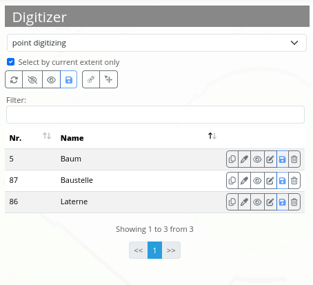

.. _digitizer_functionality:

Functionalities
***************

Digitizer allows the editing of FeatureTypes. These are based on points, lines or polygon geometries and their attribute data. The attribute data is displayed in the configurable form of the Digitizer element. Geometries can be edited directly via the map. Digitizer offers complex editing functionalities:

* Draw points, lines, polygons, rectangles, ellipses or circles
* Move objects
* Add vertices (to lines or polygons)
* Generate areas with enclaves

.. image:: ../../../../figures/Digitizer_geometries.png
     :scale: 80

The following sections explain the different functionalities of Digitizer in accordance with its default configuration.

Draw geometries
---------------

When drawing geometries, one can choose between the geometry types "point", "line" or "polygon" via a dropdown menu.

**Points**

A click on the button "draw point" activates/deactivates the option to draw points. 

.. image:: ../../../../figures/Digitizer_create_points.png
     :scale: 80

**Lines**

A click on the button "draw line" activates/deactivates the option to draw lines. 

.. image:: ../../../../figures/Digitizer_create_lines.png
     :scale: 80

**Polygons**

Polygons, rectangles, enclaves, ellipses and circles can be drawn after activation of the corresponding button.

.. image:: ../../../../figures/Digitizer_create_polygons.png
     :scale: 80
     
After activation, an object can be created through one or more clicks on the map. Afterwards, a pop-up window will appear, which requests attribute data in correspondence to its configured YAML-configuration.

Edit, save or delete geometries
-------------------------------

Objects are saved in the defined database table. Additionally, geometries are displayed in the form of a spreadsheet in the sidepane. This simplifies the administration of data. The spreadsheet displays the number (ID is automatically created after saving) and name of each object. It is possible to change the order of geometries or search for specific objects.

The list can also only display geometries of the current extent **1**. It is possible to hide **2** or show **3** all objects via click on the corresponding buttons. Modifications can be saved for all objects **4**. A change would, for instance, be the movement **5** of an object. After the button has been activated, geometries can be moved on the map via the cursor.

Furthermore, individual objects can be hidden **6** and changes saved **8**. Attribute data are modifiable as well **7**. Every object can be deleted **9** individually from the database via the Digitizer element.

Previously described functions are identical for all geometries. Additionally, intermediate points can be added to lines and the corners of areas modified. This option is activated via click on the Button *"Edit"*. In order to modify an object, it has to be selected beforehand.

