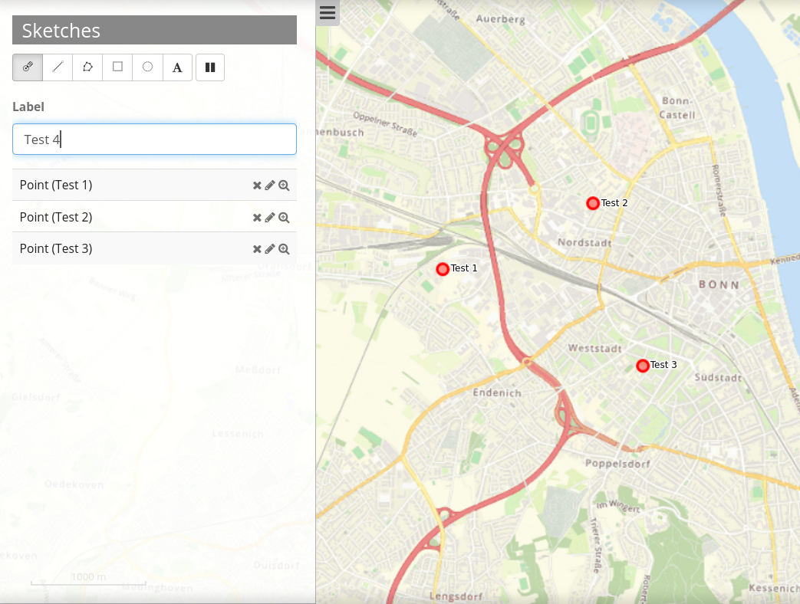
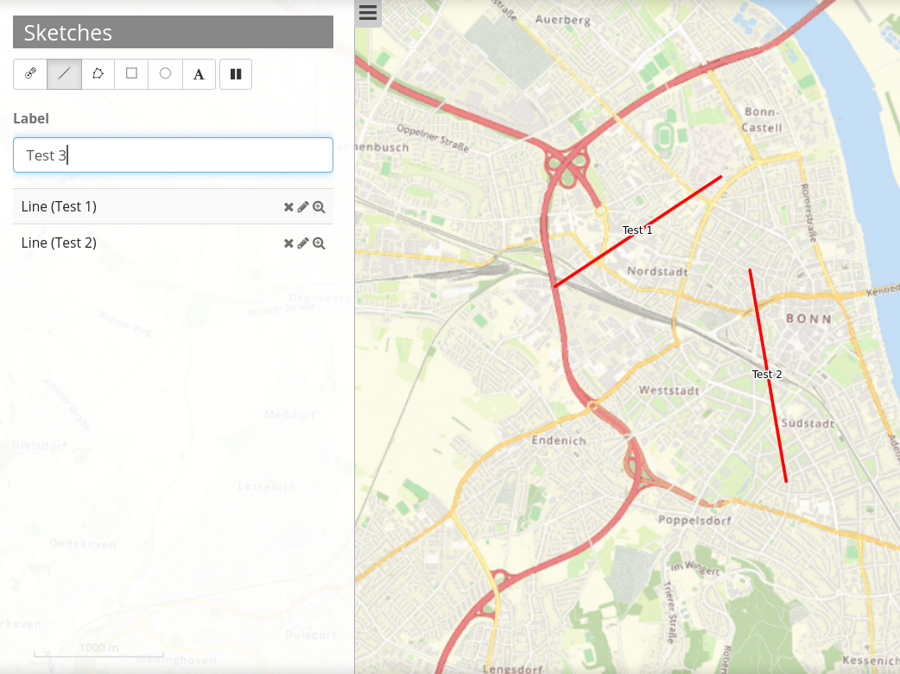
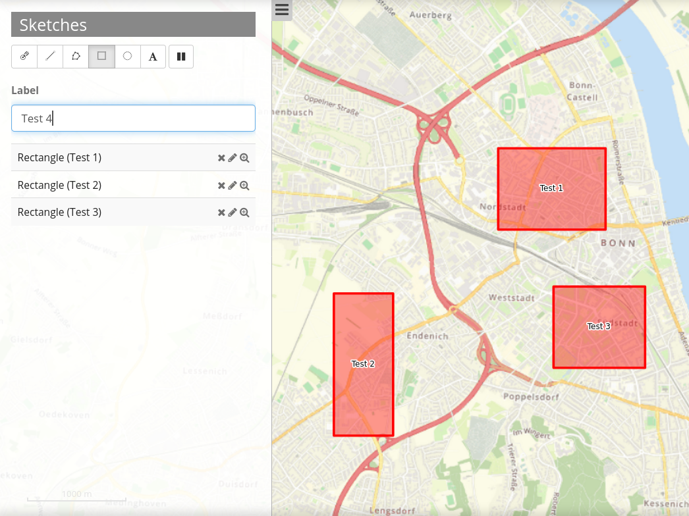
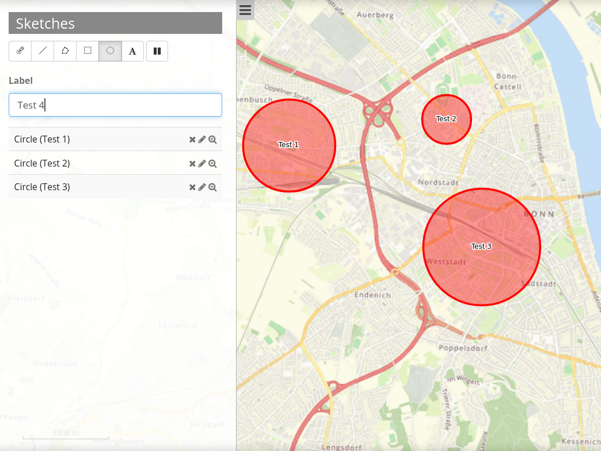
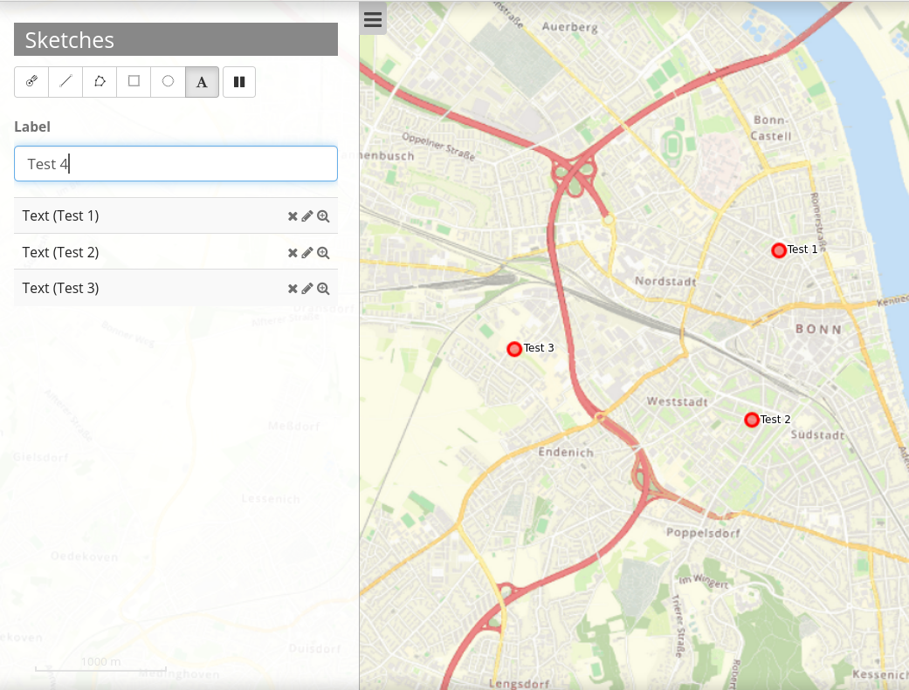
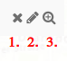

.. _sketch:

Sketch
******

With the sketch element, temporary geometries can be created. These sketches are not saved within a database and will be lost after restart of the application. Sketches can be printed out.

The following geometry types can be sketched:

* Point
* Line
* Polygon
* Rectangle
* Circle
* Text

.. image:: ../../../figures/sketch.png
     :scale: 80
     

Configuration
=============

.. image:: ../../../figures/sketch_configuration.png
     :scale: 80

* **Auto activate** The element is activated automatically.
* **Deactivate on close** Sketches are deactivated after closure of the element.
* **Title:** Title of the elements. This is referenced by the button which opens the element.
* **Target:** ID of the map-element, to which the Redlining refers.
* **Geometrytypes** Lists all geometrytypes

Draw geometries
---------------

Point drawing can be activated/deactivated via click on the button "point". Points are set via a single click on the map.

Line drawing can be activated/deactivated via click on the button "line". Line segments are set via a single click on the map. To finish drawing make a double click.

Polygon drawing can be activated/deactivated via click on the button "polygon". Corner points are set via a single click on the map. To finish drawing make a double click.

.. image:: ../../../figures/de/sketch_create_polygons.png
     :scale: 80

Rectangle drawing can be activated/deactivated via click on the button "rectangle". Rectangles are drawn via drag and drop.

Circles drawing can be activated/deactivated via a click on the button "circle". Circles are drawn via drag and drop.

Text setting is activated/deactivated via click on the button "text". A label has to be defined, before a text can be set.

Delete, Edit and Zoom
---------------------

Drawn sketches can be individually deleted [1] and edited [2]. There is also the possibility to zoom to particular geometries [3].

Stop drawing
------------

To stop drawing click the pause button.

YAML-Definition:
----------------

This template can be used to insert the element into a YAML application.

.. code-block:: yaml

   tooltip: 'Sketch'                # text of the tooltip Tooltips
   target: ~                        # ID of the element
   auto_activate: false             # (default: false).
   deactivate_on_close: true        # Drawn sketches will be deactivated if the element is closed (default: true).
   geometrytypes: point,line,polygon,text,rectangle,circle   # list of available geometry types

