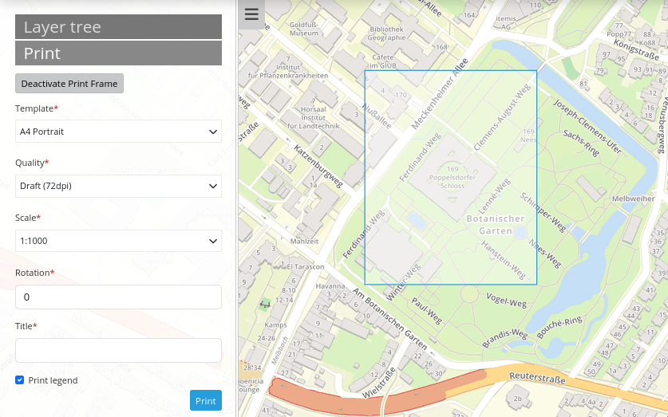
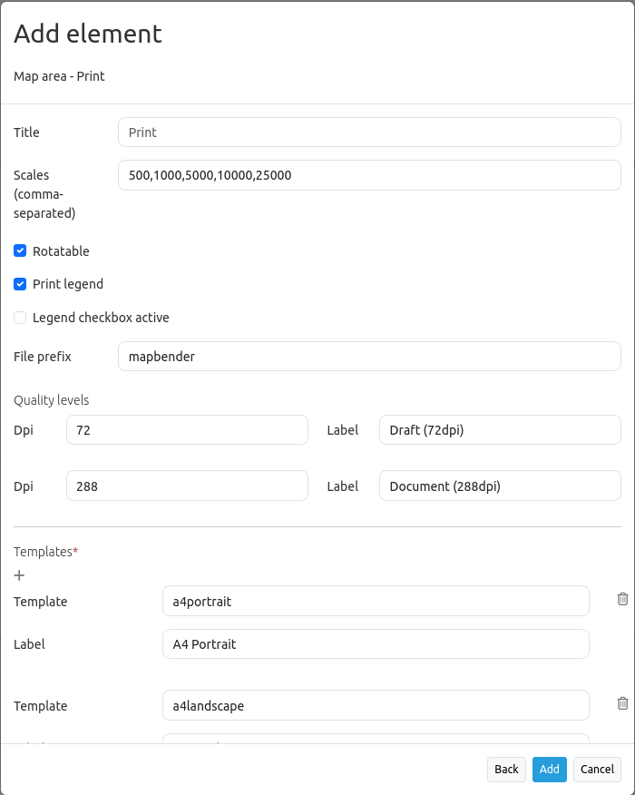
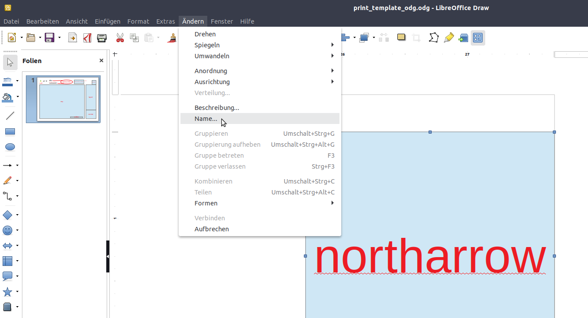

.. _printclient:

PrintClient
************

The PrintClient allows for the print of a predefined map area. The following documentation will first give an overview about the general set-up and configuration of the PrintClient. The second part will answer the question how individual print templates can be generated. Lastly, the print process and all its configuration options will be presented.

General
=======

It is possible to define different properties of the PDF you would like to print with the client:

 * Print template,
 * Quality,
 * Scale,
 * Frame rotation,
 * Activate/deactivate legend
 * Optionally, it is possible to define individual input fields (e.g. title, comment, remark), which will then also be printed in the PDF.

.. image:: ../../../figures/print_client.png
     :scale: 80

The PrintClient element can be implemented both as a dialog (via a button) and as element as part of the sidepane. If it is part of the sidepane, you have to activate the print frame first to start the print. The print frame can be moved around freely in the map canvas, it defines the area of the PDF output. When finished, you have to deactivate the print frame to use the map as usual again (when used as a dialog this happens automatically by opening and closing the dialog window).

Configuration
-------------

The Printclient can be configurated in the backend. It relies on print templates (format A0 to A4). These LibreOffice Draw files can be individually modified regarding the location of date, scale, north arrow, overview map as well as dynamic images/texts in the PDF.

* **title**: Title of the element. The title will be listed in "Layouts" and allows to distinguish between different buttons. The title will be displayed next to the button if "Show label" is activated.
* **scales**:  define scales to choose from selectbox, or – if empty – a free scale can be defined in a text field.
* **rotatable**: defines if the print extent is rotatable, default is true
* **print legend**: adds a checkbox which allows your print to have a legend
* **legend checkbox checked**: if true, the legend checkbox is checked by default
* **file_prefix**: defines a file prefix for the PDF that is generated when creating a PDF (file_prefix_date.pdf will be created)
* **quality_levels**: defines quality levels in DPI values.
* **templates**: template name. Add template file name without file extensions (Mapbender is looking for two files, e.g. a4portrait.odg & a4portrait.pdf), Template files are located at app/Resources/MapbenderPrintBundle. Deleting or adding templates is possible with the "+"- or "x" buttons.
* **label**: defines a template label for the selectbox in the frontend.

* **optional_fields**:

With the configuration of the following values it is possible to enable optional fields in the print dialog. An example (title, two comment fields, name) is offered in the YAML definition.

  * **title**: name of the optional field, default value is null (no optional fields are defined).
  * **label**: Label of the optional field.
  * **options**: { required: true } : Type of the optional field. Has to be true or false.

* **Display required fields first**: If this checkbox is active, your defined required fields appear utmost.

* **replace_pattern** - You can modify the map request for printing. You can add additional parameters like map_resolution (for MapServer).

Here's an example for the backend configuration (or look below in the YAML definition for an enhanced and commented example).

YAML-Definition
---------------

.. code-block:: yaml

    target: map                    # Id of Map element to query
    type: dialog                   # element or dialog, default is dialog
    templates:
        - { template: a4portrait, label: A4 Portrait}	# template name, template file name without file extension (Mapbender is looking for file a4portrait.odg an a4portrait.pdf), Template files are located at app/Resources/MapbenderPrintBundle
        - { template: a4landscape, label: A4 Landscape} 	# template label in the dialog
    scales: [5000, 10000, 25000]    # define scales to choose from select-box or if empty free scale can be defined in a text-field
    quality_levels:					# define quality levels in dpi
        - { dpi: 72 , label: Draft (72dpi)}		# 72 - dpi value, Draft - label
        - { dpi: 288,  label: Document (288dpi)}	# 288 - dpi value, Document - label
    rotatable: true                 # true/false use true for rotation, default is true
    legend: true                    # true/false, default is false
    legend_default_behaviour: false # true/false, if true the legend check-box is checked by default
    file_prefix: mapbender         # define the file prefix for the PDF that is generated (file_prefix_date.pdf will be created)
    optional_fields:                # define optional fields (example title-field)
        title:                      # name of the optional fields, default is null (no optional fields are defined)
            label: Title            # label of the optional field
            options:                #
                required: false     # true or false
        comment1:
            label: Comment 1
            options: { required: false }
        comment2:
            label: Comment 2
            options: { required: false }
        editor:
            label: Editor
            options: { required: true }
    replace_pattern:                 # You can modify the map-request for printing
            -                        # you can add additional parameters like map_resolution (for MapServer)
                default: { 288: '&map_resolution=288' }
            -
                pattern: 'stadtplan.xml'        # or you can request a different service which is optimized for printing
                replacement: { 288: 'stadtplan_4.xml' }

Directories
-----------

**The northarrow**
* The "north arrow" image is located at **app/Resources/MapbenderPrintBundle/images/**. The "north arrow" image can be replaced to use a different image instead.

**The print templates**
* The print templates can be found under **app/Resources/MapbenderPrintBundle/templates/**. 

**The print files**
Mapbender saves its generated print files in the browser's default download folder. If the queued print is used, the files will be saved under the Mapbender directory **web/prints/**.

Create your individual templates
================================

To create an individual print template, already existing print templates (.odg-file) can be copied, or a new LibreOffice Draw file can be used. The template can include fixed objects like a logo, copyright or print information. In addition, a layer for dynamic elements like map, overview, north arrow, scale, date and optional fields can be created. The dynamic layer is an additional non-printable layer in the LibreOffice Draw file. The layer can be added with **Menu: -> Add -> Layer -> define name for the layer and choose checkbox option "not printable"**. An element is assigned to a layer via drag and drop.

.. image:: ../../../figures/print_template_odg.png
     :scale: 80

The following objects are available by default in Mapbender:

* map
* overview map
* scale
* scalebar
* date
* northarrow
* extent_ur_y, extent_ur_x, extent_ll_x, extent_ll_y (coordinates of the print extent)
* dynamic_image (connected to group role)
* dynamic_text (connected to group role)

Optional fields in the element definition (e.g. title, comment, editor) can be defined and added to the Open Office Draw file. They need to be inserted into the non-printable area of the file, or else they will appear in the generated template PDF.

When creating dynamic texts, each property must have the appropriate name, for example the field **comment1** must have the name **comment1** in the Open Office Draw file. For naming fields, it is not enough to apply the name to the content of the text field. Instead, the field needs to be selected and its object name edited. Select text field **--> Menu Edit --> name...** to change the name accordingly.

Export the template to .pdf under the same name as the .odg file. Use the name without its extension in the print yml-definition.

The print script will read the information (position, size, font size, alignment) from the .odg-file and combines those with the fixed objects in the PDF template and the map image in Mapbender to generate your PDF.

Printing elements in front of the map element
---------------------------------------------

In order for the map element to be as large as possible and to avoid white or empty areas, elements can be placed in front of the map image to prevent that space is lost through white areas. This is particularly useful in the case of large printing formats which have a comparatively wide border.

To use this function, the templates have to be adapted and transparent PDF templates have to be created.

Adapt templates:

* Reorder elements in front of white background

  - Arrange elements into the foreground

    + Right click Arrange --> To the front

  - Arrange map element into the background

    + Right click Arrange --> To the back

* Select all

  - Press CTRL + A

* Print selection as PDF

  -  Export as PDF

  -  Selection instead of All

Legend on the first page
------------------------

The legend can be integrated next to the map on the first page. This field is not included in the print template by default. To insert the legend the ODG print template file needs to be modified. A new dynamic field with the name "legend" on the non printable layer needs to be inserted. **Menu: Modify -> Name...** to change the name of the field to "legend". As final step,  the ODG-file has to be exported as PDF-file as described above and saved in the same directory. The result could look like this:

.. image:: ../../../figures/print_client_example_legend.png
    :scale: 80

Logo on the legend page
-----------------------

If the legend shall be created on an additional page, the logo can be placed on this page too. This can be achieved with the dynamic element "legendpage_image". A new field on the non-printable layer has to be created and the name changed to "legendpage_image" (**Menu: Modify -> Name...**). The desired logo or image has to be saved in the directory **app/Resources/MapbenderPrintBundle/images/** and its name needs to be changed to "legendpage_image.png". 

.. image:: ../../../figures/print_client_example_legendpage_image.png
    :scale: 80

Coloured texts
--------------

The text in the print template can be changed in many ways. Besides the size of the font, one can also change the colour of the text. To do so, a text field via **Menu: Insert -> Text Box** needs to be inserted. To change the colour of the text, select the text in the text field (here: "title"). The colour can be changed in the tab **Properties -> Character**:

.. image:: ../../../figures/print_client_example_colour_nav.png
     :scale: 80

Or **right-click the selected text** --> dialogue window **Character** --> **Font Effects** --> **Font color**.

.. image:: ../../../figures/print_client_example_colour_dialog.png
     :scale: 80

The change of the colour of the dynamic field "title" to blue can look like this:

.. image:: ../../../figures/print_client_example_colour.png
     :scale: 80

The change of the font size works in an analogous manner.

Dynamic images and dynamic texts
--------------------------------

Dependent on a group, prints can be created with different logos and texts (e.g. the name of the commune and the individual logo). There are two objects which can handle this: "dynamic_image" and "dynamic_text". If these objects exist in the print layout [Mapbender and the user are members of a group], Mapbender will then search for an image with the name of the group (groupname.png). The picture will be displayed in the print in the object ["dynamic_image"]. The height of the object will be used to scale the image[,] the width will be calculated relative to the height. In the object ["dynamic_text"] the group description will be printed.

Depending on the group, the print can contain different images or descriptions (e.g. logo and name of the commune). This can be achieved through the dynamic elements "dynamic_image" and "dynamic_text". One can insert both elements in the ODG-print template on the non-printable layer and change their names (**Menu: Modify -> Name...**).

**Note:** Only one dynamic image and dynamic text of a group description will be printed. In other words: Mapbender always takes the first group into account. If a user is member of both groups „intern“ and „Group 1“, then „intern.png“ is taken as dynamic image and the group description of „intern“ will be adopted into the dynamic text field.

The print with a group named "Group 1" could look like this:

.. image:: ../../../figures/print_client_example_groups.png
     :scale: 80

To use this feature, it is required that groups exist. How to create groups and users is described in the Mapbender documentation in the `Mapbender Quickstart <../../quickstart.html>`_.

The description of the group will be displayed in the field "dynamic_text" (e.g. copyright message).
The element "dynamic_text" looks for a group description that is given in the first assigned group of the print. You can implement the dynamic text independently from the dynamic image. 

It is possible to print a user name. In order to do this, one has to insert **user_name** into their print template. The logged-in user's name is then printed at the defined location. If no user is logged in, nothing is printed. 

.. image:: ../../../figures/print_client_user_name.png
     :scale: 80

The printing process
====================

Printing feature information for a selected element
---------------------------------------------------

A feature can be selected via digitizer or Feature Info.

The concept is to pass the feature_type-name and the selected object ID to the print. Mapbender will then get all the feature data for the selected object and will look for fields in the print template. If a print template field is defined, the data will be printed to this field.

In the next steps it is described how this functionality can be configured. The documentation relies on the POI table that is used in the digitizer example.

You find the configuration and an example print-template in the Workshop/DemoBundle at https://github.com/mapbender/mapbender-workshop

There are some steps you have to follow:

1. Create a print template that refers to the feature columns
2. Define a featureType and refer to your new print template in your config.yml
3. Call feature print from FeatureInfo
4. Or call feature print from digitizer

*1. Create a print template that refers to the feature columns*
---------------------------------------------------------------

Define text fields in the print template for every information you would like to print for the selected object. The text field name has always the prefix *feature.*, followed with the name of the attribute (column) to export.

.. code-block:: yaml

 feature.name for column name of table poi

*2. Define a featureType and refer to your new print template in your config.yml*
---------------------------------------------------------------------------------

.. code-block:: yaml

 parameters:
   featureTypes:
     feature_demo:
       connection: search_db   # Name of the database-connection from the config.yml
       table: public.poi       # Table-name in which the FeatureTypes are stored
       uniqueId: a_gid         # Column-name with the unique identifier
       geomType: point         # Geometry-type
       geomField: geom         # Column-name in which the geometry is stored
       srid: 4326              # source EPSG-code of data
       print:                  # print template to offer for feature data print
         templates:
          - template: a4_portrait_official_feature_data_demo
            label: Demo with feature information print (portrait)
          - template: a4_landscape_official_feature_data_demo
            label: Demo with feature information print (landscape)

*3. Call feature print from FeatureInfo*
----------------------------------------

Note: FeatureInfo is the information output from a OGC WMS service. It offers information for features at a click position.

When you configure a WMS, you can generate a link with the following reference that will trigger the print with feature information.

The following code is an example for a MapServer information template.

.. code-block:: yaml

 <table>
 
 <tr>
 <td class="th_quer">Print</td>
 <td><a href="" onclick="parent.$('.mb-element-map').data('mapQuery').olMap.setCenter([[x],[y]]);parent.$('.mb-element-printclient:parent').data('mapbenderMbPrintClient').printDigitizerFeature('feature_demo',[gid]);parent.$('.mb-element-featureinfo:parent').data('mapbenderMbFeatureInfo').deactivate();return false">print feature information</a>
 </td>
 </tr>
 </table>

The FeatureInfo will open a dialog with a link *print feature information*. When you click on the link, the print dialog opens and offers the print templates that are defined for the feature type.

You can choose the desired region and create a print PDF. The PDF will contain the information for the selected feature.

*4. Or call feature print from digitizer*
-----------------------------------------

The functionality can also be integrated in the digitizer. It will offer a new button *print* in every feature information dialog.

To activate the functionality, add the following parameter to the digitizer configuration.

.. code-block:: yaml

    printable: true

With click on the print button the print dialog opens and offers the print templates that are defined for the feature type.

Note: The flexibility to move the print frame won‘t stop you from choosing a region that does not contain the feature that was selected. In this case, the feature information does not match to the features that are displayed.

Queued Print
------------

The queued print is an experimental print feature for Mapbender which comes with an advanced background print system. Right now, it's still in experimental state due to several potential cache memory regeneration problems on more complex server structures. The queued print is implemented since Mapbender 3.0.8, but deactivated by default. If you choose to activate it, you can use the feature via command line (either manually or as a cronjob). Queued print helps improving resource-intense print jobs, because the queue can manage the print jobs more easily in the background (compared to direct print). In the meantime, you're free to work with Mapbender in other ways.

*Queued print: Configuration*
-----------------------------

To activate the queued print, open the parameters.yml file of your Mapbender installation and insert the following parameter:

.. code-block:: yaml

    mapbender.print.queueable: true

To deactivate the queued print, either set the parameter to 'false' or delete the whole parameter.
As soon as the queued print section is set to true, you can configure a queued print in the Mapbender backend.
Open your PrintClient element and adjust the new options "Mode" and "Job queue". To activate the queue, set "Mode" to 'queued'. 'Direct' will implement the default print surface to your Mapbender application. Moreover, the privacy preferences of your print queue are changeable via the "Job queue" field ('global' or 'private'). After adjusting, save the element and open the application.

*Queued print: Bash commands*
-----------------------------

After the setup, the queued print can be controlled with several bash commands, which are as follows:

.. code-block:: yaml

    mapbender:print:queue:clean
    mapbender:print:queue:dumpjob
    mapbender:print:queue:gcfiles
    mapbender:print:queue:next
    mapbender:print:queue:repair
    mapbender:print:queue:rerun
    mapbender:print:runJob

Note: To run the commands, open a terminal and head to the Mapbender application directory. Then, execute a command like this: 'app/console mapbender:print:queue:clean'. Detailed information on the commands:  `app/console commands <../../customization/commands.html>`_.

*Queued print: Usage*
---------------------

When using the queued print in the frontend, there are two options: The tab "Job settings" offers the same print settings as the direct print. If the queued print has been set up right, a tab called 'Recent jobs' appears next to the 'Job settings' tab. If this tab is chosen, a chronological list of your print jobs will be shown. A new job will appear in the list after the "Print" button is clicked.

To start the printing process, type in the bash command

.. code-block:: yaml

    app/console mapbender:print:queue:next --max-jobs=0 --max-time=0

to execute a print process in the command line. This process starts all the jobs that are added into the print queue list automatically. Alternatively, you can choose to adjust the parameters and create a fitting cronjob. Terminate the process with 'CTRL + C'. If a print job is finished, it will be listed as "finished" in the status column of the list. Afterwards, the PDF button will open the printable PDF file.

Memory Limits
-------------

*Queued Print*
--------------

Print jobs can be resource intensive and may exceed your initially set php.ini memory limit. Therefore it is possible to increase the required memory limit manually. This is an advantage for users who are working with large print templates.
Note: Never reduce the memory limit.

To increase the memory limits for the queued print, adjust `mapbender.print.queue.memory_limit` (string; default is 1G). Caution: This parameter does not allow 'null' as value.

*Direct Print*
--------------

To increase the memory limit of the direct print, adjust `mapbender.print.memory_limit` (string or null; default is null) to your possible memory contigent.
If the parameter is set to 'null', Mapbender print will look for your php.ini value.
If you set the parameter to a value which is accepted by your php.ini-configuration file, Mapbender print uses this limit instead of the php.ini limit (possible values are e.g. 512M, 2G, 2048M, etc.)
Use '-1' for unrestricted memory usage.

