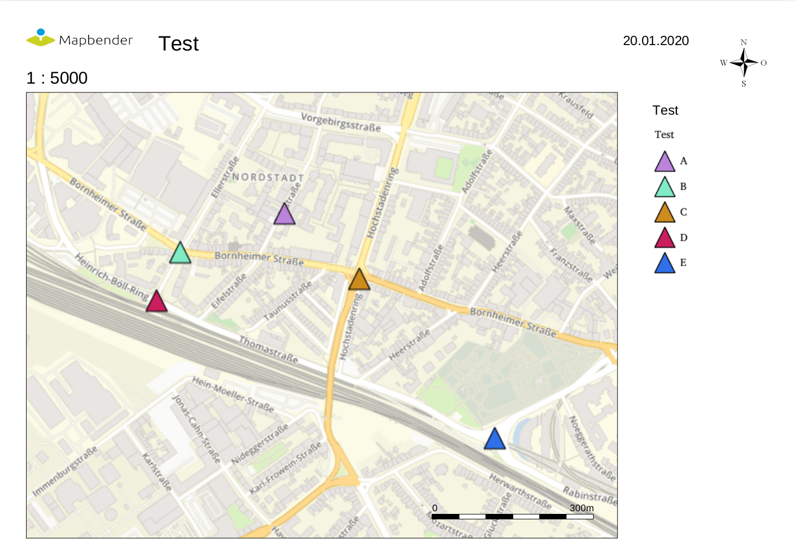
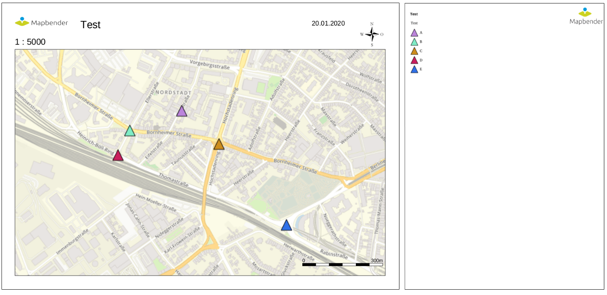
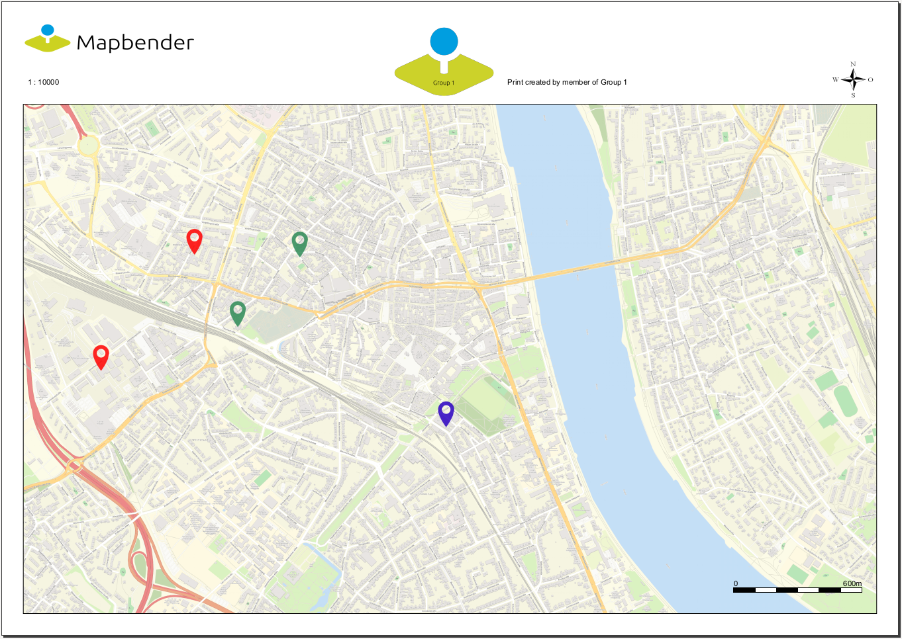

.. _printclient:

PrintClient
************

Mapbender offers a PDF print, which print a defined area of the map. Before you print you can choose via the client these different possibilities:

 * Select scale,
 * Select quality,
 * Rotate the print frame,
 * Print legend.
 * Optional you can define individual input fields (f.e. title, comment, notice) which will also be printed in the pdf.

The print element uses print templates, which can be modified individually. In the print templates you can define regions for date, scale (text or scalebar), overview map and north arrow.

Mapbender contains already a collection of print templates (LibreOffice Draw files in formats A4 to A0), which can be modified individually.

.. image:: ../../../figures/print_client.png
     :scale: 80

The PrintClient can be used both as a dialog and an element as part of the sidebar. If it is part of the sidebar, you have to activate the Print Frame first to start the print. If you have finished, you have to deactivate the Print Frame again to use the map again as usual (when used as a dialog this happens automatically by opening and closing the dialog window).

.. image:: ../../../figures/print_client_sidebar.png
     :scale: 80

Configuration
=============

.. image:: ../../../figures/print_client_configuration.png
     :scale: 80

You need a button to show this element or you can use it in the sidepane. See :ref:`button` for inherited configuration options.

* **title**: Title of the element. The title will be listed in "Layouts" and allows to distinguish between different buttons. The title will be displayed besides the button if "Show label" is activated.
* **target**: Id of Map element to query
* **type**: element or dialog, default is dialog
* **scales** -  define scales to choose from select-box or if empty free scale can be defined in a text-field
* **rotatable** - true/false use true for rotation, default is true
* **print legend** - true/false, default is false
* **legend checkbox checked** - (legend_default_behaviour) - true/false, if true the legend check-box is checked by default
* **file_prefix** - define the file prefix for the PDF that is generated (file_prefix_date.pdf will be created)
* **quality_levels** - define quality levels in DPI
* **templates**: template name, template file name without file extension (Mapbender is looking for file a4portrait.odg an a4portrait.pdf), Template files are located at app/Resources/MapbenderPrintBundle
* **label** - define a template label for the select-box
* **optional_fields** - define optional fields:

  * **title**: Name of the optional field, the default value is null (no optional fields are defined).
  * **label**: Label of the optional field.
  * **options**: { required: true } : Type of the optional field. Has to be true or false.

* **replace_pattern** - You can modify the map-request for printing. You can add additional parameters like map_resolution (for MapServer).

YAML-Definition:
----------------

.. code-block:: yaml

    target: map                    # Id of Map element to query
    type: dialog                   # element or dialog, default is dialog
    templates:
        - { template: a4portrait, label: A4 Portrait}	# template name, template file name without file extension (Mapbender is looking for file a4portrait.odg an a4portrait.pdf), Template files are located at app/Resources/MapbenderPrintBundle
        - { template: a4landscape, label: A4 Landscape} 	# template label in the dialog
    scales: [5000, 10000, 25000]    # define scales to choose from select-box or if empty free scale can be defined in a text-field
    quality_levels:					# define quality levels in dpi
        - { dpi: 72 , label: Draft (72dpi)}		# 72 - dpi value, Draft - label
        - { dpi: 288,  label: Document (288dpi)}	# 288 - dpi value, Document - label
    rotatable: true                 # true/false use true for rotation, default is true
    legend: true                    # true/false, default is false
    legend_default_behaviour: false # true/false, if true the legend check-box is checked by default
    file_prefix: mapbender         # define the file prefix for the PDF that is generated (file_prefix_date.pdf will be created)
    optional_fields:                # define optional fields (example title-field)
        title:                      # name of the optional fields, default is null (no optional fields are defined)
            label: Title            # label of the optional field
            options:                #
                required: false     # true or false
        comment1:
            label: Comment 1
            options: { required: false }
        comment2:
            label: Comment 2
            options: { required: false }
        editor:
            label: Editor
            options: { required: true }
    replace_pattern:                 # You can modify the map-request for printing
            -                        # you can add additional parameters like map_resolution (for MapServer)
                default: { 288: '&map_resolution=288' }
            -
                pattern: 'stadtplan.xml'        # or you can request a different service which is optimized for printing
                replacement: { 288: 'stadtplan_4.xml' }

Class, Widget & Style
=====================

* Class: Mapbender\\CoreBundle\\Element\\PrintClient
* Widget: mapbender.element.printClient.js

File location
=============

* **northarrow:** The "North arrow" image is located at **app/Resources/MapbenderPrintBundle/images/**. You can replace the "North arrow" image to use a different image as northarrow.

* **print templates:** You find the print templates at **app/Resources/MapbenderPrintBundle/templates/**. Create your own print template to provide an individual output for your application.

Create your individual templates
================================

To create an individual print template use an existing print template odg-file or create a new LibreOffice Draw file. Your template can have fixed objects like your logo, copyright or print information. In addition you have to create a layer for the dynamic elements like map, overview, northarrow, scale, date and optional fields. The dynamic layer is an additional non printable layer in your LibreOffice Draw file. Add this layer with **Menu -> Add -> Layer -> define a name for the layer and choose the option not printable**.

.. image:: ../../../figures/print_template_odg.png
     :scale: 80

Define areas for the map, northarrow, scale, date and optional fields.

The following objects are available from Mapbender:

* map
* overview
* scale
* scalebar
* date
* northarrow
* extent_ur_y, extent_ur_x, extent_ll_x, extent_ll_y (coordinates of the print extent)
* dynamic_image (connected to group role)
* dynamic_text (connected to group role)

You can define optional fields in the element definition (like title, comment, editor) and add them to the Open Office Draw file.

When creating dynamic text each property must have the appropriate name, for example the filed **comment1** must have the name **comment1** in the Open Office Draw file. For naming fields, it is not enough to edit the content of the textfield. You need to edit the object name. Selct the textfiled and go to **menue edit --> name...** to change the name.

.. image:: ../../../figures/de/print_template_name.png
    :scale: 80

Export the template to pdf under the same name as the odg file. Use the name without extension in your print yml-definition.

The print script will read the information (position, size, font size, alignment) from the ODG file and will also use the PDF with the fixed objects to generate the new PDF.

Dependent of the group you can generate prints with different Logo and Text (f.e. the name of the commune and the individual logo). There are two objects which handle this - dynamic_image and dynamic_text. If these objects exists in your print layout Mapbender and you are member of a group Mapbender will look for an Image with the name of the group (groupname.png) and will be displayed in the print in the object dynamic_image. The height of the object will be used to scale the image and the width will be calculated relative to the height. In the object dynamic_text the group description will be printed.

Printing elements in front of the map-element
=============================================

In order for the map-element to be as large as possible and to avoid white or empty areas, elements can be placed in front of the map image to prevent that space is lost through white areas. This is particularly useful in the case of large printing formats, such as DIN A1, which have a comparatively wide border.

To use this function, the templates have to be adapted and transparent PDF templates have to be created.

Adapt templates:

* Reorder elements in front of white background

  - Arrange elements in the foreground

    + Right click Arrange --> To the front

  - Arrange map-element in the background

    + Right click Arrange --> To the back

* Select all

  - Press CTRL + A

* Print selection as PDF

  -  Export as PDF

  -  Selection instead of All

Legend on the first page
========================

You can integrate the legend next to the map on the first page. This field is not included in the print template by default. To insert the legend you have to modify the ODG print template file. Insert a new dynamic field with the name "legend" on the non printable layer and put it to the desired spot. Go to **Menue: Modify -> Name...**  to change the name of the field to "legend". As final step, you have to export the ODG-file as PDF-file as described above and save it in the same directory. The result could look like this:

Logo on the legendpage
======================

If the legend should still be created on an additional page, you can put a logo on this second page. This can be achieved with the dynamic element "legendpage_image". You have to create a new field on the non printable layer and change its name to "legendpage_image" (**Menue: Modify -> Name...**). Save the desired logo or image in the directory **app/Resources/MapbenderPrintBundle/images/** and change its name to "legendpage_image.png". The print could contain two pages and look like this:

You can see the legendpage image in the right corner of the second page.

Coloured texts
==============

The text in the print template can be changed in many ways. Besides the size of the font, you can also change the colour of the text. To do so, insert a text field via **Menue: Insert -> Text Box**. If you want to insert it as a dynamic element, you have to insert it on the non printable layer and change its name, for example to "title". To change the colour of the text, select the text in the text field (here: "title"). You can either change the colour in the tab **Properties -> Character**:

.. image:: ../../../figures/print_client_example_colour_nav.png
     :scale: 80

Or you **right-hand click the selected text** and open the dialogue window **Character**. There you can change the colour in the tab **Font Effects -> Font color**.

.. image:: ../../../figures/print_client_example_colour_dialog.png
     :scale: 80

The change of the colour of the dynamic field "title" to blue can look like this:

.. image:: ../../../figures/print_client_example_colour.png
     :scale: 80

The change of the font size works in an analogous manner.

Dynamic images and dynamic texts
================================

Depending on the group, the print can contain different images or descriptions (e.g. logo and name of the commune). This can be achieved through the dynamic elements "dynamic_image" and "dynamic_text". You can insert both elements in the ODG-print template on the non printable layer and change their names (**Menue: Modify -> Name...**). As soon as you’ve put the fields in the print template, Mapbender will look for an image with the name of the group and will display it in the field of the "dynamic_image". The height of the object will be used to scale the image and the width will be calculated relative to the height. You have to save the different images in the directory **app/Resources/MapbenderPrintBundle/images/** with the name of the group (e.g. the name of the group is "Group 1", then the name of the image has to be Group 1.png). The description of the group will be displayed in the field "dynamic_text".
The print with a group named "Group 1" could look like this:

To use this feature, it is required, that you’ve created groups before. How to create groups and users is described in the Mapbender documentation in the `Mapbender Quickstart <../../quickstart.html>`_.

Printing feature information for a selected element
===================================================

You can print information from a selected feature to the print output. A feature can be selected via digitizer or featureInfo.

The concept is to pass the feature_type-name and the selected object-id to the print. Mapbender will then get all the feature data for the selected object and will look for fields in the print template. In a field is defined, the data will be printed to this field.

In the next steps it is described how this functionallity can be configured. The documentation relies on the poi table that is used in the digitizer example.

You find the configuration and an example print-template in the Workshop/DemoBundle at https://github.com/mapbender/mapbender-workshop 

There are some steps you have to follow:

1. Create a print template that refers to the feature columns
2. Define a featureType and refer to your new print template in your config.yml
3. Call feature print from featureInfo
4. Or call feature print from digitizer

1. create a print template that refers to the feature columns
-------------------------------------------------------------

Define textfields in your print template for every information you would like to print for the selected object. The textfield name has always the prefix *feature.* followed with the name of the attribute (column) to export.

.. code-block:: yaml

  feature.name for column name of table poi

2. define a featureType and refer to your new print template in your config.yml
-------------------------------------------------------------------------------

.. code-block:: yaml

 parameters:
   featureTypes:
     feature_demo:
       connection: search_db   # Name of the database-connection from the config.yml
       table: public.poi       # Table-name in which the FeatureTypes are stored
       uniqueId: a_gid         # Column-name with the unique identifier
       geomType: point         # Geometry-type
       geomField: geom         # Column-name in which the geometry is stored
       srid: 4326              # source EPSG-code of data
       print:                  # print template to offer for feature data print
         templates:
          - template: a4_portrait_official_feature_data_demo
            label: Demo with feature information print (portrait)
          - template: a4_landscape_official_feature_data_demo
            label: Demo with feature information print (landscape)

3. Call feature print from featureInfo
--------------------------------------

Note: FeatureInfo is the information output from a OGC WMS service. It offers information for features at a click position.

When you can configure a WMS you can generate a link with the following reference that will trigger the print with feature information.

The following code is an example for a MapServer information template.

.. code-block:: yaml

 <table>
 
 <tr>
 <td class="th_quer">Print</td>
 <td><a href="" onclick="parent.$('.mb-element-map').data('mapQuery').olMap.setCenter([[x],[y]]);parent.$('.mb-element-printclient:parent').data('mapbenderMbPrintClient').printDigitizerFeature('feature_demo',[gid]);parent.$('.mb-element-featureinfo:parent').data('mapbenderMbFeatureInfo').deactivate();return false">print feature information</a>
 </td>
 </tr>
 </table>

The featureInfo will open a dialog with a link *print feature information*. When you click on the link the print dialog opens and offers the print templates that are defined for the feature type.

You can choose the desired region and create a print pdf. The pdf will contain the information for the selected feature. 

4. or call feature print from digitizer
----------------------------------------

You also can integrate the functionality to the digitizer. It will offer a new button *print* in every feature information dialog.

To activate the functionality you have to add the following parameter to your digitizer configuration.

.. code-block:: yaml
    
    printable: true

When you click on the print button the print dialog is opens and offers the print templates that are defined for the feature type.

Again you can choose the desired region and create a print pdf. The pdf will contain the information for the selected feature. 

Note: The flexibility to move the print frame wont stop you from choosing a region that does not contain the feature that was selected. In this case the feature information does not match to the features that are displayed.

Configuration of the element
============================

Go to your application an create a new element **printclient** (Please note: You need a button to show this element or you can use it in the sidepane.)
