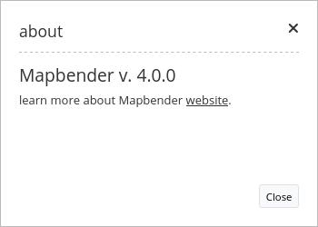

.. _about_dialog:

About Dialog
************

This element creates a `button <button.html>`_ which shows a simple about dialog, listing Mapbender's version. The button can be placed into the toolbar and the footer region.

Configuration
=============

.. image:: ../../../figures/about_dialog_configuration.png
     :scale: 80

* **Show Label:** Enable/Disable About dialog text next to its icon (default: true).
* **Title:** Text indicated next to the about dialog icon. 
* **Tooltip:** Text to use as a tooltip. Appears when hovering over the icon. 

YAML-Definition:
----------------

This template can be used to insert the element into a YAML application.

.. code-block:: yaml

   title: 'About Mapbender'    # text indicated next to the about dialog icon. 
   tooltip: 'About Mapbender'  # text to use as tooltip
   label: true                  # false/true to label the button, default is true
   icon: 'icon-about'           # icon to display on button