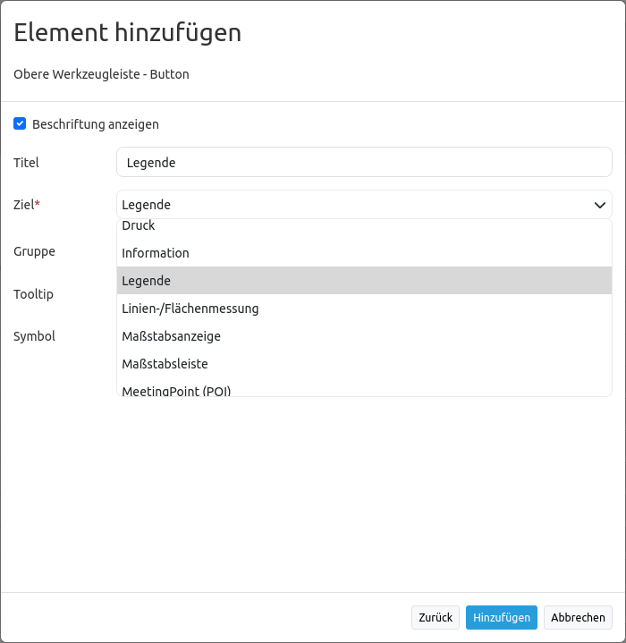
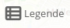

.. _button:

Button
******

The button element provides a push button widget. Some elements like `Legend <../basic/legend.html>`_ , `Layertree <../basic/layertree.html>`_, `FeatureInfo <../basic/feature_info.html>`_, `Line/Area Ruler <../basic/ruler.html>`_ and  `PrintClient <../export/printclient.html>`_ need a button to be displayed/activated if not defined in a frame.

Buttons optionally can be grouped, so that only one button in a group can be active at any given time. This is done by the group paramter.
You can define a button that refers to a website or script using the click paramter. You can only choose features as target parameter, which have been added in the content or footer before.

Configuration
=============

.. image:: ../../../figures/button_configuration.png
     :scale: 80

* **Show label:** Enable or disable text (title) next to the button.
* **Title:** Title of the element. The title will be listed in "Layouts" and allows to distinguish between different buttons. It will be indicated if "Show label" is activated.
* **Tooltip:** Text, that will be indicated if the mouse hovers over the button for a longer time.
* **Icon:** Symbol of the button. Based on a CSS class.
* **Target:** Target element (Title(ID)) of the button. The target element will be triggered by clicking on the button. (e.g.: Print).
* **Click:** Refers to a website or a script (e.g.: http://mapbender.org). By clicking on the button the website will open.
* **Group:** Adds the element to a group. Only one button of the group may be activated.
* **Action:** Method that is invoked when the button is activated (e.g. activate or open).
* **Deactivate:** Method that is invoked when the button is disabled (e.g. deactivate).

Icons
-----

For some symbols you can choose between two different types of icons:

* A symbol based on a graphic (e.g. "About"),
* A symbol based on a font (e.g. "About (Font Awesome)").

The latter are based on a `IconSet <https://github.com/mapbender/icons>`_, which is delivered with Mapbender as a module. We recommend to use the symbols from this library.

More information on that topic:

* https://github.com/mapbender/icons
* http://rawgit.com/mapbender/icons/master/demo.html

Configuration examples:
========================
Depending on the purpose of the application, different buttons are required which provide different features. These can be integrated as needed.
You can add buttons for features which are integrated in the content. For example the legend, the feature info or the line and/or area ruler can be activated or opened by buttons. 

Button for the legend element
------------------------------

The legend is very helpful, because it provides information about the map content. In this user example the legend is integrated in the content as element type "dialog". You can find a descripton of how to configure the legend element in this documentation at `Legend <../basic/legend.html>`_.
You can add a button for the legend by following these steps:

First you have to select the button element by clicking on the ``+`` - symbol in the Toolbar section in the Layouts tab.

.. image:: ../../../figures/de/add_toolbar.png
     :scale: 80

After the selection of the button element, the "Add element - Button" dialog box opens, where you can configure the button.
You can set the name of the legend button in the field *Title*. Here the title is "Legend". As soon as you hover your mouse over the button, the text "Open legend" appears, because this text is defined in the field *Tooltip*. You can choose from a variety of icons to set the icon for your button. In this example, the icon "Legend" was chosen. 

.. image:: ../../../figures/de/button_legend_dialog_icon.png
     :scale: 80

In the *Target* field you can choose the predefined feature which should be activated or opened by clicking on the button. The dropdown list contains all features, which have been added to the content, the sidepane or the footer before. In this example the option "Legend" was chosen.

In this example the other fields (*Click, Group, Action* and *Deactivate*) remain empty. By default the action "open" is configured. So by clicking on the button, the legend will open in a dialog box. In the Mapbender application the button will look like this:

.. image:: ../../../figures/de/button_legend_text.png
     :scale: 80
     
The title of the element is displayed next to the icon, because in the configuration dialog box the option "Show label" was checked. If the checkmark isn't set, the button looks like this:

.. image:: ../../../figures/de/button_legend_symbol.png
     :scale: 80

If you choose the *Icon* "Legend (Font Awesome)" instead of "Legend" and check the option "Show label", the button would look like this:

     
Now, by clicking the button, the legend will open in a dialg box. This only works, if the *element type* of the legend element is set to "dialog". The *element type* "blockelement" should only be used when you want to integrate the legend in the sidepane.

Button for Line and Area Ruler
--------------------------------

The features line and area ruler can also be integrated in the application with buttons. Also in this case it is necessary, that the features are already added to the content, sidepane or footer.
This example shows how to create groups. Both buttons should be in one group, so that only one feature, line or area ruler, can be active and not both at the same time.
You can add this button, like the legend button, by clicking on the ``+`` -symbol in the application in the Layouts tab. The dialog box "Add element - Button" appears. For the line ruler feature it can look like this:

.. image:: ../../../figures/de/button_distance_dialog.png
     :scale: 80
     
In this example the title (*Title*) of the button is "Line ruler". When you hover your mouse over the button, the text "Measure line" will appear. As *Icon* the option "Line ruler" and as *Target* the element "Distance" was chosen. The feature "Distance" was created before with the feature Line/Area Ruler. You can find a description of how to create this feature in this documentation under `Line/Area Ruler <../basic/ruler.html>`_.

To group this button and the button for the area ruler, you have to put a group name in the field *Group*. In this example the name of the group is "measure". You also have to add this group name to the button for the area ruler. In the field *Deactivate* "deactivate" was added. When you click on the active area ruler button again, the feature gets deactivated with this configuration.
The button for the area ruler can be integrated the same way as the button for the line ruler. The dialog box for the configuration of this button can look like this:

.. image:: ../../../figures/de/button_area_dialog.png
     :scale: 80

Attention should be paid to the field *Group* with the group name "measure", which has to be the same as the one of the button line ruler. Both buttons can look like this in the application:

.. image:: ../../../figures/de/button_measure.png
     :scale: 80

If the button line ruler is active, it looks like this:

.. image:: ../../../figures/de/button_measure_activated.png
     :scale: 80

As soon as you click on the button area ruler, the feature line ruler is deactivated and the feature area ruler activated.

YAML-Definition:
----------------

.. code-block:: yaml

    title:        # title
    tooltip:      # text to use as tooltip
    icon: ~       # icon CSS class to use
    label: true   # false/true to label the button, default is true
    target: ~     # title (Id) of target element
    click:        # refer to a website or script like http://mapbender.org
    group: ~      # group to put the button into. Only one button per group can be active
    action: ~     # method of target to call when button is activated
    deactivate: ~ # method of target to call when button is deactivated

Class, Widget & Style
=====================

* **Class:** Mapbender\\CoreBundle\\Element\\Button
* **Widget:** mapbender.mbButton (mapbender.element.button.js)
* **Style:** mapbender.elements.css

HTTP Callbacks
==============

None.
