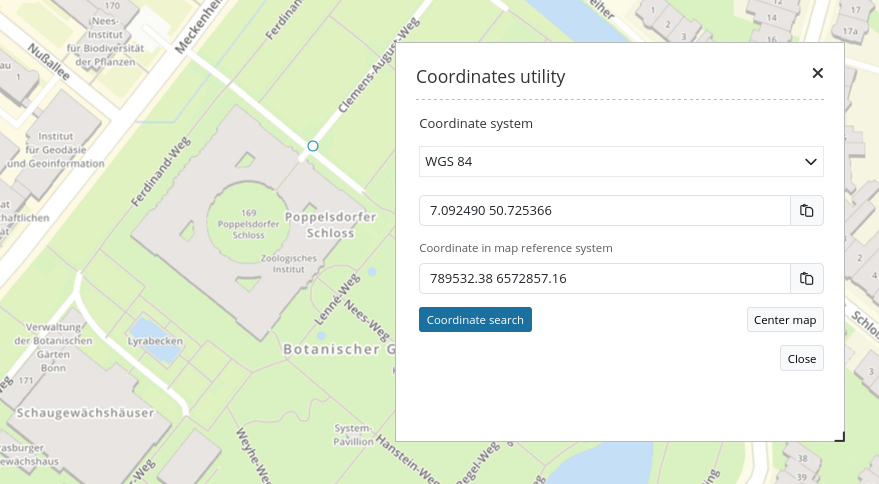
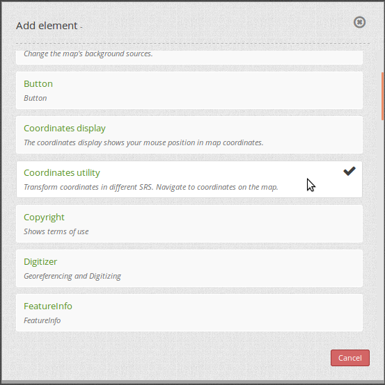
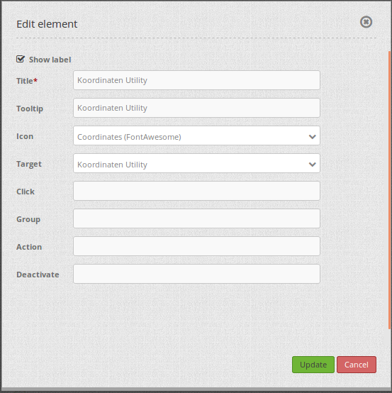

.. _coordinate_utility:

Coordinate Utility
******************

The element *Coordinate Utility* allows two different things:

1. Zoom to a given Point-coordinate
2. Show the click-point of the map.

Both functions can be accessed with one user-interface:

Both cases allow a dynamic coordinate-transofrmation so that also points in a different coordinate-system can be used.

Additional you have the possibility to copy the coordinates into the clipboard.

The element can be configured in the Mapbender-Backend as a dialog with a button or directly in the Sidebar as an element.

Initialization and Configuration
================================

Add the element `Coordinate Utility` into the content of your application.

The customization allows - besides the standard-configuration - some additional options:

.. image:: ../../../figures/coordinate_utility_configuration.png
     :scale: 80

* **Title:** Title of the element.
* **Target:** Map on which this tool works (Main Map)
* **Type:** Dialog or Element.

  * **Dialog:** The tool is placed in the Content of the application and is called with a button. The tool is presented as a dialog.
  * **Element:** The tool is placed in the Sidebar of the application. You have to declare it as element.

* **Srs List:** You can define additional SRS to which the tool has to transform the coordinates. This list can be left empty.

* **Add map's srs list:** The supported coordinate-systems defined in the `Map element  <../basic/map>`_ are automatically used by the Coordinate-Tool. These coordinate systems, defined in the map, are also used by the `SRS Selector  <../basic/srs_selector>`_.

If you define the Tool as a dialog, you need a `Button  <../misc/button>`_ that you place in the Toolbar. The following screenshot shows an example configuration of the button:

* **Target:** Name of the tool that is placed in the content of the application (Koordinaten Utility)

Using the tool
===============

**Get Coordinate:**

* If the Coordinate tool is opened as a dialog, the map reacts on a click. Click into the map and the click-coordinate is displayed in the dialog.
* Change the coordinate system with the drop-down-list. The click-coordinate is displayed in the given coordinate-system.
* The last line therefore shows the click-coordinate in the original coordinate-system of the map.
* The button at the end of each text-field allows to copy the coordinate directly into the clipboard.

**Zoom to coordinate:**

* The text-field can be used to edit your own coordinates. They must be given in the coordinate-system that is chosen in the upper drop-down list.
* With a click on the **Center map** button, the map zooms to the given coordinate and shows the position with an orange symbol.

YAML-Definition
===============

.. code-block:: yaml

    coordinatesutility:
        title: 'Koordinaten Utility'
        class: Mapbender\CoordinatesUtilityBundle\Element\CoordinatesUtility
        type: element
        target: map
        srsList:
            -
                name: 'EPSG:31466'
                title: '31466'
            -
                name: 'EPSG:31468'
                title: '31468'
            -
                name: 'EPSG:25833'
                title: '25832'
            -
                name: 'EPSG:4326'
                title: '4326'
                addMapSrsList: true
