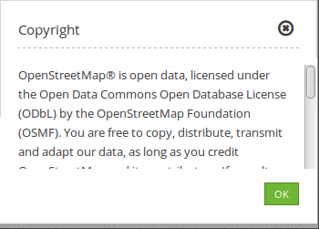
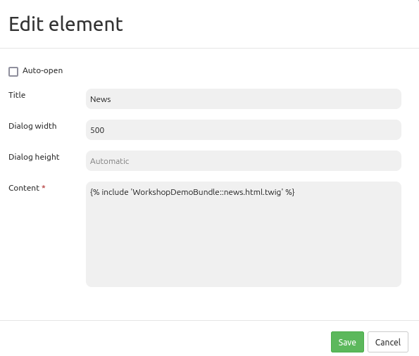

.. _copyright:

Copyright
*********

The copyright elment can be used to show text (also HTML) in a dialog. The dialog can be shown automatically on start if needed. You can integrate Links and Images (see :ref:`html`).

Configuration
=============

.. image:: ../../../figures/copyright_configuration.png
     :scale: 80

* **Autoopen:** Enable or disable autoopening of the copyright window, when starting the application (default: off).
* **Title:** Title of the element. It will be indicated next to the button.
* **Tooltip:** Text used as a tooltip. It will be displayed when hovering with the cursor over the button. It also used as a header in the copyright window.
* **Popup width:** Width of the Popup window (default: 300).
* **Popup height:** Height of the Popup window (default: 170).
* **Content:** Content of the copyright window, displayed when clicking on the button (or autoopened by starting the application, if enabled).

Refer to a twig file
--------------------

In the Content-area you can refer to a twig file. Please note that the twig file has to contain valid HTML.

YAML-Definition:
----------------

This template can be used to insert the element into a YAML application.

.. code-block:: yaml

   class: Mapbender\CoreBundle\Element\Copyright
   title: "Copyright"              # Title of the element
   popupWidth: 300
   popupHeight: 170
   tooltip: "Copyright"            # Text to use as tooltip
   content: "Lorem ipsum"          # Edit the text you want to display as copyright text
   autoOpen: true                  # Automatically open the dialog when you start the application
   
