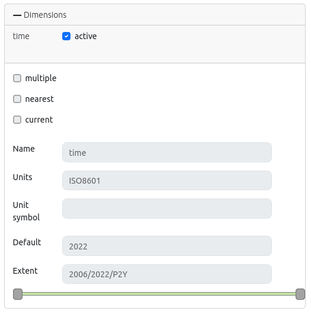
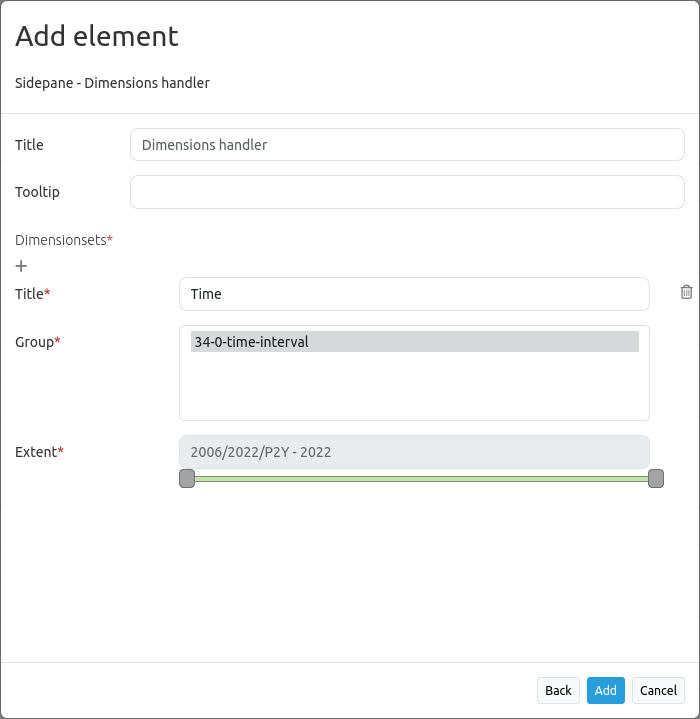

.. _dimensions_handler:

Dimensions handler
******************

The dimensions handler can be used to integrate WMS services with a time dimension. WMS-Time services are registered as a normal WMS data source. If a dimension is specified in the service, it is displayed in the layer metadata.

.. code-block:: resource

    Dimension:
 		name:'time', units:'ISO8601', unitSymbol:'', default:'2018-01', multipleValues:'', nearestValue:'1', current:'', extent:'2014-01/2018-01/P1M'

.. image:: ../../../figures/wmst_source.png
     :scale: 80

WMS-T are inserted almost like WMS in the layersets, with the exception that the time parameter still has to be activated. If this is not activated, the dimensions of the service are ignored and the default value is used when calling the layer in the map content.

If a service supports a time dimension, the instance displays the "Dimensions" button. By clicking on this button, the supported time parameters are displayed and time values can be activated by clicking the checkbox.
After another click on the button, the detailed form opens, in which the usage can be further defined. Here you can further restrict the values ​​from the WMS service. To set up the service, the following definitions of time parameters are necessary:

* **Query type**: multiple, nearest, current
* **Name**: value TIME (name=time)
* **Units**: format for temporal dimensions (ISO 8601:2000)
* **Unit symbol**:
* **Default**: default time
* **Extent (extent slider)**: Supported extent for the time dimension 

The element supports the following time variables:

* Single time parameter
* List of times
* Time interval

Controlling time parameters
===========================

There are two ways to control the time of the WMS. On the one hand, each service with an active time parameter can be controlled via the context menu of the layer in the layertree. In addition, a central slider can be integrated, which can be displayed in any area of ​​the application. The slider can be used to combine several layers with the same extent to control them centrally.

Timeslider in context menu
--------------------------

A timeslider can be integrated via the layertree as an option in the context menu of the layer. To do this, the "Dimension" option must be activated in the `Layertree <../basic/layertree.html>`_ element.

.. image:: ../../../figures/wmst_layertree.png
     :scale: 80

After activation in the layertree, a time slider appears in the context menu. To use the feature, the element must first be activated via the checkbox. Then it's possible to alter the timeslider with the cursor.

.. image:: ../../../figures/wmst_context_menu.png
     :scale: 80

Timeslider as element
----------------------

The layers can also be controlled by the dimensions handler element via a central slider. The dimensions handler can be integrated into sidepane, toolbar or footer.
The configuration of the dimensions handler is done in three steps:

* **Creating the element**: First, the element needs to be created. To do that, integrate the Dimensions handler as new element in the Layouts tab of your Mapbender application.
* **Defining a dimensionsset**: Next, define a dimensionsset. You can create a new set in the element via the "+" button. Type in a title for the set and select a Group.
* **Defining the slider**: At last, you can select the layer instances for the dimensionset that you want to control via the slider. Multiselect is supported, but only instances that have the same extent can be combined with each other. In addition, after the first selection of an instance, a slider appears. There you can restrict the extent for the time display.

When an instance is selected, all instances that do not conform to this default are no longer selectable. Finally, save the configuration to add the Dimensions handler element to the Mapbender application.

.. image:: ../../../figures/wmst_element.png
     :scale: 80

Configuration
=============

* **Title**: Title of the element
* **Tooltip**: Labeling of the element on mouseover
* **Dimensionsset**: Group for display of time extent with a title (**Title**), layergroup (**Group**) and time dimension extent (**Extent**)

The following section lists the YAML definitions for the element and the inclusion in the service and leveltree.

Element configuration
---------------------

.. code-block:: yaml

    target: ~                            # ID of the map element
    dimensionsets:
        title: Time
        group:
            dimension:      # Dimension specification as in the layer configuration
                origextent: 2014-01/2018-01/P1M
                active: null
                type: interval
                name: time
                units: ISO8601
                unitSymbol: null
                default: 2017-11
                multipleValues: true
                nearestValue: true
                current: true
                extent: 2014-01/2017-11/P1M

Layer configuration 
-------------------

.. code-block:: yaml

        dimension:                      # Dimension specification in layer configuration
            -   name: time
                units: ISO8601
                unitSymbol: null
                default: 2018-01
                multipleValues: false
                nearestValue: true
                current: false
                extent: 2014-01/2018-01/P1M

Layertree configuration
-----------------------

.. code-block:: yaml

        title: Layertree
        class: Mapbender\CoreBundle\Element\Layertree
        configuration:
            [...]
            menu:
                - [...]
                - dimension

