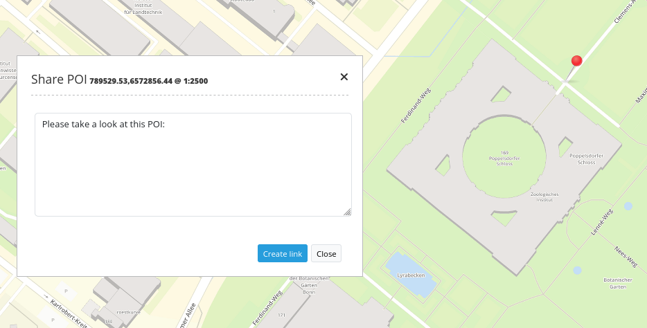

.. _poi:

POI (MeetingPoint)
***********************

Generate POI-URLs (aka meeting points) suitable for e-mail. The generated point is projected and displayed in the coordinate system of the map.

Configuration
=============

.. image:: ../../../figures/poi_configuration.png
     :scale: 80
     
* **Use Mailto:** Sends POI by e-mail.
* **Title:** Title of the element. The title will be listed in "Layouts" and allows to distinguish between different buttons. It will be indicated if "Show label" is activated.
* **Body:** Defines text to display. 
* **GPS Position:** Defines GPS Position in the map.

YAML-Definition:
----------------

This template can be used to insert the element into a YAML application.

.. code-block:: yaml

    target: map                             # only map-element is possible
    body: 'Please take a look at this POI'  # define a text to display

