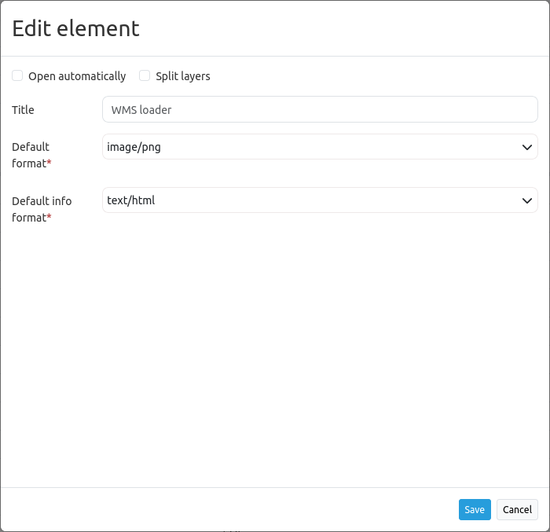

.. _wms_loader:

WMS Loader
***********************

Opens a dialog in  which a WMS can be loaded via the getCapabilities-Request. It is possible to load WMS 1.1.1 and WMS 1.3.0.

.. image:: ../../../figures/wms_loader.png
     :scale: 80

Configuration
=============

* **Auto open:** Opens the element when application is started (Default: false).
* **Split layers:** Splits layer on load of the service (Default: false).
* **Title:** Title of the element. The title will be listed in "Layouts" and allows to distinguish between different buttons. It will be indicated if "Show label" is activated.
* **Default format:** Default format is image/png, other possibilities: image/gif, image/jpeg.
* **Default info format:** Default info format is text/html, other possibilities: text/xml, text/plain.

YAML-Definition:
----------------

.. code-block:: yaml

   target: ~                            # Id of Map element to query
   tooltip: 'WMS Loader'                # text to use as tooltip
   autoOpen: false                      # true/false open when application is started, default false 
   defaultFormat: 'image/png'           # default format is image/png, further possibilities: image/gif, image/jpeg
   defaultInfoFormat: 'text/html'       # default infoformat is text/html, further possibilities: text/xml, text/plain
   splitLayers: false                   # split layer on load of the service, default false

You need a button to show this element. See `button <button.html>`_ for inherited configuration options.

How to add a WMS by defining a link
====================================

You can add a WMS to Mapbender by defining a link, e.g. in your :ref:`WMS featureinfo<feature_info>` or your search results.

Activate the option **use Declarative** in the WMS Loader element (in a YAML application set the option ``useDeclarative`` to true).

The link has to look like this:

.. code-block:: html

  <a href="#"
  mb-action="source.add.wms" mb-layer-merge="1" mb-wms-merge="1"
  mb-wms-layers="Gewaesser,Fluesse"
  mb-add-vendor-specific="bplan=123" 
  mb-url="http://wms.wheregroup.com/cgi-bin/germany.xml?VERSION=1.1.1&REQUEST=GetCapabilities&SERVICE=WMS">load service</a>

.. code-block:: yaml

    mb-action="source.add.wms"    # defines action to add a  WMS
    mb-wms-merge="1"              # adds the WMS only once, if WMS is already part of the application it will use the WMS which is there (default is 1)
    mb-layer-merge="1"            # default is 1 which means: activate the layers passed mb-wms-layers and do not disable the layers which are already active.
    mb-wms-layers="Gewaesser,Fluesse" # defines the layers to be activated, _all activates all layers, default all layers are deactivated
    href oder mb-url              # refer to the WMS getcapabilities URL
    mb-add-vendor-specific="bplan=123" # define a vendor specific that will be added to the requests (new from version 3.2.9)

