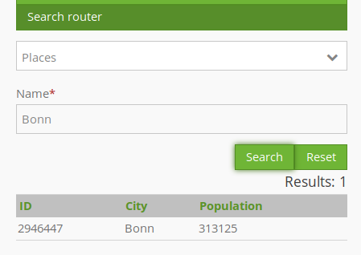
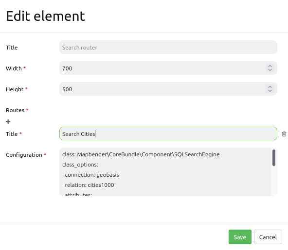
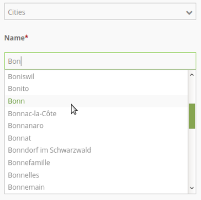
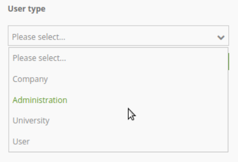
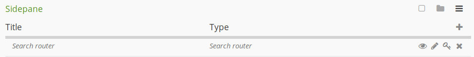
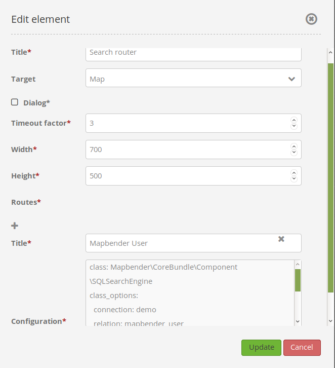
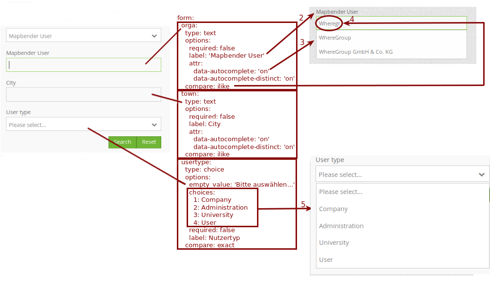

.. _search_router:

Search Router
*************

This element creates a configurable search formular with result output in which generic SQL search is supported.

Add SearchRouter
================

In order to use the SearchRouter, two requirements have to be met:

1. The database has to be defined in the configuration files.
2. The SearchRouter element has to be integrated in the Mapbender layout. The element may be integrated into the sidepane or as a button into the toolbar. To configure a button visit the documentation at :ref:`button`.

Configuration
=============

* **Title:** Title of the element. The title will be listed in "Layouts" and allows to distinguish between different buttons. It will be indicated if "Show label" is activated.
* **Target:** Id of Map element to query.
* **Dialog:** Render inside a dialog or not.
* **Timeout factor:** Timeout factor (multiplied with autcomplete delay) to prevent autocomplete right after a search has been started.
* **Width:**  Width of the dialog (only for dialog, not sidepane)
* **Height:**  Height of the dialog (only for dialog, not sidepane)
* **Routes:** Collection of search routes.
* **Title**: Search Title (appears, when a search is added to Routes by using +)
* **Configuration**: Field to configure the search (ppears, when a search is added to Routes by using +)

You can define Searches (Routes) with the ``+`` Button. Each Search has a ``title`` which will show up in the search form in a selectbox. From there you can choose the search you want to use and a ``configuration``. The definition of the search is done in YAML syntax in the textarea configuration. Here you define the database connection, the Search tables/views, the design of the form and of the result table.

**Tip:**
The SearchRouter needs access to the database where the search tables are. You have to define a new database configuration to be able to connect with the geo database. Read more about this at :ref:`yaml_en`.
Only one coordinate reference system is allowed. The geometry column must match the coordinate system of the map.

Type
----

Examples of the different types:

* Type text; example with autocomplete:

.. code-block:: yaml

	form:
		name:
		type: text                                                      # input box for text
		options:
			required: true
			attr:
				data-autocomplete: 'on'                                 # auto complete
				data-autocomplete-distinct: 'on'
		compare: exact                                             

* Type choice; example with different selection options via dropdown:

.. code-block:: yaml

    usertype:                                                         
      type: choice                                                      # box with selection options as dropdown list
      options:
        placeholder: 'Please select...'                                 # text that is shown before an option is selected
        choices:                                                        # the options need to be specified: "name of the column of the database": "name shown in the dropdown list"
          1: Company
          2: Administration
          3: University
          4: User
        required: false                                                 # no required field
        label: user type                                                # heading above the box
      compare: exact     
      

Comparison Mode
---------------

For every field a comparison mode can be set, which should be used by the engine when the query is sent. The SQL search engine has the following modes:

* **exact:** exact comparison (key = val)
* **iexact:** comparison ignoring cases (case-insensitive)
* **like:** Standard, both-side 'like'
* **like-left:** left-hand 'like'
* **like-right:** right-hand 'like'
* **ilike**: both-side 'like', (case-insensitive - \*searchstring\*)
* **ilike-left:** left-side 'like' (case-insensitive - \*searchstring)
* **ilike-right:** right-side 'like' (case-insensitive - searchstring\*)

Styling the Results
-------------------

By default the results are shown in the default-OpenLayers Style, orange for hits and blue for selected objects. The OpenLayer default Styling looks like this:

.. image:: ../../../figures/de/search_router_example_colour_orangeblue.png
     :scale: 80

You can overwrite this by handing over a styleMap-Configuration, which could look like this:

.. code-block:: yaml

    results:
        [...]
        styleMap:
            default:
                strokeColor: '#00ff00'  # border color
                strokeOpacity: 1        # 1 - opak (no transparency -> 1)
                strokeWidth: 3          # border width
                fillColor: '#f0f0f0'    # fill color               
                fillOpacity: 0          # fill opacity, (full transparency -> 0)
                pointRadius: 6          # size of the point symbol
            select:
                strokeColor: '#0000ff'
                strokeOpacity: 1
                strokeWidth: 4
                fillColor: '#ff00ff'
                fillOpacity: 0.8
                pointRadius: 10
            temporary:
               strokeColor: '#0000ff'
               fillColor: '#0000ff'
               fillOpacity: 1

Three different styles are configured:

- **default**: The standard-style for all results
- **select**: The style used if a result is clicked.
- **temporary**: The styles used if you hover with the mouse-pointer over a result.
               
This will not draw the point-symbol interiors, since the transparency is set to zero (fillOpacity: 0). Only their outlines will be drawn in green. The selected features will be drawn in here with a purple fill and an opacity of 0.8. The stroke-Color is a blue line. The temporary symbols on mouse-hover are opaque blue points. The following screenshot shows this design:

.. image:: ../../../figures/de/search_router_example_colour_purplegreen.png
     :scale: 80

The default settings override the OpenLayers-Default Settings, so you only have to state the things you want to overwrite. If you state nothing, the default OpenLayer style will be used.

The select-style works the same way: Any statement you make will overwrite the settings of the *final* default style.

Note, that the hexadeximal color values have to be stated in quotation marks, because the #-Symbol would be interpreted as a comment instead.

                
Configuration Examples
======================

1. Example
----------

In this example a search was configured for the Mapbender user and added into the sidepane, usable under the ``+`` in Layouts.

The confguration dialouge for this example looks like this:

The element title (*Title*) is Search. It is again displayed as a title in the sidepane. The checkbox is unchecked, because the element is implemented into the sidepane and not as a button. The *Timeout factor* is set to 2. The fields *Width* and *Height* are filled, but they won't be used in this application, because the element is configured in the sidepane. It is implemented via the ``+`` -Symbol and *Routes* into the search, called (*Title*) Mapbender User. The yaml-Configuration of the Element is written in *Configuration*. In Completion it reads:

.. code-block:: yaml

  class: Mapbender\CoreBundle\Component\SQLSearchEngine
  class_options:
    connection: demo                       # database (on which the element has access)
    relation: mapbender_user               # table (on which the element has access)
    attributes:                            # table columns (which the element addresses)
      - gid
      - orga
      - town
      - usertype
    geometry_attribute: the_geom           # definition of the geometry column
  form:                                    # configuration of the form
    orga:                                  # search field (e.g. search for specific Mapbender User)
      type: text
      options:
        required: false                    # no mandatory field
        label: 'Mapbender User'            # caption of the search field
        attr:                              # additional definable attributes
          data-autocomplete: 'on'          # auto-completion of search words
          data-autocomplete-distinct: 'on'
      compare: ilike                       # see section 'comparison mode' on this page
    town:                                  # search field (e.g. search for specific city)
      type: text
      options:
        required: false                    # no mandatory field
        label: City                        # caption of the search field
        attr:
          data-autocomplete: 'on'
          data-autocomplete-distinct: 'on'
      compare: ilike
    usertype:                              # search field (search for specific User type)
      type: choice                         # possible choices via drop down list
      options:
        empty_value: 'Please select...'    # displayed text in field before entering a search
        choices:                           # choices need to have the following format: "entry in the database column": "displayed name in the drop down list"
          1: Company
          2: Administration
          3: University
          4: User
        required: false                    # no mandatory field
        label: User type                   # caption of the search field
      compare: exact                       # see section 'comparison mode' on this page
  results:                                 # configuration of the shown results list
    view: table                            # display results as table
    count: true                            # show number of results
    headers:                               # column title; format: column title in the database: column title shown in the table 
      gid: ID
      orga: 'Mapbender User'
      town: City
    callback:
      event: click               
      options:
        buffer: 10
        minScale: null
        maxScale: 10000
    styleMap:                              # Styling points on the map
      default:                             # Styling of all points on the map
        strokeColor: '#003366'        
        strokeOpacity: 1
        fillColor: '#3366cc'
        fillOpacity: 0.5
      select:                              # Styling of the selected point on the map
        strokeColor: '#330000'
        strokeOpacity: 1
        fillColor: '#800000'
        fillOpacity: 0.5

This picture illustrates which consequences the configurations in the yaml-definition have for the search formula:

Displayed is the excerpt of the yaml-definition configuring the formula. Columns orga, town and usertype are used in the formula and implemented as the fields Mapebender User, Town and Usertype. Mapbender User and Town are type text, Usertype can be of various types. The text that should be displayed here, if nothing is selected yet, is "Please select…" (Nr. **1** – empty_value: ‚Please select...‘). The title above these fields is set with a label (Nr. **2**). The attribute data-autocomplete: ‚on‘ results in a dropdown menu with recommendations from the database (Nr. **3**). Because compare: ilike is enabled it is not necessary to write the exact word. The search will find results that are only similar to the written term (Nr. **4** – Wheregr (the g is lowercase, nevertheless WhereGroup with uppercase G was found). The fieldtype choice is variable, possibilities are defined in choices (Nr. **5**). The table contains the possibilities as numbers (1, 2, 3, 4). In this example every number represents a text, which should be displayed in the dropdown menu.

A complete search for the Mapbender User WhereGroup, in the Town Bonn, of the Usertype Company and the found results will look like this:

.. image:: ../../../figures/de/search_router_example_search_WG.png
     :scale: 80

This picture illustrates the consequences our configuration of the yaml-defnition had on the display of the results.

.. image:: ../../../figures/de/search_router_example_results_description.png
     :scale: 80

Here only the configuration of the results is shown. The number of results is shown because count: true (Nr. **1**) is enabled. The titles of the columns are defined in headeers (Nr. **2**). Here the name of the column is mentioned first, to define which results are referenced. After the colon we set the title which will be displayed in the application. In the block styleMap the points are styled. The block default (Nr. **3**) references all points, and the block select (Nr. **4**) only selected points.

Because none of these fields are mandatory the search will work wih only on field.

2. Example
-----------

The following example uses the german geographical names data in 1:250.000 from the `Bundesamt für Kartographie und Geodäsie <http://www.geodatenzentrum.de/geodaten/gdz_rahmen.gdz_div?gdz_spr=deu&gdz_akt_zeile=5&gdz_anz_zeile=1&gdz_unt_zeile=20>`_. The data was extracted to ``gn250_p`` table in the ``gisdb`` database and can be used for the search. The data has some specific columns:

- id: the id of the dataset
- name: the name of the dataset
- kreis: the administrative county (not for every dataset)
- oba_wert: the type of data (e.g. station, museum, etc.)

Example of a route-configuration in the ``configuration`` area:

.. code-block:: yaml

    class: Mapbender\CoreBundle\Component\SQLSearchEngine
    class_options:
      connection: gisdb
      relation: gn250_p
      attributes:
        - id
        - name
        - kreis
        - oba_wert
      geometry_attribute: geom
    form:
      name:
        type: text
        options:
          required: true
        compare: ilike
    results:
      view: table
      count: true
      headers:
        id: ID
        name: Name
        kreis: Landkreis
        oba_wert: Art
      callback:
        event: click
        options:
          buffer: 10
          minScale: null
          maxScale: null

YAML-Definition 
---------------

In the mapbender.yml file:

.. code-block:: yaml

   target: map                                               # ID map element
   asDialog: true                                            # true: results in dialog box
   timeoutFactor:  3                                         # timeout factor (multiplied by autocomplete deceleration) to prevent autocorrect after a search has been started
   height: 500                                               # height of dialog
   width: 700                                                # width of dialog
   routes:                                                   # collection of search routes
       demo_polygon:                                         # machine-readable name
      class: Mapbender\CoreBundle\Component\SQLSearchEngine  # path to used search engine
      class_options:                                         # options passed to the search engine
          connection: digi_suche                             # search_db, DBAL connection name, ~ for default
          relation: polygons          
          attributes: 
              - gid                                          # list of columns, expressions are possible
              - name 
              - type
          geometry_attribute: geom                           # name of the geometry column, attention: projection needs to match with the projection of the map element
      form:                                                  # declaration of the search form
          name:                                              # field name, column name
              type: text                                     # input field, normally text or numbers
              options:                                       # declaration of the input field
                  required: false                            # HTML5, required attributes
                  label: Name                                # custom label, otherwise field name used
                  attr:                                      # HTML5, required attributes
                      data-autocomplete: on                  # attribute to activate autocomplete
                      data-autocomplete-distinct: on         # attribute to activate distinct autocomplete
                      data-autocomplete-using: type          # autocomplete, list of input fields (with comma seperated), WHERE input           
              compare: ilike                                 # see section 'comparison mode' on this page
          type:
              type: choice
              options:
                  empty_value: Please select a type.
                  required: false
                  choices:
                      A: A
                      B: B
                      C: C
                      D: D
                      E: E
      results:
          view: table                                         # display results as table 
          count: true                                         # show number of results
          headers:                                            # column title
              gid: ID                                         # column name -> header
              name: Name
              type: Type
          callback:                                           # click event
              event: click                                    # click or mouseover event
              options:
                  buffer: 10                                  # buffer (before zoom)
                  minScale: ~                                 # scaling boundaries for zoom, ~ for no boundaries
                  maxScale: ~
          results:
          styleMap:
              default:
                  strokeColor: '#00ff00'
                  strokeOpacity: 1
                  fillOpacity: 0
              select:
                  strokeColor: '#ff0000'
                  fillColor: '#ff0000'
                  fillOpacity: 0.4

HTTP Callbacks
==============

<route_id>/autocomplete
-----------------------

Auto-completed Ajax endpoint for the predefined search route. The auto-complete uses Backbone.js. The auto-complete is implemented in mapbender.element.searchRouter.Search.js.

<route_id>/search
-----------------

Auto-completed Ajax endpoint for the predefined search route. The search module uses Backbone.js. The auto-complete is implemented in mapbender.element.searchRouter.Search.js.
