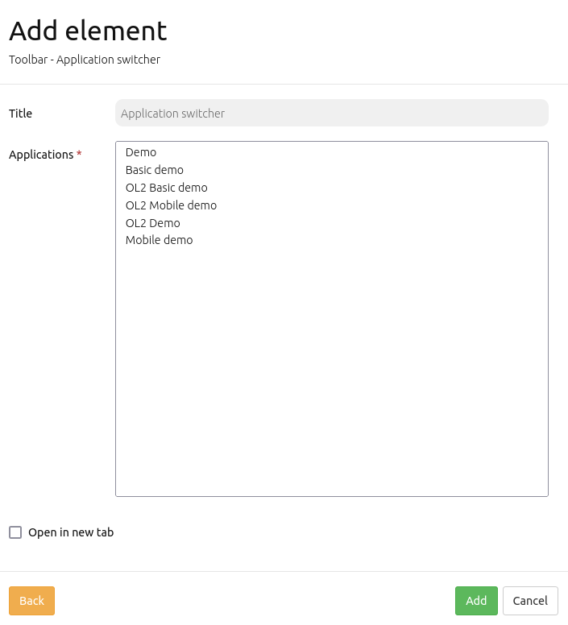
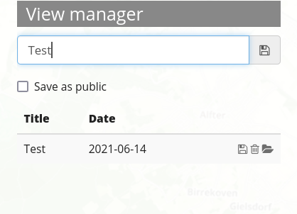
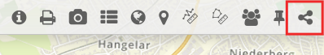

.. _share:

Share
*****

Application Switcher
====================

This element allows the user to switch from one application to another. When selecting to jump to another application, the current map view parameters (center, scale, srs, rotation) will be retained.

The Application Switcher can be implemented into the toolbar or footer of an application. Frontend users define themselves to which of the predefined applications they want to be able to switch to. 

The backend element dialogue offers the currently available applications a user can potentially switch to. Select one or more applications in the list to add them to the Application Switcher. Moreover, switched-to applications can be configurated to automatically open in a new browser tab with the checkbox "Open in new tab".

YAML-Definition:
----------------

.. code-block:: yaml

  applications: ['mapbender_user', 'mapbender_mobile', 'mapbender_user_basic']   # Definition of the switchable applications
  open_in_new_tab: false                                                         # Open application in a new tab (Default: false). 

View Manager
============

This element stores and reapplies map states. These contain the following map parameters: center, scale, srs, rotation, layer/source, layerset selection, source opacities. Saved states are always reapplied on top of the current configuration. This means that changed application configurations will remain in effect after reload of the map state.

.. note:: Note: Thus far the View Manager can only be implemented in the Sidepane.

.. image:: ../../../figures/view_manager_overview.png
     :scale: 80

Basic operations
----------------

Each state must be given a title for reidentification. For saving the current map view as a new state, enter a title and click on the adjoined save button.

The most basic interaction (always available) is re-applying the map state stored in the entry. This option is always-on: The saved map state will be reapplied as soon as "Apply" is hit on the selected map state in list view. Moreover, entries may offer a "Replace" interaction. This will overwrite the map state stored in the entry, and will also update the title, using the global title input field. Also, entries may offer a "Delete" interaction (with an extra confirmation step).

.. note:: Note: The View Manager does *not* store or reapply the following configurations:
* any interactively added sources (via WmsLoader)
* any interactively removed layers (via Layertree context menu)
* any values for WMS dimensions
* any dynamically rendered geometries (Digitizer etc.)

Access rights
-------------

Each map state is attributed to an application and further separated into a public and user-private list. The rights to save, reapply or delete map states are defined in the element configuration. Furthermore, rights to show private lists and dates as well as the permition for anonymous users to save map states can be set here.

In general, access checks on public entries are suspended for the root user. The administrator can create, update and delete public entries at will. Anonymous users are excluded from working with private entries and they can never delete public entries. Their ability to create and update public entries is gated through the "Allow saving to anonymous users" option. If this checkbox is deactivated, their access to public entries is downgraded to read-only.

If the goal is to exclude anonynmous visitors completely, a ROLE_USER access restriction has to be set on the entire element.

YAML-Definition:
----------------

.. code-block:: yaml

   publicEntries        # String or empty (falsy value disables public entries entirely); other allowed values are ro (read only), rw (allow read and write), rwd (allow read and write and deletion) (Default: ro)
   privateEntries       # Turns user-private states on, with full usage (save, reapply, delete) (Default: true)
   allowAnonymousSave   # Extend right to save public entries also to anonymous users (Default: false)
   showDate:            # Show date of creation or last update in entry listing (Default: true)

Persistent map view
===================

This feature makes certain view parameters and certain source settings "persistent". This enables an application to be closed and opened up again in the same browser without loosing certain information.

Persisted and restored settings encompass:

* view parameters (center, scale, rotation, SRS)
* per-layerset selected or deselected states
* per-source and source layer selected or deselected states
* per-source opacity

Persistence is purely based on local browser storage, which means it is private to a user's local browser. It also remains private for multi-user systems. There is no interaction whatsoever with the Mapbender login.

Behaviour is enabled on a per-application basis with a new checkbox under the "Base data" tab.

.. image:: ../../../figures/persistent_map_view.png
     :scale: 80

This feature can also be set in a Yaml-application definition, with a new *persistentView* entry on the top level. Omitting the entry is the same as setting it to false.

YAML-Definition:
----------------

.. code-block:: yaml

parameters:
    applications:
        mapbender_user:
            title: Mapbender Demo Map
            screenshot: screenshot.png
            published: true
            persistentView: true      # <== this is new
            template:  Mapbender\CoreBundle\Template\Fullscreen

This change introduces a new column in the *mb_core_application* table and therefore requires *app/console doctrine:schema:update --force* to be run.

Currently not persisted and not restored are:

* Dimension parameter values
* Source additions (via WMS Loader)
* Layer / entire source removals (via Layertree context menu)
* Source / layer reordering operations via Layertree drag+drop
* States of per-layer featureinfo checkboxes

Share URL
=========

Certain view parameters are automatically contained in every application URL. Thus, users can share specific map views by simply sending the complete URL via email / chat or any other text-capable system. Contained view parameters include: 

* center
* scale
* rotation
* spatial reference system

There is no extra configuration for this functionality. It is always turned on.

If a URL is opened up in a new browser tab, previously mentioned view configurations will be restored. Made changes can be undone/redone via the browser back/forward buttons.

Users will be sent back to the same part of the map if they hit F5 to refresh the page. They will not be sent back to the configured initial map view. In order to do so, users have to open the application again from the application list or manually delete the hash part of the application URL.

NOTE: The following information is *not* saved by the URL: layer selection, sorting, runtime additions, geometry features or source additions via WMS loader.

Element "Share URL"
-------------------

URL share can be further simplified by integrating a respective element in the toolbar or footer.

After clicking on the button, the URL is saved to the clipboard. Standard browser interactions (e.g. open in new tab) are also possible.

This element stores the following information:

* basic view parameters (center, scale, rotation, SRS)
* layer and layerset settings changes (selected / deselected layersets, sources and layers, layer opacity settings)

The URL does *not* transfer dynamically added sources (via WmsLoader), dynamically removed layers or sources (via Layertree context menu) or changes to the source or layer order (via Layertree drag&drop)

YAML-Definition:
----------------

.. code-block:: yaml

    title: Share this map view        # Optional custom title, uses default title "Share URL" if omitted (string or empty).
    tooltip: I am displayed on hover  # Optional custom tooltip, same as title if omitted (string or empty).
    label: true                       # Enables display of title, set as FALSE will only display icon (Default: true).
