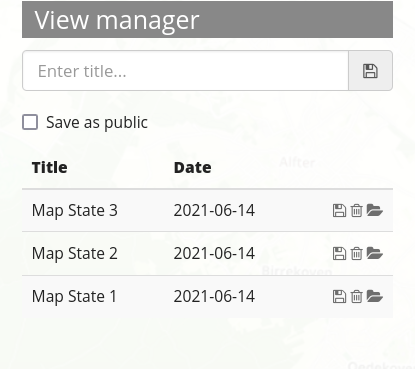
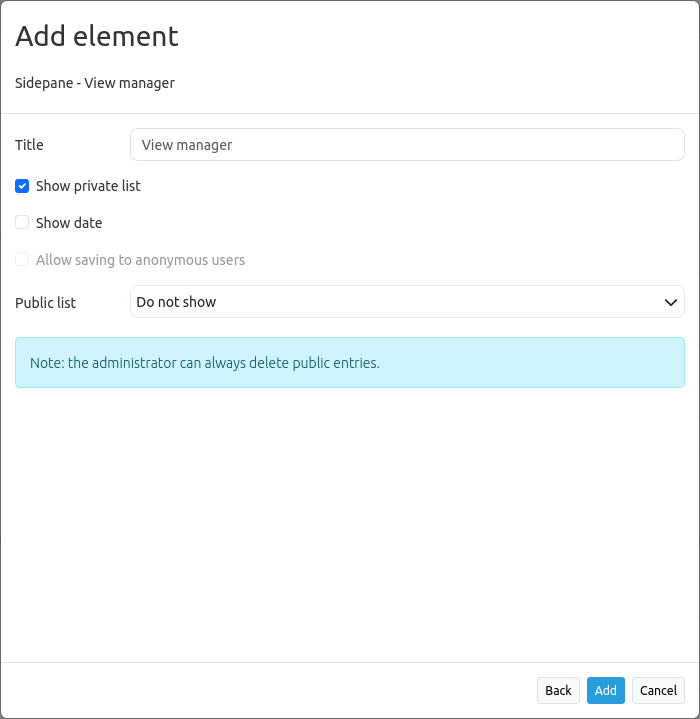

.. _view_manager:

View Manager
************

This element View Manager stores and reapplies map states. These contain the following map parameters: center, scale, srs, rotation, layer/source, layerset selection, source opacities. Saved states are always reapplied on top of the current configuration. This means that changed application configurations will remain in effect after reload of the map state.

.. note:: Note: Thus far the View Manager can only be implemented in the Sidepane.

Basic operations
----------------

Each state must be given a title for reidentification. For saving the current map view as a new state, enter a title and click on the adjoined save button.

.. image:: ../../../figures/view_manager_create_map_state.png
     :scale: 80

The most basic interaction (always available) is re-applying the map state stored in the entry. This option is always on: The saved map state will be reapplied as soon as "Apply" is hit on the selected map state in list view. Moreover, entries may offer a "Replace" interaction. This will overwrite the map state stored in the entry, and will also update the title, using the global title input field. Also, entries may offer a "Delete" interaction (with an extra confirmation step).

.. note:: Note: The View Manager does *not* store or reapply the following configurations:

* any interactively added sources (via WmsLoader)
* any interactively removed layers (via Layertree context menu)
* any values for WMS dimensions
* any dynamically rendered geometries (Digitizer etc.)

Access rights
-------------

Each map state is attributed to an application and further separated into a public and user-private list. The rights to save, reapply or delete map states are defined in the element configuration. Furthermore, rights to show private lists and dates as well as the permition for anonymous users to save map states can be set here.

In general, access checks on public entries are suspended for the root user. The administrator can create, update and delete public entries at will.

Anonymous users are excluded from working with private entries and they can never delete public entries. Their ability to create and update public entries is gated through the "Allow saving to anonymous users" option. If this checkbox is deactivated, their access to public entries is downgraded to read-only. If the goal is to exclude anonymous visitors completely, a ROLE_USER access restriction has to be set on the entire element.

Configuration
=============

YAML-Definition:
----------------

.. code-block:: yaml

   publicEntries        # String or empty (falsy value disables public entries entirely); other allowed values are ro (read only), rw (allow read and write), rwd (allow read and write and deletion) (default: ro)
   privateEntries       # Turns user-private states on, with full usage (save, reapply, delete) (default: true)
   allowAnonymousSave   # Extend right to save public entries also to anonymous users (default: false)
   showDate:            # Show date of creation or last update in entry listing (default: true)

