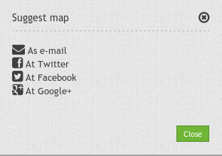
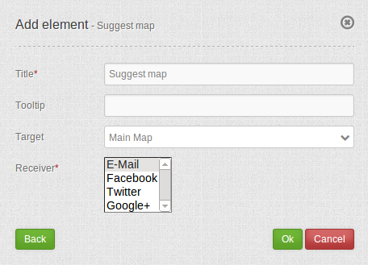

.. _suggestmap:

Suggest Map
***********************

**Notice:** that you need the element `WMC Editor <wmc_editor.html>`_ to use this functionality.

**Notice:** that all configurations are pubic at the moment. Later in development we want to add access control to this module too.

Configuration
=============

* **Title:** Title of the element. The title will be listed in "Layouts" and allows to distinguish between different buttons. It will be indicated if "Show label" is activated.
* **Tooltip:** text to use as tooltip.
* **Target:** Id of Map element to query.
* **Receiver:** element to use (E-Mail, Facebook, Twitter, Google+)

YAML-Definition:
----------------

.. code-block:: yaml

    title: Suggest Map   
    tooltip: Suggest Map      # text to use as tooltip
    icon: iconSuggestMap      # choose an icon
    label: true               # add title as label
    target: wmceditor         # choose wmceditor as target
    action: open              #
    deactivate: close         #

You need a button to show this element. See `Button <../misc/button.html>`_ for inherited configuration options.

Class, Widget & Style
=====================

* **Class:** Mapbender\\WmcBundle\\Element\\SuggestMap
* **Widget:** <Put Widget name here>
* **Style:** <Put name of css file here>

HTTP Callbacks
==============

<action>
--------

JavaScript API
==============

<function>
----------
