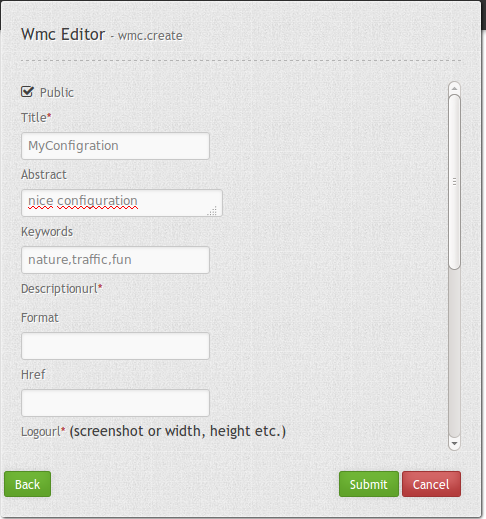
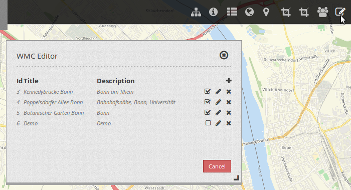
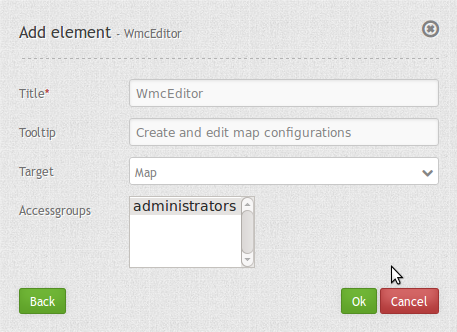

.. _wmc_editor:

WMC Editor
**********

Mapbender can save and edit configurations with the WMC Editor. This configurations can be loaded with the element `WMC Loader <wmc_loader.html>`_.

You can add WMC Editor to your application. Notice that the editor needs a button to open.

The Editor offers the possibility to create and update configurations. You can save configurations with a title, desciption and upload a screenshot.

**Notice:** All configurations are public at the moment. We want to add access control to this module later in development.

Configuration
=============

* **Title:** Title of the element. The title will be listed in "Layouts" and allows to distinguish between different buttons. It will be indicated if "Show label" is activated.
* **Tooltip:** text to use as tooltip.
* **Target:** Id of Map element to query.
* **Accessgroups:** define groups that can use the WMC Editor.

YAML-Definition:
----------------

.. code-block:: yaml

    title: WMC Editor
    tooltip: WMC Editor   # text to use as tooltip
    target: map           # name of map element
    accessGroups: [0,1]   # define groups that can use the WMC Editor

You need a button to show this element. See `Button <../misc/button.html>`_ for inherited configuration options.

Class, Widget & Style
=====================

* **Class:** Mapbender\\WmcBundle\\Element\\WmcEditor
* **Widget:** <Put Widget name here>
* **Style:** <Put name of css file here>

HTTP Callbacks
==============

<action>
--------------------------------

Opens a dialog with an editor in which configurations can be saved and edited.
