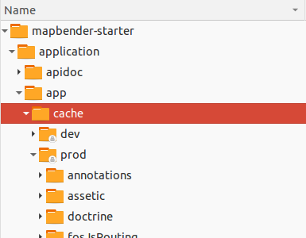

.. _installation_configuration:

Details of the configuration of Mapbender
=========================================

Configuration steps
-------------------

Following we describe the configuration steps of Mapbender a bit further. Configuring your Mapbender installation is made up of the following six steps:

* Creating the database
* Creating the database schema
* Copying the bundles' assets to the public web directory
* Creating the "root" user
* Inserting srs parameters (EPSG code definition)
* Loading the applications of the mapbender.yml to your database

All can be done using the console utility provided by `Symfony <http://symfony.com/>`_, on which Mapbender framework is built upon. There's a mayor caveat though you should understand, before continuing:

.. note:: The console utility will write files in the app/cache and app/logs directories. These operations are made using the user permissions of whatever user you're logged in with. This is also true for the app/db directory and the SQLite database within. When you open the application from within the browser, the server PHP process will try to access/write all these files with other permissions. So make sure you give the PHP process write access to these files. See last step below.

.. note:: **Notice:** The following steps assume that you are in the directory above the app directory (notice that for git installation that means mapbender/application/ else mapbender/).

.. code-block:: yaml

   cd mapbender/
   or for git based installation 
   cd mapbender/application

Adapting the configuration file
^^^^^^^^^^^^^^^^^^^^^^^^^^^^^^^
Database connection parameters are stored together with some more configuration parameters in the file ``app/config/parameters.yml``. This file is using YAML syntax, so be aware that you can **not** use tabs for indenting. Be careful about this and use whitespaces instead. 

Your database configuration in the parameters.yml file could look like this when you use PostgreSQL:

.. code-block:: yaml

    database_driver:   pdo_pgsql
    database_host:     localhost
    database_port:     5432
    database_name:     mapbender
    database_path:
    database_user:     postgres
    database_password: secret

Further information is available in the chapter :ref:`database`.

Creating the database
^^^^^^^^^^^^^^^^^^^^^

Symfony can attempt to create your database, this works of course only if the
configured database user is allowed to. Call the console utility like this:

.. code-block:: yaml

   app/console doctrine:database:create

Creating the database schema
^^^^^^^^^^^^^^^^^^^^^^^^^^^^

Symfony will create the database schema for you:

.. code-block:: yaml

    app/console doctrine:schema:create

Copying the assets bundles
^^^^^^^^^^^^^^^^^^^^^^^^^^

Each bundle has it's own assets - CSS files, JavaScript files, images and more -
but these need to be copied into the public web folder:

.. code-block:: yaml

    app/console assets:install web

Alternatively, as a developer, you might want to use the symlink switch on that command to
symlink instead of copy. This will make editing assets inside the bundle
directories way easier.

.. code-block:: yaml

   app/console assets:install web --symlink --relative

Creating the administrative user
^^^^^^^^^^^^^^^^^^^^^^^^^^^^^^^^

The first user - which has all privileges - must be created using the command:

.. code-block:: yaml

    app/console fom:user:resetroot

This will interactively ask all information needed and create the user in the
database.

Alternatively, there is a silent mode you can use, if you want to use a script to install Mapbender and don't want to be asked for all parameters:

.. code-block:: yaml

    app/console fom:user:resetroot --username="root" --password="root" --email="root@example.com" --silent

Inserting SRS parameters
^^^^^^^^^^^^^^^^^^^^^^^^

Inserting Proj4 SRS parameters into a database occurs using the command:

.. code-block:: yaml

    app/console doctrine:fixtures:load --fixtures=./mapbender/src/Mapbender/CoreBundle/DataFixtures/ORM/Epsg/ --append

Importing applications from application/app/config/applications
^^^^^^^^^^^^^^^^^^^^^^^^^^^^^^^^^^^^^^^^^^^^^^^^^^^^^^^^^^^^^^^

Importing applications from the folder applications into a database occurs using the command:

.. code-block:: yaml

    app/console doctrine:fixtures:load --fixtures=./mapbender/src/Mapbender/CoreBundle/DataFixtures/ORM/Application/ --append

Configuration files
-------------------

The basic configuration is done inside the **app/config/parameters.yml** file. A template is
provided in the app/config/parameters.yml.dist file. 

**app/config/config.yml** provides more parameters f.e. to configure portal functionality, owsproxy or provide an additional database. 

parameters.yml
^^^^^^^^^^^^^^

* database: The parameters starting with **database** are the database connection details. 
* mailer: The mailer settings start with **mailer**. Use f.e. smtp or sendmail. 
* locale: You can choose a locale for your application (default is en, de is available). Check http://doc.mapbender.org/en/book/translation.html to find out how to modify translations or how to add a new language.

.. note:: You need a mailer for self-registration and reset password functionality.

If you use a proxy you have to add the proxy settings to parameters.yml at section *OWSProxy Configuration*.

This is how the configiration could look like:

.. code-block:: yaml

    # OWSProxy Configuration
        ows_proxy3_logging: false
        ows_proxy3_obfuscate_client_ip: true
        ows_proxy3_host: myproxy
        ows_proxy3_port: 8080
        ows_proxy3_connecttimeout: 60
        ows_proxy3_timeout: 90
        ows_proxy3_user: ~
        ows_proxy3_password: ~
        ows_proxy3_noproxy:
            - 192.168.1.123

**Locales:**

You can choose a locale for your application:

- en: English (default),
- de: German,
- es: Spanish,
- it: Italian,
- nl: Dutch,
- pt: Portuguese,
- ru: Russian.

Check http://doc.mapbender.org/en/book/translation.html to find out how to modify translations or how to add a new language.

**Logo**

To change the logo systemwide, take a look into the Tipps & Tricks section into the chapter :ref:`templates`

config.yml
^^^^^^^^^^

* fom_user.selfregistration: To enable or disable self-registration of users, change the fom_user.selfregistration parameter. You have to define self_registration_groups, so that self-registered users are added to these groups automatically, when they register. They will get the rights that are assigned to these groups.
* fom_user.reset_password: In the same way the possibility to reset passwords can be enabled or disabled.
* framework.session.cookie_httponly: For HTTP-only session cookies, make sure the framework.session.cookie_httponly parameter is set to true.

**Notice:** You need a mailer for self-registration and reset password functionality (see parameters.yml).

Applications under application/app/config/applications
^^^^^^^^^^^^^^^^^^^^^^^^^^^^^^^^^^^^^^^^^^^^^^^^^^^^^^

You can configure an applications on two ways. In the .yml-file or with the browser in the Mapbender backend.

* The Mapbender Team provides an up-to-date folder applications with demo applications. New elements with their parameters are added to this configuration in every new version (You can disable the applications by setting published: false or you can empty the mapbender.yml file)
* applications that are defined in the folder are not editable in the backend
* you can import the applications to the database with the following app/console command

.. code-block:: yaml

    app/console doctrine:fixtures:load --fixtures=./mapbender/src/Mapbender/CoreBundle/DataFixtures/ORM/Application/ --append

Production- and Development environment and Caching: app.php and app_dev.php
-----------------------------------------------------------------------------

Mapbender provides two environments: a production-environment for the
general operation and a development-environment in which the application can
be testet. This concept follows the `"environments" in the Symfony framework
<http://symfony.com/doc/current/book/configuration.html>`_.

The production-environment is called with the URL
http://localhost/mapbender/app.php, the development-environment with the
URL http://localhost/mapbender/app_dev.php. The call with app_dev.php is
and should only be available from localhost.

There are differences in the behaviour of app.php and app_dev.php:

* The cache-mechanism of the development-environment behaves different: Not
  all files are cached, so that the code-changes are directly
  visible. Therefore is the usage of the app_dev.php always slower that the
  production-environment.

  In detail, the development-environment of Mapbender does not cache the
  CSS, JavaScript and Translation files, among others.

  The production-environment caches all theses files and puts them into the
  app/cache folder.

* The development-environment gives out error-messages and stack-traces out
  to the user-interface. The production-environment logs them into the file
  app/log/prod.log.

* The development-environment shows the Symfony Profiler. This tool logs
  things, that are important for developers but should not be visible for
  common users.

  .. image:: ../../figures/symfony_profiler.png
             :scale: 80
  

The directory app/cache contains the cache-files. It contains directories
for each environment (prod and dev) but the mechanism of the dev-cache, as
described, behaves different.

If changes of the Mapbender interface or the code are made, the
cache-directory (app/cache) has to be cleared to see the changes in the
application.

The following screenshots shows the location of the cache-directory in
Mapbender:

Deleting the cache
------------------

Especially in development or testing environments it may be required to delete the internal symfony cache. You can do this using the following console command:

.. code-block:: bash

                app/console cache:clear

Alternatively, you can remove all data within the Mapbender cache directory by using the following command. Be careful!

.. code-block:: bash

                rm -rf app/cache/*

More detailed information regarding the cache can be found under the appropriate symfony documentation page: https://symfony.com/doc/current/console/usage.html

Logging in Mapbender
--------------------

The Log-Level is defined in the files ``config_dev.yml`` and ``config_prod.yml``. These files are placed in the folder ``application/app/config/``. The config-files are for the different environments (see `production- and development environment <configuration.html#production-and-development-environment-and-caching-app-php-and-app-dev-php>`_).

For the development-environment (at the development on local systems) Mapbender is called with ``app_dev.php`` and therefore the file ``config_dev.yml`` is responsible. In the production-environment, where the ``app.php`` file is used, the configuration from ``config_prod.yml`` is applied.

Loglevel
^^^^^^^^

Overall, 6 log-levels are used:

* DEBUG (100): Detailed debug information.
* INFO (200): Interesting events. Examples: User logs in, SQL logs.
* NOTICE (250): Normal but significant events.
* WARNING (300): Exceptional occurrences that are not errors. Examples: Use of deprecated APIs, poor use of an API, undesirable things that are not necessarily wrong.
* ERROR (400): Runtime errors that do not require immediate action but should typically be logged and monitored.
* CRITICAL (500): Critical conditions. Example: Application component unavailable, unexpected exception.
* ALERT (550): Action must be taken immediately. Example: Entire website down, database unavailable, etc. This should trigger the SMS alerts and wake you up.
* EMERGENCY (600): Emergency: system is unusable.

This description of the log-level is analog to the `IETF Syslog Protocol <http://tools.ietf.org/html/rfc5424>`_.

config_dev.yml
^^^^^^^^^^^^^^

You find the responsible part of the ``config_dev.yml`` in the section "monolog":

.. code-block:: yaml
                
    monolog:
        handlers:
            main:
                type:  stream
                path:  %kernel.logs_dir%/%kernel.environment%.log
                level: debug
            firephp:
                type:  firephp
                level: info

Two "handler" are described: ``main`` und ``firephp``.

* **main:** The handler ``main`` is set to the log-level ``debug`` and streams all entries in a file which is defined unter ``path``. This file is defined with variables which means that the file ``dev.log`` is placed under the folder ``application/app/logs/``.

* **firephp:** The handler ``firephp`` can communicate with an appropriate  Extension of the web browser. The developer can therefore see the debug-messaged directly in the web browser without opening the log files.

These are the preferred settings for development tasks.

config_prod.yml
^^^^^^^^^^^^^^^

.. code-block:: yaml

    monolog:
        handlers:
            main:
                type:         fingers_crossed
                action_level: error
                handler:      nested
            nested:
                type:  stream
                path:  "%kernel.logs_dir%/%kernel.environment%.log"
                level: debug

This settings lead to a two-step logging. Here we have also two handlers: ``main`` and ``nested``.

* **main:** The ``main`` handler ist a type ``fingers-crossed`` and set to the ``error`` level. This means, the error is only active when an error occurs.

* **nested:** The ``main``-Handler calls the ``nested`` handler, which writes the entries into the ``prod.log`` file.

  Per default the handler is set to ``debug`` so that on an error also the debug-messages are written into the ``prod.log`` file.

  If you want to disable the debug-messages you can set here also the log-level ``error``.

**Further links:**

* In the package "monolog":
  
  * `Using Monolog <https://github.com/Seldaek/monolog/blob/master/doc/01-usage.md>`_
  * `Handlers, Formatters and Processors <https://github.com/Seldaek/monolog/blob/master/doc/02-handlers-formatters-processors.md>`_
  
* `Symfony, Monolog and different log types <http://www.whitewashing.de/2012/08/26/symfony__monolog_and_different_log_types.html>`_. Blog-entry by Benjamin Eberlei.
