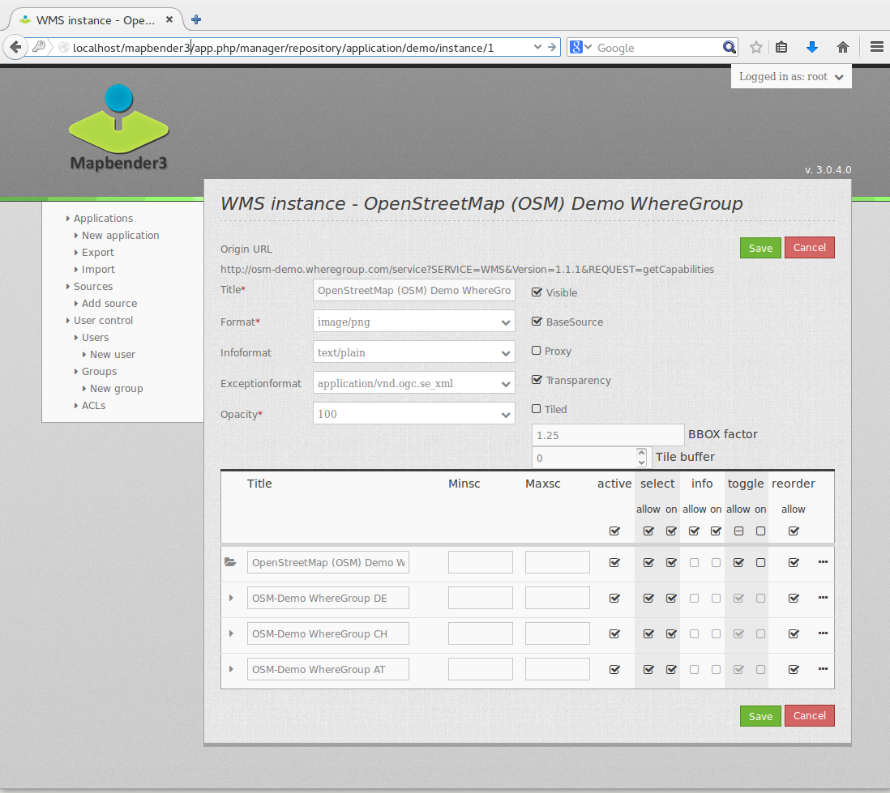
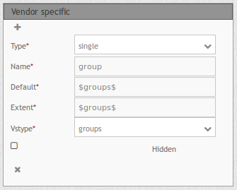
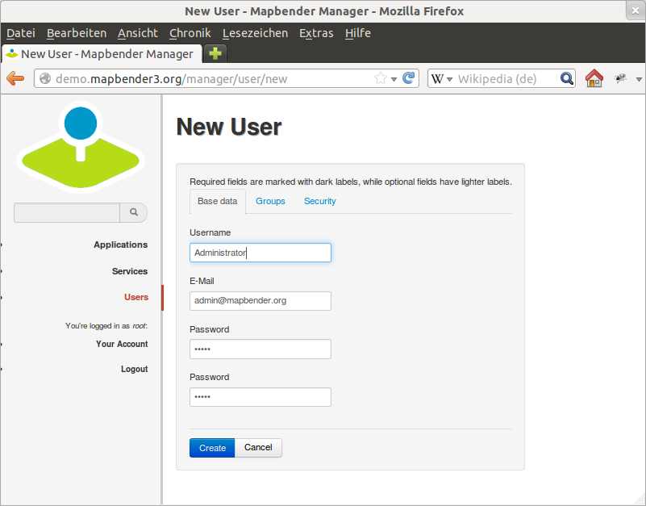

.. _quickstart:

:Author: OSGeo-Live
:Author: Astrid Emde
:Version: osgeo-live8.5
:License: Creative Commons Attribution-ShareAlike 3.0 Unported  (CC BY-SA 3.0)
:Thanks: mapbender-user list
:Date: |date|

  .. |mapbender3-button-show| image:: ../figures/mapbender3_button_show.png

  .. |mapbender3-button-copy| image:: ../figures/mapbender3_button_copy.png

  .. |mapbender3-button-publish| image:: ../figures/mapbender3_button_publish.png

  .. |mapbender3-button-edit| image:: ../figures/mapbender3_button_edit.png

  .. |mapbender3-button-delete| image:: ../figures/mapbender3_button_delete.png

  .. |mapbender3-button-add| image:: ../figures/mapbender3_button_add.png

  .. |mapbender3-button-key| image:: ../figures/mapbender3_button_key.png

################################################
Mapbender Quickstart: First steps with Mapbender
################################################

Mapbender is a web based geoportal framework to publish, register, view, navigate, monitor and grant secure access to spatial data infrastructure services.

Management interfaces empower administrators who need to maintain and categorize map and feature services and grant access to individuals, groups and other services.

Mapbender is the next version in the Mapbender series. It is rewritten from the ground up, using modern web technologies. The foundation is laid by Symfony 2, the brand-new version of the successful Symfony PHP web application framework. On the client-side expect to find OpenLayers and jQuery (UI) nicely glued together by MapQuery.

With this new code base we will continue the Mapbender idea of being a Geoportal Framework:

  * Applications can be setup, configured and styled right from within the browser
  * Services like WMS can be managed inside a service repository and linked to applications
  * Rights management are easy to maintain, for individual users and groups, whether you store them inside the database or in an LDAP.
  * Search modules (SQL oder Solr) can be configured
  * Applications for digitaliszation can be setup.
  * Mobile template can be used to provide applications for smartphones and tablets

You will need nothing but a standard web browser for this quickstart.

This quickstart describes how to:

  * start Mapbender
  * create an application
  * load a Web Map Service (OGC WMS)
  * configure WMS
  * create an individual application
  * create a user and a group and assign applications to them

This is how a Mapbender application can look like:

  .. image:: ../figures/mapbender3_basic_application.png
     :scale: 80

Installation
===============
For the installation of Mapbender have a look at http://doc.mapbender.org/en/book/installation.html.

Start Mapbender
================================================================================

#. Choose  ``Mapbender`` from the start menu or visit http://localhost/mapbender3/app.php

#. The application will take a few moments to start up

If you have any difficulties running Mapbender, please check whether your Apache web server and your PostgreSQL database are running.

Start Mapbender in the developer mode app_dev.php
=================================================
Symfony offers a developer mode with lot of information about your application (logging, exceptions, database queries, memory usage, time and more). This mode is only available from localhost.

  .. image:: ../figures/mapbender3_app_dev.png
     :scale: 80

#. Start the developer mode: http://localhost/mapbender3/app_dev.php

#. Have a look at the information that is offered in the developer mode.

  .. image:: ../figures/mapbender3_symfony_profiler.png
     :scale: 80

Welcome page
================================================================================

#. The Welcome page lists applications that are public and can be used by all users. The applications are listed with a screenshot, a title and a description.

#. You can open an application by click on the title, the screenshot or the start button.

#. Before you can administrate with Mapbender you have to log in to get access to the administration.

#. Click on Login at right-top to open the login page.

#. You can log in with the user that was generated on installation. It can be ``root`` and password ``root`` (This is the default user and password that you get after installation of Mapbender on OSGeo-Live. Please change the root password if you want to run a productive environment. Please don't delete the user :guilabel:`root`.).

  .. image:: ../figures/mapbender3_welcome.png
     :scale: 80

After successful login you are directed to the ``Mapbender administration``.

Application overview
================================================================================
After the login you are directed to the :guilabel:`Applications` with a list of applications you are allowed to access.

The Application overview provides the following functionality:

 * title and description
 * screenshot for the application (if provided)
 * |mapbender3-button-show| link to the application
 * |mapbender3-button-copy| button to duplicate the application
 * |mapbender3-button-edit| button to edit the application
 * |mapbender3-button-publish| button to publish/unpublish the application
 * |mapbender3-button-delete| button to delete the application
 * with the filter textfield you can search for applications

  .. image:: ../figures/mapbender3_application_overview.png
     :scale: 80

Create an individual application
================================================================================

Create a new application by providing basic information about your application. After that you use the edit mode to add elements, layers, styles (CSS-Editor) and security settings.

#. choose ``Applications --> New Application``

#. define a title and description for your application

#. define an URL title which will be used in the URL to open the application. It can be the same as the title but should not contain spaces.

#. upload an image file as screenshot for the application overview

#. choose a template for your application. The template defines the structure of the application. Mapbender provides some templates for you (Fullscreen, Classic,...). You also can define your own template.

#. choose the button **Create** to create the application

#. click the ``Edit-Button`` |mapbender3-button-edit| at the new application to edit the application

Your application is set up. Now you need Elementes (modules) like (map, legend, navigation) and WMS to populate your application.

  .. image:: ../figures/mapbender3_create_application.png
     :scale: 80

.. tip:: Please note, that the style-, icon- and layoutconfiguration has to be done in css- and twig-files at the moment. Read more about template generation at http://doc.mapbender.org/en/book/templates.html

Copy or rename an application
================================================================================
You also can create a new application by copying an existing application. Every application with write access can be copied. It provides a button |mapbender3-button-copy| to duplicate the application with all the services. The new application will get a derived name which can be changed in the next step.

Delete an application
================================================================================
You can delete an application from the menu item ``Applications`` with the |mapbender3-button-delete|-button. With this step you only delet the application, the sources are still available.

Export / Import applications and sources
================================================================================
You can export applications as JSON or YAML with ``Applications --> Export``. You can chose one or more applications to export and you can also export the sources which are published in the applications.

  .. image:: ../figures/mapbender3_application_export.png
     :scale: 80

The exportfile contains all the definitions of the application/s (sources) and can be imported via ``Applications --> Import`` in another Mapbender installation or in the same installation.

  .. image:: ../figures/mapbender3_application_import.png
     :scale: 80

Management of Data Sources
================================================================================
Mapbender can handle different Services like OGC WMS or OGC WMTS or OGC WFS. Every Service has to be handled differently. The administration provides an administration interface for every source (at the moment only WMS).

Source Repository overview
================================================================================

#. Go to ``Sources`` and have a look at the Source repository.

#. You get an overview on the Sources that are loaded in your Mapbender.

#. Type (f.e WMS), Title, Description offer first information about the services.

#. On click on the button |mapbender3-button-show| ``View-Button`` you get further information about the source.

#. With the button |mapbender3-button-delete| ``Delete-Button`` you can delete the source from your repository.

Loading Web Map Services
================================================================================
You can load OGC Web Map Services (WMS) to your application. Mapbender supports Version 1.1.1 and 1.3.0.

A WMS returns an XML-file when the getCapabilities document is requested. This information is parsed by Mapbender and Mapbender gets all the necessary information about the service from this XML

.. tip:: You should first check the Capabilities document in your browser before you try to load it with Mapbender

#. Choose menu item ``Source --> Add Source`` or use the |mapbender3-button-add|-button in the source repository. Link to the WMS getCapabilities URL in the text field ``Serviceurl``.

#. Enter username and password if your service needs authentication.

#. You can  chose ``only valid`` to load only services that follow the OGC WMS schema. Services that do not follow the schema may cause problems.

#. Hit **Load** to load the Service to the repository.

#. After successfull registration of the service Mapbender will display an overview on the information that was provided by the service.

  .. image:: ../figures/mapbender3_wms_load.png
     :scale: 80

Here are some example WMS:

Germany demo

http://wms.wheregroup.com/cgi-bin/germany_workshop.xml?VERSION=1.1.1&REQUEST=GetCapabilities&SERVICE=WMS

WhereGroup OSM WMS

http://osm-demo.wheregroup.com/service

Omniscale OSM WMS (see also http://osm.omniscale.de/)
http://osm.omniscale.net/proxy/service?

Add Service to Application
================================================================================
After the successfull upload of a WMS you want to add your WMS to an application.

#. Choose ``Applications -->`` |mapbender3-button-edit| ``edit-Button --> Layers --> Edit-Button``.

#. Click on the |mapbender3-button-add| ``-button`` to add a layerset, which represents a collection of layers (a possible names can be "main" for the main map and "overview" for the overview map)

#. Now you can add layer to the layerset

#. Click on the |mapbender3-button-add| ``button`` at your new layerset to add a Service.

#. You can change the order of the Services in your application by drag & drop.

  .. image:: ../figures/mapbender3_add_source_to_application.png
     :scale: 80

Configure your WMS
================================================================================
You can configure the WMS for your specific application. Maybe you don't want to provide all layers or you want to change the order or titles of the layer or disable the feature info or change the min-/maxscale for a layer.

#. Choose ``Applications -->`` |mapbender3-button-edit| ``edit-Button --> Layers --> edit-Button`` to configure the Service Instance.

#. You will see a table with the layers of the Service.

#. You can change the order of the layers via drag & drop

**Service configuration:**

* Title: name shown in the application
* Format: choose the format for getMap-Requests
* Infoformat: choose the format for getFeatureInfo-Requests
* Exceptionformat: choose the format for exceptions
* Opacity: choose opacity in percent
* Tile buffer: This parameter is valid for tiles services and specifies if additional tiles should be requested. If the user pans the map, these tiles are already downloaded and visible. The higher the value the more tiles are requested. Default: 0
* BBOX-Faktor: This parameter is valid for non-tiled WMS services. You can specify the size of the returned map-image. A value greater than 1 will request a bigger map-image. Default: 1.25, can be set to 1.
* Visible: set the visibility of the request
* BaseSource: should the Service be handled as BaseSource (BaseSources can be shown/hided in the layertree)
* Proxy: if active the service will be requested by Mapbender and not directly
* Transparency: default is active, the source is without a transparent background if it is deactivated (getMap-Request with TRANSPARENT=FALSE)
* Tiled: you can request a WMS in tiles, default is not tiled (may be a good choice if you map is very big an the WMS service does not support the width/height)

**Vendor Specific Parameter:**

You can define Vendor Specific Parameters in a layerset instance to add them
to a WMS request. This principle follows Multi-Dimensions in the WMS
specification.

You can use Vendor Specific Parameters in Mapbender for example to add the
user- and group information of the logged-in user to a WMS request. You can
also add hard coded values.

The following example shows the definition of the parameter "group" which
transfers the group-value of the logged-in user.

* Type: „single“, „multiple“, „interval“ (multiple values in dimensions)
* Name: parameter name of the WMS request.
* Default: the default value.
* Extent: available values (multiple as a comma seperated list).
* Vstype: Mapbender specific variables. Group (groups), User (users), Simple.
* Hidden: If this value is set, requests are send via a server so that the parameters are not directly visible.

Currently, the element can be used to transfer user- and groupinformation,
e.g. for a user the $id$ and for groups the value $group$.

**Layer configuration:**

* title - layer title from Service information
* active (on/off) - enable/disable a layer for this individual application
* select on - selectable in geodata explorer
* select allow - layer is active when the application starts
* info on - layer provides feature info requests, info default activates the feature info functionality
* info allow - layer info is active when the application starts
* minscale / maxscale - the scale range in which the layer should be displayed, 0 means no scale limitation
* toggle - open folder on start of the application
* reorder - allows to reorder the layers with drag & drop while using the application
* ... -> opens a dialog with more information
* layers name- layer name of the service information (for getMap-Requests)
* style - if a WMS provides more than one style you can choose a different style than the default style

Add Elements to your application
================================================================================
Mapbender offers a set of elements. You can add the elements to your application. You have different regions (Toolbar, Sidepane, Content, Footer) to which you can add elements.

  .. image:: ../figures/mapbender3_application_add_element.png
     :scale: 80

#. Choose ``Applications -->`` |mapbender3-button-edit| ``edit-Button --> Layouts --> Button`` |mapbender3-button-add| to get an overview over the elements Mapbender provides.

#. Choose an element from the list.

#. Notice that you have different areas in your application. Make sure to add the element to a region that makes sense.

#. Configure the element. Notice: When you select an element for example **map** you see that the element has a set of attributes. Each element offers individual attributes for configuration.

#. You can change the position of the element via drag & drop

#. Have a look at your application. Open your application choose ``Applications --> Applications Overview --> `` |mapbender3-button-show| ``view-Button``

Now you should get an idea how easy it is to change a Mapbender application without changes in the code.

  .. image:: ../figures/mapbender3_application_elements.png
     :scale: 80

Examples for elements Mapbender offers:

* About Dialog
* Activity Indicator
* BaseSourceSwitcher
* Button
* Coordinates Display
* Copyright
* Feature Info
* GPS-Position
* HTML
* Legend
* Layertree - Table of Content
* Map
* Meetingpoint (POI)
* Overview
* PrintClient
* Ruler Line/Area
* Scale Selector
* ScaleBar
* SimpleSearch
* Search Router
* SRS Selector
* Spatial Reference System Selector (SRS Selector)
* Navigation Toolbar (Zoombar)
* WMS Loader
* WMC Editor
* WMC Loader
* WMC List

You find detailed information on every element at the `MapbenderCoreBundle element documentation <http://doc.mapbender.org/en/bundles/Mapbender/CoreBundle/index.html>`_, `MapbenderWmcBundle element documentation <http://doc.mapbender.org/en/bundles/Mapbender/WmcBundle/index.html>`_ and `MapbenderWmsBundle element documentation <http://doc.mapbender.org/en/bundles/Mapbender/WmsBundle/index.html>`_.

Try it yourself
================================================================================

* add a Map Element to the content of your application
* add a Layertree to the content of your application
* add a button that opens the Layertree to the top of your application
* add the Navigation Toolbar to the content
* add a Copyright and change the copyright text
* add a SRS Selector to the footer

User and group management
================================================================================
An access to Mapbender requires authentication. Only public applications can be used by everyone.

A user has permissions to access one or a set of applications and services.

.. NOT IMPLEMENTED YET
  There is no inherent difference between roles like :``guest``, ``operator`` or ``administrator``. The ``role`` of a user depends on the functionality and services the user has access through his applications.

Create a user
================================================================================

#. To create a user go to ``User control --> Users --> New User`` or click the |mapbender3-button-show| ``add-Button``.

#. Choose a name and a password for your user.

#. Provide an email address for the user.

#. Save your new user.

#. You can provide more information about the user in the tab ``Profile``.

Create a group
================================================================================
#. Create a group by ``User control --> Group --> New Group``.

#. Define a name and a description for your group.

#. Save your new group.

Assign users to group
================================================================================

#. Assign a user to a group by ``Users --> Groups``.

#. Choose one or more users you want to add to the group at :menuselection:`Users`.

#. Assign a user by  |mapbender3-button-edit| ``Users --> Edit-Button--> Groups`` to a group.

  .. image:: ../figures/mapbender3_assign_user_to_group.png
     :scale: 80

Roles
================================================================================
Mapbender provides different rights. They refer to the Symfony ACL System http://symfony.com/doc/2.1/cookbook/security/acl_advanced.html#built-in-permission-map

* view - Whether someone is allowed to view the object.
* edit - Whether someone is allowed to make changes to the object.
* delete - Whether someone is allowed to delete the object.
* operator - Whether someone is allowed to perform all of the above actions.
* master - Whether someone is allowed to perform all of the above actions, and in addition is allowed to grant any of the above permissions to others.
* owner - Whether someone owns the object. An owner can perform any of the above actions and grant master and owner permissions.

#. Assign roles to a user by ``Users --> Edit your User --> Security``.

  .. image:: ../figures/mapbender3_roles.png
     :scale: 80

Assign an Application to a User/Group
================================================================================
#. Edit your application by ``Application --> Edit-Button`` |mapbender3-button-edit| .

#. Choose ``Security``

#. Publish your application by ``Security --> activated`` or ``Application --> visible``

#. Set permission like view, edit, delete, operator, master, owner

#. Assign a user/group to the application

#. Test your configuration!

#. Logout from Mapbender by ``Logout``.

#. Login as the new user

  .. image:: ../figures/mapbender3_security.png
     :scale: 80

Assign single elements to a User/Group
================================================================================
#. Edit your application by ``Application --> Edit-Button`` |mapbender3-button-edit| .

#. Choose ``Layouts``

#. Every element has a |mapbender3-button-key| ``-Button``

#. Chose the |mapbender3-button-key| ``-Button`` from the element, that should be only availale for special users / groups

#. Set permission like view, edit, delete, operator, master, owner

#. Assign a user/group to the element

#. Test your configuration!

Start Application at a defined position
============================================================

You can open an application at a defined location. This can be done by POI or polygon. You also can add textes in the request.

You can pass one or more POIs in the URL. Each POI has the following parameters:

- point: coordinate pair with values separated by comma (mandatory)
- label: Label to display (optional)
- scale: Scale to show POI in (optional, makes only sense with one POI)

If you pass more than one POI, the map will zoom to 150% of the POIs bounding.

To pass a single POI, use the following URL format:

* ?poi[point]=363374,5621936&poi[label]=Hello World&poi[scale]=5000

* http://demo.mapbender.org/application/mapbender_user?poi[point]=363374,5621936&poi[label]=Hello World&poi[scale]=5000

  .. image:: ../figures/mapbender3_position_poi_label.png
     :scale: 80

To pass multiple POIs, use the following format:

* ?poi[0][point]=363374,5621936&poi[0][label]=Hello%201&poi[1][point]=366761,5623022&poi[1][label]=World

Things to try
================================================================================

Here are some additional challenges for you to try:

#. Try to load some WMS in your application. Try to configure your WMS.

#. Try to create an individual application.

What Next?
================================================================================

This is only the first step on the road to using Mapbender. There is a lot more functionality you can try.

Mapbender Project home

  http://mapbender.org

Mapbender Website

  http://mapbender.org/

You find tutorials at

  http://doc.mapbender.org

API-Documentation

  http://api.mapbender.org

Get to know Mapbender on

	http://projects.mapbender.osgeo.org

Get involved in the project

	http://www.mapbender.org/Community
