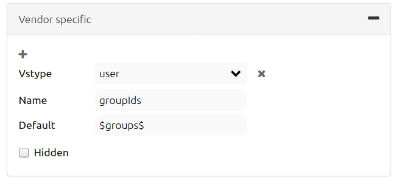
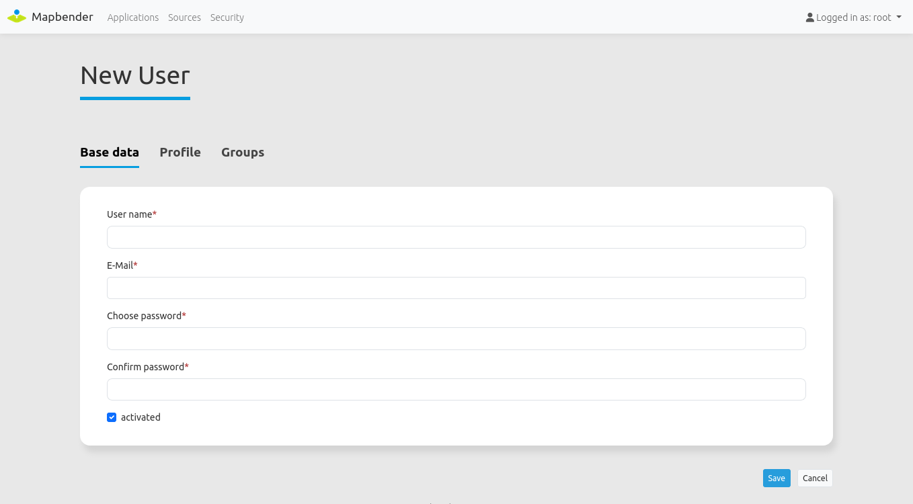
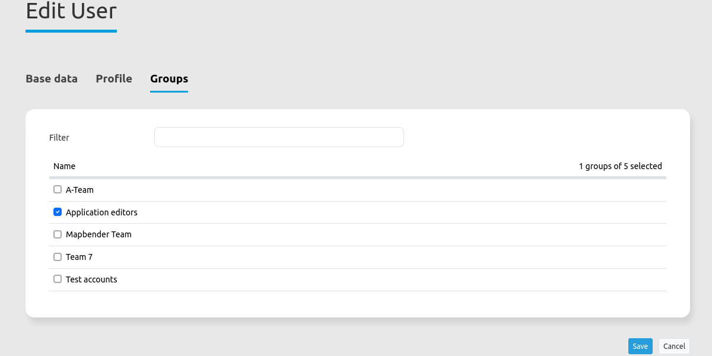

.. _quickstart:

:Author: OSGeo-Live
:Author: Astrid Emde
:Version: osgeo-live8.5
:License: Creative Commons Attribution-ShareAlike 3.0 Unported  (CC BY-SA 3.0)
:Thanks: mapbender-user list

  .. |mapbender-button-show| image:: ../figures/mapbender_button_show.png

  .. |mapbender-button-copy| image:: ../figures/mapbender_button_copy.png
  
  .. |mapbender-button-export| image:: ../figures/mapbender_button_export.png

  .. |mapbender-button-publish| image:: ../figures/mapbender_button_publish.png

  .. |mapbender-button-edit| image:: ../figures/mapbender_button_edit.png

  .. |mapbender-button-delete| image:: ../figures/mapbender_button_delete.png

  .. |mapbender-button-add| image:: ../figures/mapbender_button_add.png

  .. |mapbender-button-key| image:: ../figures/mapbender_button_key.png
  
  .. |mapbender-button-update| image:: ../figures/mapbender_button_update.png  

.. image:: ../_static/mapbender_logo.png
  :scale: 100 %
  :alt: project logo
  :align: right

################################################
Mapbender Quickstart: First steps with Mapbender
################################################

Mapbender is a web based geoportal framework to publish, register, view, navigate, monitor and grant secure access to spatial data infrastructure services. Management interfaces empower administrators who need to maintain and categorize map and feature services and grant access to individuals, groups and other services. Mapbender is written from the ground up using modern web technologies. The foundation is laid by Symfony. On the client-side expect to find OpenLayers.

With this code base, we will continue the Mapbender idea of being a Geoportal framework. Key features of Mapbender are:

* Applications can be setup, configured and styled right from within the browser.
* Services (e.g. WMS) can be managed inside a service repository and linked to applications.
* Rights management are easy to maintain, for individual users and groups, whether you store them inside the database or in an LDAP.
* Search modules can be configured.
* Applications for digitalization can be setup.
* Mobile template can be used to provide applications for smartphones and tablets.

You will need nothing but a web browser for this quickstart.

This quickstart describes how to:

#.  Start Mapbender
#.  Create an application
#.  Insert elementes into an individual application
#.  Configure sources
#.  Manage users and groups
#.  Use the rights management
#.  Start an application at a defined position

This is how a Mapbender application can look like:

  .. image:: ../figures/mapbender_basic_application.png
     :width: 100%

Install Mapbender
=================

This quickstart explains the basics of Mapbender and serves as a quick introduction after your first successful installation.
For the installation of Mapbender have a look at :ref:`installation`.

1. Start Mapbender
==================

#. Choose ``Mapbender`` from the start menu (if a shortcut was already created) or visit http://localhost/mapbender (this address can be slightly different depending on how the Apache Alias was created in the file /etc/apache2/sites-available/mapbender.conf, more information at :ref:`installation`).
 
#. The application should then appear in your browser window.

If you have any difficulties running Mapbender, please check whether your Apache web server and your PostgreSQL database are running without errors.

Start Mapbender in a productive environment
-------------------------------------------

Mapbender offers two environments: dev (default) and prod.

The development environment shows full error messages including stack traces in the browser and enables the Symfony debug console and profiler. Also, caching is disabled.
The productive environment enables caching and only shows generic error messages. More specific error messages are written into logfiles.

The environment can be set via the ``APP_ENV`` variable. Make sure to change this to `prod` when deploying your application for the public. The value can be changed in several ways:

* by editing the ``APP_ENV`` variable in the `.env` file,
* by overriding the value in an `.env.local` file,
* by setting an environment variable in your Apache2 vHost configuration: ``SetEnv APP_ENV prod``,
* by explicitly setting it when starting the local webserver:

.. code-block:: bash

    APP_ENV=prod symfony server:start --no-tls

Mapbender Backend
-----------------

#. After a successful Mapbender startup, the application overview page in the :ref:`backend` will appear. The applications are listed with a screenshot, title, URL title and description.

#. You can open an application by click on the title, the screenshot or via the |mapbender-button-show| ``button``.

#. A log-in is required to gain access into Mapbender's :ref:`backend`. In order to do so, click on **login** at the top-right of the login page. You can login with the user that was generated during installation. This could be ``root`` with the password ``root`` - this is the default user and password that you get after installation of Mapbender. Please change the root password if you want to run a productive environment. Please don't delete the user root. 

After a successful login you will be directed to the :ref:`backend`.

Application overview
--------------------

The application overview site displays a list of all available applications. The root user has access to the following functions:

 * title, URL title and description
 * preview screenshot for the application (if provided)
 * filter textfield for application search
 * option to create new applications
 * |mapbender-button-show| link to the application
 * |mapbender-button-copy| button to duplicate the application
 * |mapbender-button-export| button to export the application
 * |mapbender-button-edit| button to edit the application
 * |mapbender-button-publish| button to make the application available for anonymous users
 * |mapbender-button-delete| button to delete the application

  .. image:: ../figures/mapbender_app_dev.png
     :width: 100%

2. Create an individual application
===================================

There are three different options to create an application: 

An application can be created out of an already existing one. This can be done via a click on the |mapbender-button-copy| button in the application overview. The application will receive the same title and URL title with the appendix *"imp"*. All previously defined elements and configurations will be transferred as well. Another possibility is the import of an application. Further information can be found under :ref:`yaml`.

Furthermore, new applications can be created from scratch. The required steps are explained in the following:

#. Select the option *"New Application"* in the application overview.

#. After that, select a template in order to define the layout of your application. The options are: Fullscreen, Fullscreen alternative, Mapbender Mobile template. It is also possible to define your own template and assign it to a new application.

.. tip:: Please note that the style-, icon- and layout-configurations can be set up online via the CSS editor tab and/or via configuration files locally. Read more about template generation under :ref:`templates`.

#. Define a title, URL title and a description (optional). Title and URL title can be identical. However, the URL title has to follow the usual URL syntax: Typically, lowercase letters, numbers, as well as hyphens and underscores are allowed.

#. A thumbnail can be uploaded as well. It will appear next to the application title on the application overview page. For this, select "*Select File"* below the thumbnail section.

#. Set the checkmark at *"Persistent map state"*, to make certain map parameters and configurations persistent. Further information can be found in :ref:`share`.

#. Set the checkmark at *"Show Splashscreen"* to generate a loading screen on application startup that indicates the loading time.

#. Click *"Save"* to save and create your application. It is now possible to add elements (e.g. map, navigation bar, legend) and services to your applicaiton.

  .. image:: ../figures/mapbender_create_application.png
     :width: 100%

3. Add elements to your application
===================================

Mapbender applications consist of a Top toolbar, Sidepane, Map area and Footer. A variety of different elements can be added into these areas.

#. Choose ``Applications`` → |mapbender-button-edit| ``Button`` → ``Layouts``.

#. Click on the |mapbender-button-add| ``Button`` to get an overview over the elements Mapbender provides in the corresponding area.

#. Choose an element from the list. Notice that you have different areas in your application. Make sure to add the element to a region that makes sense. Not all elements can be added to all regions.

#. Configure the element. Notice: When you select an element, for example **map**, you see that the element has a set of attributes. Each element offers individual attributes for configuration.

#. You can change the position of an element via drag & drop within and between regions.

#. Have a look at your application. To open your application, click on the |mapbender-button-show| ``Button``.

Now you should have an idea about how easy it is to change a Mapbender application.

  .. image:: ../figures/mapbender_application_add_element.png
     :width: 100%

In the following, you find a complete list of all elements and their functionalities. For a more detailed description, please have a look at the corresponding chapters in the :ref:`Table of Contents<welcome>`.

* :ref:`about_dialog`: Show information about Mapbender in an about dialog
* :ref:`activity_indicator`: Shows HTTP activity
* :ref:`applicationswitcher`: Switch to another application while maintaining the current map position
* :ref:`button`: Integrate another element as a button
* :ref:`basesourceswitcher`: Change the map's background sources
* :ref:`coordinate_utility`: Transform coordinates to different SRS and navigate to them on the map
* :ref:`coordinates_display`: Show the map coordinates of your mouse position
* :ref:`copyright`: Shows terms of use
* :ref:`datamanager`: Create and save information in a database*
* :ref:`digitizer`: Create and manage spatial data*
* :ref:`dimensions_handler`: Manage sources with a time dimension
* :ref:`imageexport`: Export the current map view (format options: png or jpeg)
* :ref:`legend`: Displays legend of active themes on the map
* :ref:`link`: Links to an external URL
* :ref:`layertree`: Lists all included layer sets and layers with selection and sorting options
* :ref:`map`: Creates the map element in which layersets and layers are integrated into
* :ref:`overview`: Provides an overview map
* :ref:`poi`: Create a POI for sharing
* :ref:`printclient`: Render a Print dialog
* :ref:`ruler`: Enables to measure a line/area and display its length/area in a dialog
* :ref:`scaledisplay`: Displays the current map scale
* :ref:`scalebar`: Displays a small line indicator representing the current map scale
* :ref:`scale_selector`: Displays and changes a map scale
* :ref:`search_router`: Enables a configurable search via SQL
* :ref:`simplesearch`: Enables a configurable search on JSON sources (e.g. Solr)
* :ref:`simplesearch`: Enables a search
* :ref:`sketch`: Enables a drawing tool with different shapes
* :ref:`srs_selector`: Changes the map's spatial reference system
* :ref:`shareurl`: Share the current map view via URL
* :ref:`view_manager`: Save map states for later restoration
* :ref:`wms_loader`: Load a WMS via a getCapabilities-Request

.. hint:: Items marked with an asterisk (*) require additional dependencies.

4. Configure Sources
====================

Mapbender can handle sources of the type OGC WMS or OGC WMTS / TMS. Via a click on ``Sources``, one can navigate to an overview of all uploaded sources. There is a second list called *"Shared instances*" which only provides sources of the type shared. Further information about bound and shared instances can be found here: :ref:`layerset`.

The sources pages provides a user with the following functions:

 * |mapbender-button-add| add data source
 * |mapbender-button-show| show data source 
 * |mapbender-button-update| update data source
 * |mapbender-button-delete| delete data source
 * filter via text to search for sources
 
  .. image:: ../figures/mapbender_sources.png
     :width: 100%

Load sources
------------

Mapbender allows the integration of OGC Web Map Services (WMS) and Web Map Tile Services (WMTS). The versions 1.0.0 and 1.3.0. are supported. A source provides a XML, when the getCapabilities document is requested. This information is read by Mapbender. The client receives all necessary information about a source via this XML.

.. tip:: You should check your capabilties document in your browser before uploading the service.

#. To upload a source, click on ``Add source``.

#. Define the *"Type"* of the source: OGC WMS or OGC WMTS / TMS.

#. Provide the link to the getCapabilities URL in the field *Service URL*.

#. Define username and password (in case your source requires it).

#. Click on ``Load`` to upload the service into the repository.

#. After a successful upload, Mapbender will provide an overview of the WMS information.

  .. image:: ../figures/mapbender_add_source.png
     :width: 100%

Add sources to an application
-----------------------------

After uploading a service, it can be integrated into one or several application(s).

#. Navigate to your application overview page. Click on the |mapbender-button-edit| ``Button`` of the desired application and navigate to the tab *Layersets*.

#. In the *Layersets* section you can integrate uploaded sources into your application. Click on |mapbender-button-add| ``Button`` next to the filter function to create a layerset. All layers have to be assigned to at least one layerset. Provide a name for it (e.g. "main" for the main map and "overview" for the overview map).

#. Now you can add layers to the layerset. Click on the |mapbender-button-add| ``Button`` next to the desired layerset.

#. The order of the layers can be changed via drag & drop.

  .. image:: ../figures/mapbender_add_source_to_application.png
     :width: 100%

Source configuration
--------------------

Sources can be individually configured. This can be useful if you, for instance, don't want to display all layers, change the order or titles of the layers, prevent a layer's feature info output or adjust the scale in which the layers are visible.

#. Click on  ``Application`` → |mapbender-button-edit| → ``Layersets`` → |mapbender-button-edit| ``Edit instance`` to configure an instance.

#. You can now change the instance configuration.

#. The order of the layers can also be changed via drag & drop.

**Source configuration:**

* Title: Name of the application
* Opacity: Opacity in percentage (0: transparent, 100: opaque)
* Format: Format of the getMap-Requests
* Infoformat: Format of the getFeatureInfo-Requests (text/html für die Ausgabe als HTML wird empfohlen)
* Exceptionformat: Format for error messages
* Tile buffer: This parameter is valid for tiles services and specifies if additional tiles should be requested. If the user pans the map, these tiles are already downloaded and visible. The higher the value the more tiles are requested (default: 0).
* BBOX Factor: This parameter is valid for non-tiled WMS services. You can specify the size of the returned map-image. A value greater than 1 will request a bigger map-image (default: 1.25).
* BaseSource: If active, the service is handled as a BaseSource. Should be activated for full-screen background maps, such as street maps and satellite images, and where a simultaneous display is not needed.
* Proxy: If active, the service will be requested by Mapbender and not directly. Should always be enabled for password-protected services, as otherwise the password will be readable by every user.
* Transparency: default is active, the source is without a transparent background if it is deactivated (getMap-Request with Transparent=FALSE)
* Tiled: you can request a WMS in tiles, default is not tiled (may be a good choice if your map is very big and the WMS service does not support the width/height)
* Layer ordering: Handles the order of the layers in the service. Can be set toStandard  (reversed) and QGIS (same order).

**Dimensions:**

This function is relevant for sources with a time dimension. Further information can be found under :ref:`dimensions_handler`.

**Vendor Specific Parameter:**

You can define Vendor Specific Parameters in a layerset instance to add them to a WMS request. This principle follows Multi-Dimensions in the WMS specification.

You can use Vendor Specific Parameters in Mapbender for example to add the user- and group information of the logged-in user to a WMS request. You can also add hard coded values.

List of the possible parameters:

* User: $email$, $groups$, $id$, $username$
* Groups: $id$, $title$, $description$

The following example shows the definition of the parameter “group”, which transfers the group value of the logged-in user.

* Vstype: Mapbender specific variables. Group (groups), User (users), Simple
* Name: Parameter name of the WMS request
* Default: Default value
* Hidden: If this value is set, requests are send via a server so that the parameters are not directly visible. Only works if `Proxy` is enabled for the service, too.

Currently, the element can be used to transfer user- and group information, e.g. for a user the $id$ and for groups the value $group$.

**Layer configuration:**

* title: Layer title as shown in the layer tree. Default value is the getCapabilities requested title.
* min./max. scale: scale scope (e.g., 1:100-1:1000)
* active on/off: activates/deactivates a layer completely
* select allow: layer is active when the application starts
* select on: selectable in geodata explorer
* info allow: layer info is active when the application starts
* info on: layer provides feature info requests, info default activates the feature info functionality
* toggle allowed: allows opening in the layer tree
* toggle on: open folder on start of the application
* more information (...): opens a dialog with detailed layer information
    * ID: ID of the layer. Can be useful :ref:`to control <en/elements/basic/map:Activating Layers>` URL parameters.
    * Name: layer name of the service information (for getMap-Requests)
    * Style: if a WMS provides more than one style you can choose a different style than the default style.

5. User and group management
============================

Access to Mapbender requires authentication. Only public applications can be used by everyone.

A user can get permissions to access one or a set of applications and services.

Create a user
-------------

#. To create a user, go to ``Security`` → ``Users`` → ``Add new user``.

#. Choose a name for your user.

#. Provide an email address for the user.

#. Choose a password for your user and repeat it in the ``Confirm password`` field.

#. Save your new user. It is still possible to alter user information later on.

You can provide more information about the user in the tab ``Profile``. In the ``Groups`` and ``Security`` tabs it is possible to assign the user additional parameters, e.g. the membership to a group.

Create a group
--------------

#. Create a group by ``Security`` → ``Groups`` → ``Add new Group``.

#. Define a name and a description for your group.

#. In the tab ``Users``, assign users to your group.

#. Save your new group.

6. Rights management
====================

Mapbender provides an easy-to-use rights management that is implemented into the backend. 

* **View**:	Select a user that is allowed to view an object (e.g., an application or a service).
* **Create**:	Select a user that is allowed to create an object.
* **Edit**:	Select a user that is allowed to make changes to an object.
* **Delete**: Select a user that is allowed to delete an object.

.. important:: Assign rights to a user via ``Security`` → ``Global Permissions``.

Example for user rights in *Global Permissions*:

  .. image:: ../figures/mapbender_roles.png
     :width: 100%

Assign an Application to a User/Group
-------------------------------------

#. Edit your application via *Application* → |mapbender-button-edit| *Edit*.

#. Choose ``Security``.

#. Make your application accessable to the public by *Security* → *Public Access*. Alternatively, one can use |mapbender-button-publish| *Toggle public access*.

#. Alternatively to public access, you can set permissions for specific users/groups:

  .. image:: ../figures/mapbender_security.png
     :width: 100%

Test your configuration. Logout from Mapbender by clicking *Logout* in the upper right corner. Login again as the new user.

Assign elements to a User/Group
-------------------------------

Per default, all elements of an application are accessible to users and groups if they have access to that particular application. This can be modified for each element. 

#. Edit your application by pressing the |mapbender-button-edit| *Edit*.

#. In your application settings, choose :ref:`en/backend/applications/layouts:Layouts`.

#. Every element has a |mapbender-button-key| *Restrict element access*.

#. Choose the |mapbender-button-key| *Restrict element access* from the element that should be only available for special users/groups.

#. Assign one or more users or groups to the element. Then, you can set a *View* permission for the specific users or groups.

#. Test your configuration.

7. Start an Application at a defined position
=============================================

You can open an application at a defined location. This can be done by a POI. You also can add texts in the request.

You can pass one or more POIs in the URL. Each POI has the following parameters:

- point: coordinate pair with values separated by comma (mandatory)
- label: Label to display (optional)
- scale: Scale to show POI in (optional, makes only sense with one POI)

If you pass more than one POI, the map will zoom to 150% of the POIs bounding.

To pass a single POI, use the following URL format:

* ?poi[point]=363374,5621936&poi[label]=Hello World&poi[scale]=5000

What's next?
============

This is only the first step on the road to using Mapbender. There is a lot more functionality you can try.

Mapbender Website: https://mapbender.org/

You find tutorials at: https://doc.mapbender.org

Get involved in the project: https://mapbender.org/en/community/
